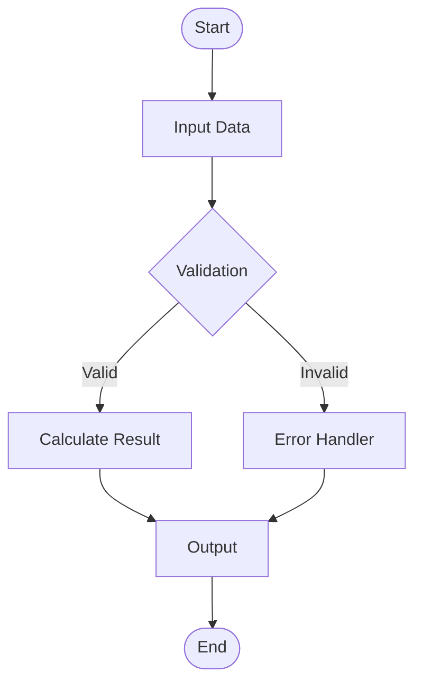
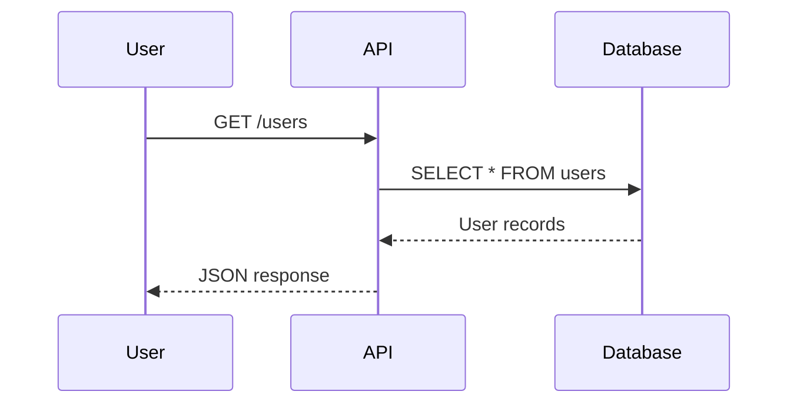
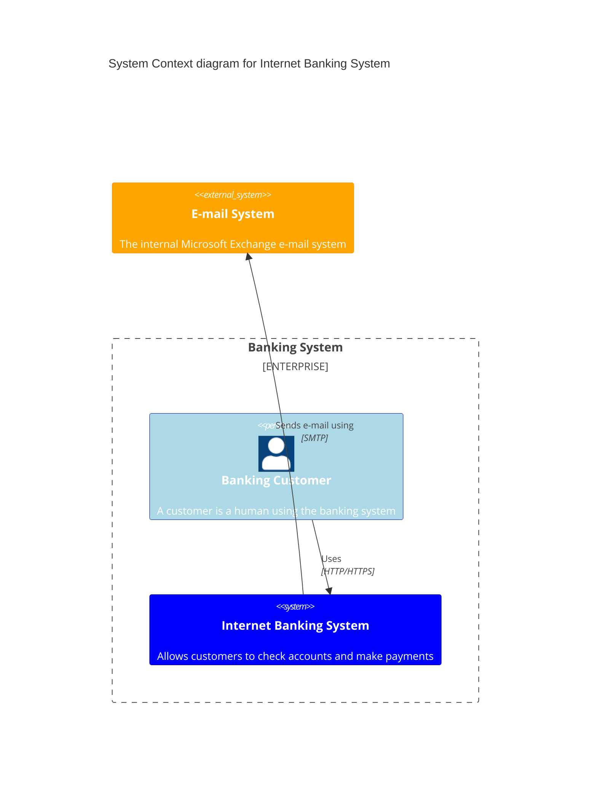

# Skill: Mermaid Diagram Expert v6.0.0-skill-edition

**Pure skill-based Mermaid rendering for Claude Code with MCP Playwright integration.**

## Metadata

```yaml
skill_id: moai-mermaid-diagram-expert
skill_name: "Mermaid Diagram Expert"
version: 6.0.0-skill-edition
created_date: 2025-11-20
updated_date: 2025-11-20
language: english
execution_mode: claude-code-skill
mcp_integration: playwright
diagram_types_supported: 21
triggers:
  - keywords: [mermaid, diagram, flowchart, sequence, class, ER, gantt, C4, architecture, visualization]
  - contexts: [diagram-generation, visual-documentation, architecture-visualization]
agents:
  - docs-manager, backend-expert, frontend-expert, database-expert, devops-expert
freedom_level: high
context7_references:
  - url: "https://mermaid.js.org"
    topic: "Official Mermaid.js documentation and syntax"
  - url: "https://mermaid.js.org/syntax/"
    topic: "Complete syntax reference for all diagram types"
  - url: "https://mermaid.live"
    topic: "Interactive Mermaid editor and testing platform"
```

---

# Quick Start (2 minutes)

## How to Use This Skill in Claude Code

### Basic Usage

```
Skill("moai-mermaid-diagram-expert")
```

This skill provides:
1. Complete Mermaid syntax for all 21 diagram types
2. MCP Playwright integration for rendering SVG/PNG
3. Ready-to-use examples and reference documentation
4. Enterprise diagram patterns and best practices

### Supported Diagram Types (21)

#### Structural Diagrams
- **Flowchart** - Process flows and decision trees
- **Sequence** - Interaction sequences and message flows
- **Class** - Object-oriented class relationships
- **ER** - Entity-relationship databases
- **Block** - Block diagram structures
- **State** - State machines and stateful flows

#### Timeline & Tracking
- **Timeline** - Chronological events and milestones
- **Gantt** - Project scheduling and timelines
- **Gitgraph** - Git workflow and branching

#### Architecture & Design
- **C4** - Context, Container, Component, Code architecture
- **Architecture** - System architecture diagrams
- **Requirement** - Requirements and traceability

#### Data Visualization
- **Pie Chart** - Pie and donut charts
- **XY Chart** - Scatter and line charts
- **Sankey** - Flow diagrams with proportional width
- **Radar** - Multi-variable comparison charts

#### User & Process
- **Mindmap** - Hierarchical mind mapping
- **User Journey** - User experience flows
- **Kanban** - Kanban board states
- **Packet** - Network packet structures

---

# Usage in Claude Code

## Step 1: Invoke the Skill

```python
Skill("moai-mermaid-diagram-expert")
```

## Step 2: Get Mermaid Syntax

The skill provides complete syntax for your diagram type:

### Example: Flowchart



### Example: Sequence Diagram



### Example: C4 Architecture



## Step 3: Render with MCP Playwright

Once you have your Mermaid code:

```python
# This skill integrates with MCP Playwright
# You can use the playwright MCP server to render the diagram
# The MCP server is configured in .claude/mcp.json
```

The MCP configuration in `.claude/mcp.json` enables:
```json
{
  "mcpServers": {
    "playwright": {
      "command": "npx",
      "args": ["-y", "@anthropic-ai/playwright-mcp"]
    }
  }
}
```

---

# All 21 Diagram Types Reference

See `examples.md` for complete working examples of all 21 diagram types.

## Categories

### 1. Process & Flow Diagrams (6 types)
- Flowchart
- Sequence
- State
- Timeline
- Gitgraph
- User Journey

### 2. Structure & Design (5 types)
- Class
- ER
- Block
- Architecture
- C4

### 3. Data & Analytics (4 types)
- Pie Chart
- XY Chart
- Sankey
- Radar

### 4. Planning & Organization (4 types)
- Gantt
- Mindmap
- Kanban
- Requirement

### 5. Network & Technical (2 types)
- Packet
- (Reserved for extensions)

---

# Best Practices

## 1. Clarity and Readability
- Use descriptive labels for all nodes
- Keep diagram complexity moderate (20-30 nodes max)
- Use consistent styling and color schemes

## 2. Performance
- For complex diagrams, consider breaking into multiple diagrams
- Use subgraphs to organize large flowcharts
- Limit text length in nodes

## 3. Accessibility
- Provide text alternatives for diagrams
- Use color + shape differentiation (not color alone)
- Include descriptive titles and legends

## 4. Organization
- Group related diagrams in directories
- Use consistent naming conventions
- Document diagram purposes in comments

---

# Integration with MoAI-ADK

This skill is designed for use within Claude Code during:

- **Architecture phase** (`/moai:1-plan`) - Design system diagrams
- **Documentation phase** (`/moai:3-sync`) - Create visual documentation
- **Review phase** - Communicate system design visually
- **Onboarding** - Help new team members understand architecture

---

# Common Patterns

## API Architecture (C4 Example)

```
System Context
  └─ API Gateway
  └─ Backend Services
  └─ Database
  └─ Cache Layer
```

## Microservices Flow (Sequence Example)

```
Client → API Gateway → Service A → Database
            → Service B → Cache
```

## Data Pipeline (Flowchart Example)

```
Extract → Transform → Load → Validate → Report
```

## State Management (State Diagram Example)

```
Idle → Processing → Complete
  ↓        ↓           ↑
Error ────────────────┘
```

---

# Learning Resources

- **Official Site**: https://mermaid.js.org
- **Live Editor**: https://mermaid.live
- **Syntax Guide**: https://mermaid.js.org/syntax/
- **Examples**: See `examples.md` and `reference.md` in this skill

---

# Support

For Mermaid syntax questions:
- Check `examples.md` for working examples
- Review `reference.md` for official documentation links
- Use https://mermaid.live for interactive testing

For Claude Code integration:
- Ensure `.claude/mcp.json` has Playwright configured
- Verify Node.js is installed (`node --version`)
- Check Playwright is available (`npx @anthropic-ai/playwright-mcp --version`)

---

**Version**: 6.0.0-skill-edition
**Last Updated**: 2025-11-20
**Focus**: Pure skill-based Mermaid rendering with MCP Playwright
