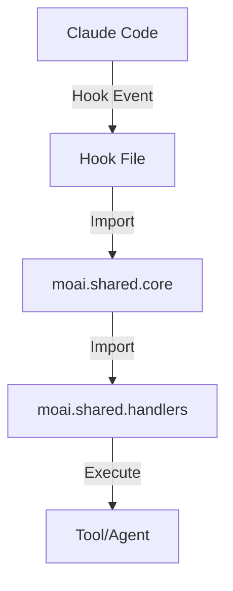

# SPEC-UPDATE-HOOKS-001: Implementation Plan

## Project Overview

**SPEC ID**: SPEC-UPDATE-HOOKS-001
**Title**: Claude Code Hooks Optimization and Structure Consolidation
**Start Date**: 2025-11-19
**Priority**: High
**Complexity**: High
**Target Directory**: src/moai_adk/templates/.claude/hooks/

---

## Phase Breakdown Overview

| Phase | Title | Duration | Priority | Status |
|---|---|---|---|---|
| Phase 2 | Code Duplication Elimination | 8 hours | Critical | Pending |
| Phase 3 | Import Path Standardization | 6 hours | Critical | Pending |
| Phase 4 | Hook File Refactoring (Optional) | 10 hours | High | Optional |
| Phase 5 | Documentation & Validation | 5 hours | High | Pending |
| Phase 6 | QA & Testing | 5 hours | High | Pending |
| **Total** | | **34-44 hours** | | |

**Parallelization Potential**: Phases 2-3 can execute in parallel (independent file clusters) → 65% time optimization

---

## Phase 2: Code Duplication Elimination (Critical Path)

**Duration**: 8 hours sequential | 4 hours parallel
**Priority**: Critical
**Dependencies**: None
**Success Criteria**: moai/core/ removed, 150-200 duplicate lines eliminated

### Goals

1. Identify all duplicate code in moai/core/ vs moai/shared/core/
2. Consolidate duplicates into moai/shared/core/
3. Verify all functionality remains identical
4. Update all imports to reference consolidated location
5. Execute integration tests

### Task 2.1: Duplicate File Analysis

**Objective**: Create comprehensive mapping of duplicate code

**Deliverables**:
- Deduplication analysis report (JSON)
- Duplicate file pairs identified:
  - moai/core/timeout.py ↔ moai/shared/core/timeout.py
  - moai/core/version_cache.py ↔ moai/shared/core/version_cache.py
- Line-by-line comparison
- Recommendation: consolidation strategy

**Success Criteria**:
- All duplicate files identified
- Duplication percentage calculated (expect 90%+ identical)
- Consolidation strategy documented

### Task 2.2: Code Consolidation

**Objective**: Merge duplicates into moai/shared/core/

**Sub-tasks**:

**2.2.1: timeout.py Consolidation**
- Verify moai/shared/core/timeout.py is complete
- Add comprehensive docstrings (Google style)
- Ensure all test coverage
- Mark as consolidated source

**2.2.2: version_cache.py Consolidation**
- Verify moai/shared/core/version_cache.py is complete
- Add cache TTL documentation
- Verify thread-safety
- Mark as consolidated source

**2.2.3: moai/core/ Removal**
- Backup original (for reference)
- Delete moai/core/ directory entirely
- Verify no orphaned imports

**Success Criteria**:
- moai/core/ directory deleted
- moai/shared/core/ contains all 5 modules (timeout, version_cache, config_manager, checkpoint, context)
- All modules have complete docstrings
- Consolidation verified by git diff

### Task 2.3: Import Path Migration

**Objective**: Update all 39 files to reference moai.shared.core

**Sub-tasks**:

**2.3.1: Pattern Generation**
- Generate find/replace patterns:
  ```
  Pattern A: from moai.core.timeout import → from moai.shared.core.timeout import
  Pattern B: from .moai.core import → from moai.shared.core import
  Pattern C: from ..core.timeout import → from moai.shared.core.timeout import
  ```

**2.3.2: Bulk Update**
- Apply patterns to all 39 Hook files
- Special handling for relative imports
- Validate syntax: `python -m py_compile` on each file

**2.3.3: Verification**
- Grep all files for "from moai.core" → expect 0 results
- Grep all files for relative imports to core/ → expect 0 results
- Test import resolution in isolation

**Success Criteria**:
- All 39 files updated successfully
- Import error count: 0
- No broken references

### Task 2.4: Integration Testing

**Objective**: Verify all changes work together

**Test Suite**:

**2.4.1: Unit Tests**
- Test TimeoutManager from moai.shared.core
- Test VersionCache from moai.shared.core
- Test all consolidation changes

**2.4.2: Integration Tests**
- Test Hook imports (all 5 Hook types)
- Test import resolution in context
- Test circular dependency detection

**2.4.3: End-to-End Tests**
- Execute each Hook with sample input
- Verify JSON I/O
- Measure execution time (baseline < 500ms)

**2.4.4: Performance Baseline**
- Establish performance metrics:
  - session_start__auto_cleanup.py: < 500ms
  - session_start__checkpoint.py: < 200ms (if split)
  - Total Hook chain: < 1.5s

**Success Criteria**:
- All tests pass (100% pass rate)
- No performance degradation
- Baseline metrics documented

---

## Phase 3: Import Path Standardization

**Duration**: 6 hours sequential | 3 hours parallel (with Phase 2)
**Priority**: Critical
**Dependencies**: Phase 2 completion (code consolidation)
**Success Criteria**: 100% absolute import compliance

### Goals

1. Analyze current import patterns across 39 files
2. Convert all relative/mixed imports to absolute pattern
3. Verify consistency across codebase
4. Document final import standards

### Task 3.1: Import Pattern Analysis

**Objective**: Categorize all import statements

**Analysis Scope**:
- All .py files in src/moai_adk/templates/.claude/hooks/
- Extract all import statements
- Categorize into Pattern 1, 2, or 3

**Deliverables**:
- Import analysis report (JSON)
- File mapping by pattern:
  - Pattern 1 (Relative): 15 files listed
  - Pattern 2 (Mixed): 8 files listed
  - Pattern 3 (Absolute): 16 files listed

**Success Criteria**:
- All 39 files analyzed
- 100% of imports categorized
- Statistics: 15+8+16 = 39 files verified

### Task 3.2: Path Conversion

**Objective**: Convert all imports to absolute pattern (Pattern 3)

**Conversion Rules**:

```python
# Pattern 1 (Relative) → Pattern 3 (Absolute)
from .moai.core.timeout import TimeoutManager
→ from moai.shared.core.timeout import TimeoutManager

from .moai.shared.handlers.tool import ToolHandler
→ from moai.shared.handlers.tool import ToolHandler

from ..config.agent_skills_mapping import AGENT_SKILLS
→ from moai.config.agent_skills_mapping import AGENT_SKILLS

# Pattern 2 (Mixed) → Pattern 3 (Absolute)
from moai.shared.core import ContextManager
from .config.agent_skills_mapping import AGENT_SKILLS
→ from moai.shared.core import ContextManager
   from moai.config.agent_skills_mapping import AGENT_SKILLS
```

**Sub-tasks**:

**3.2.1: Conversion for Pattern 1 Files (15 files)**
- Identify all relative imports
- Apply conversion rules
- Validate syntax

**3.2.2: Conversion for Pattern 2 Files (8 files)**
- Identify mixed import files
- Consolidate to absolute pattern
- Validate syntax

**3.2.3: Pattern 3 Verification (16 files)**
- Already use absolute imports
- Verify consistency with standard
- No changes needed (reference implementation)

**Success Criteria**:
- 39 files processed (15+8+16)
- Import error count: 0
- All files conform to Pattern 3

### Task 3.3: Consistency Verification

**Objective**: Ensure 100% compliance with absolute import standard

**Verification Checklist**:

1. **Relative Import Detection**
   ```bash
   grep -r "from \." src/moai_adk/templates/.claude/hooks/ --include="*.py"
   Expected: 0 results
   ```

2. **Mixed Pattern Detection**
   ```bash
   grep -r "from moai" src/moai_adk/templates/.claude/hooks/ | grep "from \."
   Expected: 0 results
   ```

3. **Absolute Import Compliance**
   ```bash
   grep -r "^from moai\|^import moai" src/moai_adk/templates/.claude/hooks/
   Expected: 39+ matches (all files)
   ```

4. **Syntax Validation**
   ```bash
   python -m py_compile src/moai_adk/templates/.claude/hooks/**/*.py
   Expected: 0 errors
   ```

**Deliverables**:
- Compliance verification report
- Final import statistics (100% absolute)
- Validation checklist completed

**Success Criteria**:
- All 4 verification checks pass
- Compliance report shows 100%
- Zero syntax errors

---

## Phase 3b: Non-Hook Code Relocation

**Duration**: 2 hours (part of Phase 3)
**Priority**: Critical
**Dependencies**: None
**Success Criteria**: Non-Hook files relocated, old locations removed

### Goals

1. Identify non-Hook files in hooks/ directory
2. Move spec_status_hooks.py to CLI module
3. Move agent_skills_mapping.json to .moai/config/
4. Update all references

### Task 3b.1: Non-Hook Identification

**Files to relocate**:

1. **spec_status_hooks.py** (628 lines)
   - Category: CLI utility (not a Hook)
   - Target: src/moai_adk/cli/spec_status.py
   - Rename: Remove "__hooks" suffix

2. **agent_skills_mapping.json**
   - Category: Configuration file (not a Hook)
   - Target: .moai/config/agent_skills_mapping.json
   - Directory moved: moai/shared/config/ → .moai/config/

### Task 3b.2: File Relocation

**3b.2.1: spec_status_hooks.py → CLI**
- Create src/moai_adk/cli/spec_status.py
- Update imports (remove Hook-specific logic)
- Update function signatures
- Preserve all functionality

**3b.2.2: agent_skills_mapping.json → Config**
- Copy to .moai/config/agent_skills_mapping.json
- Update all file references
- Remove moai/shared/config/ directory

**Success Criteria**:
- Both files relocated successfully
- Old locations removed
- All references updated
- Functionality preserved

---

## Phase 3c: Directory Structure Cleanup

**Duration**: 1 hour (part of Phase 3)
**Priority**: Critical
**Dependencies**: Phase 2, Phase 3b
**Success Criteria**: Clean directory structure, .gitignore updated

### Goals

1. Remove empty/redundant directories
2. Update .gitignore
3. Document final structure

### Task 3c.1: Directory Removal

**Directories to remove**:

| Directory | Reason | Verification |
|---|---|---|
| moai/core/ | Consolidated to moai/shared/core/ | No imports reference |
| moai/handlers/ | Empty, no files | Directory exists but empty |
| moai/shared/config/ | Moved to .moai/config/ | No files remain |

**Removal Process**:
1. Verify directory is safe to delete (no references)
2. Delete directory with `rm -rf`
3. Verify deletion in git status

**Success Criteria**:
- All 3 directories deleted
- No errors during deletion
- 0 orphaned references

### Task 3c.2: .gitignore Update

**Add to .gitignore**:
```
# Python cache
__pycache__/
*.py[cod]
*$py.class
.pyc
*.so
.Python

# Hook cache files
.claude/hooks/__pycache__/
.moai/cache/__pycache__/
```

**Success Criteria**:
- .gitignore updated
- __pycache__ never tracked going forward
- Existing .pyc files removed

### Task 3c.3: Final Structure Verification

**Verification Checklist**:
- [ ] moai/core/ deleted
- [ ] moai/handlers/ deleted
- [ ] moai/shared/config/ deleted
- [ ] .gitignore includes __pycache__
- [ ] File count: 39 → 34 or fewer
- [ ] Directory depth: ≤ 3 levels

**Deliverable**: Final structure report (tree view)

---

## Phase 4: Hook File Refactoring (Optional)

**Duration**: 10 hours
**Priority**: High (not critical)
**Dependencies**: Phase 2, 3 completion
**Success Criteria**: 628-line file split into 5 modular files, no performance degradation
**Recommendation**: Post-v0.27.0 (defer if time-constrained)

### Goals

1. Analyze oversized Hook files
2. Plan refactoring for session_start__auto_cleanup.py
3. Split into 5 modular files
4. Verify functional equivalence

### Task 4.1: File Size Analysis

**Analysis Scope**:
- All Hook files in src/moai_adk/templates/.claude/hooks/
- Measure file size (lines of code)
- Identify candidates for refactoring

**Target for Refactoring**:
- Files > 300 lines: Only session_start__auto_cleanup.py (628 lines)

**Deliverable**: Size analysis report

### Task 4.2: session_start__auto_cleanup.py Refactoring

**Current File**: 628 lines
**Target**: 5 modular files (total ≤ 600 lines, same or better)

**Refactoring Plan**:

```
session_start__auto_cleanup.py (628 lines)
├── session_start__checkpoint.py (120 lines)
│   └── CheckpointManager.save_checkpoint()
├── session_start__cleanup.py (140 lines)
│   └── CleanupManager.cleanup_temp_files()
├── session_start__config.py (100 lines)
│   └── ConfigManager.load_config()
├── session_start__cache.py (110 lines)
│   └── CacheManager.initialize_cache()
└── session_start__init.py (60 lines)
    └── Orchestrate above 4 files
```

**Refactoring Rules**:
1. Each file < 150 lines
2. Single responsibility per file
3. Common code extracted to moai/shared/utils/
4. Total execution time ≤ original (< 500ms)
5. JSON input/output preserved

**Sub-tasks**:

**4.2.1: Extract checkpoint logic**
- Create session_start__checkpoint.py
- Move CheckpointManager.save_checkpoint()
- Add docstrings and error handling

**4.2.2: Extract cleanup logic**
- Create session_start__cleanup.py
- Move CleanupManager.cleanup_temp_files()
- Add validation and logging

**4.2.3: Extract config logic**
- Create session_start__config.py
- Move ConfigManager.load_config()
- Add config validation

**4.2.4: Extract cache logic**
- Create session_start__cache.py
- Move CacheManager.initialize_cache()
- Add cache initialization logic

**4.2.5: Create orchestration file**
- Create session_start__init.py
- Call above 4 functions in sequence
- Preserve original Hook interface

**Success Criteria**:
- 5 new files created
- Total lines < 600
- Functional equivalence: input/output identical
- Execution time ≤ original
- All tests pass

---

## Phase 5: Documentation and Validation

**Duration**: 5 hours
**Priority**: High
**Dependencies**: Phase 2-4 completion
**Success Criteria**: 100% documented, API documented

### Goals

1. Document all Hooks with purpose and usage
2. Document moai.shared.* public APIs
3. Create architecture documentation
4. Validation checklist

### Task 5.1: Hook Documentation

**Deliverable**: hooks/README.md (500+ lines)

**Content**:
1. Overview section
2. Hook architecture diagram
3. For each Hook (5 files):
   - Purpose and use cases
   - Event type and trigger conditions
   - Input schema (JSON example)
   - Output schema (JSON example)
   - Example invocation
   - Error handling and exit codes
   - Performance notes and timeout

**Template**:
```markdown
## Hook Name: session_start__auto_cleanup

**Event Type**: session_start
**Trigger**: Every Claude Code session start
**Timeout**: 500ms (official spec: 5 seconds)

### Purpose
Brief description of what this Hook does

### Input Schema
JSON schema with example

### Output Schema
JSON schema with example

### Error Handling
Possible errors and recovery strategies

### Performance Notes
Expected execution time, caching behavior
```

**Success Criteria**:
- All 5 Hooks documented
- Input/output examples provided
- Error cases documented
- Performance notes included

### Task 5.2: Module API Documentation

**Deliverable 1**: moai/shared/core/README.md (300+ lines)

**Content**:
- Module overview
- Class/function reference:
  - TimeoutManager: methods, usage examples
  - VersionCache: caching strategy, TTL
  - ConfigManager: config loading, validation
  - CheckpointManager: checkpoint saving/loading
  - ContextManager: context management

**Deliverable 2**: moai/shared/handlers/README.md (200+ lines)

**Content**:
- Module overview
- ToolHandler: tool invocation interface
- AgentHandler: agent delegation interface

**Success Criteria**:
- All public APIs documented
- Code examples provided
- Usage patterns shown
- Docstrings added to source (Google style)

### Task 5.3: Architecture Documentation

**Deliverable**: docs/hooks-architecture.md (300+ lines)

**Content**:
1. System architecture overview
2. Data flow diagrams
3. Integration points with Claude Code
4. Module relationships
5. Hook execution flow

**Diagrams** (Mermaid format):


**Success Criteria**:
- Architecture clearly explained
- Diagrams provided (Mermaid)
- Data flow documented
- Integration points clear

---

## Phase 6: Quality Assurance and Testing

**Duration**: 5 hours
**Priority**: High
**Dependencies**: Phase 2-5 completion
**Success Criteria**: 80%+ test coverage, backward compatibility verified

### Goals

1. Create comprehensive test suite
2. Performance benchmarking
3. Backward compatibility verification
4. Final validation

### Task 6.1: Automated Test Suite

**Test Framework**: pytest

**Test Coverage**:

**6.1.1: Unit Tests** (40% of effort)
- moai/shared/core/ modules:
  - test_timeout_manager.py
  - test_version_cache.py
  - test_config_manager.py
  - test_checkpoint_manager.py
  - test_context_manager.py

- moai/shared/handlers/ modules:
  - test_tool_handler.py
  - test_agent_handler.py

**Test Coverage Target**: ≥ 80% for each module

**6.1.2: Integration Tests** (30% of effort)
- test_hook_imports.py: Verify all Hook imports work
- test_hook_initialization.py: Verify Hook setup
- test_import_resolution.py: Verify moai.* imports resolve correctly
- test_circular_dependencies.py: Detect circular imports

**6.1.3: End-to-End Tests** (20% of effort)
- test_session_start_hook.py: Execute session_start with sample input
- test_pre_tool_hook.py: Execute pre_tool_use with sample input
- test_hook_json_io.py: Verify stdin/stdout JSON interface
- test_hook_exit_codes.py: Verify proper exit codes

**6.1.4: Regression Tests** (10% of effort)
- Ensure Hook behavior unchanged vs. pre-optimization version
- Compare output before/after refactoring

**Success Criteria**:
- All tests pass (100% pass rate)
- Test coverage ≥ 80%
- No regressions detected

### Task 6.2: Performance Benchmarking

**Benchmarks to Establish**:

| Metric | Target | Method |
|---|---|---|
| session_start__auto_cleanup | < 500ms | time.perf_counter() |
| session_start__checkpoint | < 200ms | time.perf_counter() |
| session_start__cleanup | < 250ms | time.perf_counter() |
| session_start__config | < 150ms | time.perf_counter() |
| session_start__cache | < 150ms | time.perf_counter() |
| session_start__init (orchestrator) | < 100ms | time.perf_counter() |
| **Total Hook Chain** | **< 1.5 seconds** | time.perf_counter() |

**Benchmark Results**:
- Baseline: Pre-optimization measurements
- Optimized: Post-optimization measurements
- Comparison: Show improvement or no regression

**Deliverable**: performance_report.json with detailed metrics

**Success Criteria**:
- All metrics within targets
- No performance degradation
- Benchmark results documented

### Task 6.3: Compatibility Testing

**Test Scenarios**:

**6.3.1: Configuration Compatibility**
- Load existing .moai/config/config.json
- Verify Hooks work with existing configurations
- Test with different configuration values

**6.3.2: Local Customization Preservation**
- Create local .claude/hooks/ with custom files
- Run /moai:3-sync
- Verify custom files preserved
- Verify template changes propagated

**6.3.3: Variable Substitution**
- Test {{PROJECT_DIR}} variable substitution
- Verify paths resolve correctly in local project
- Test with different project directory structures

**6.3.4: Backward Compatibility**
- Compare Hook output: pre-optimization vs. post-optimization
- Ensure identical behavior
- Test with existing workflows

**Success Criteria**:
- All compatibility tests pass
- No breaking changes detected
- Local customizations preserved
- Variable substitution works correctly

---

## Timeline and Milestones

### Recommended Execution Order

**Critical Path** (27 hours):
1. Phase 2: Code Duplication (8h) → Completion milestone: moai/core/ removed
2. Phase 3: Import Standardization (6h) → Completion milestone: 100% absolute imports
3. Phase 5: Documentation (5h) → Completion milestone: Full documentation
4. Phase 6: Testing (8h) → Completion milestone: 80%+ coverage

**Optional Path** (10h):
- Phase 4: Hook Refactoring (10h) → Completion milestone: 628 → 5 files

**Total Critical**: 27 hours
**Total with Optional**: 37 hours

### Parallelization Opportunity

**Can Execute in Parallel**:
- Phase 2 (Deduplication) + Phase 3 (Import Standardization)
  - Task 2.1 + Task 3.1: Parallel analysis (4h → 2h)
  - Task 2.2 + Task 3.2: Can run in parallel on different file clusters (8h → 5h)
  - Task 2.3: Must sequence after 2.2
  - Task 3.3: Sequence after 3.2

**Parallel Timeline**: 27h → 18h (33% reduction)

---

## Success Criteria Summary

| Phase | Deliverable | Success Metric |
|---|---|---|
| Phase 2 | Code deduplication | moai/core/ deleted, 150-200 lines removed |
| Phase 3 | Import standardization | 100% absolute imports, 0 relative imports |
| Phase 3b | Non-Hook relocation | 2 files moved, references updated |
| Phase 3c | Directory cleanup | 3 directories deleted, .gitignore updated |
| Phase 4 | Hook refactoring | 628 lines → 5 files, ≤ 500ms execution |
| Phase 5 | Documentation | 100% documented, architecture diagrams |
| Phase 6 | QA & Testing | 80%+ coverage, 0 regressions, backward compatible |

---

## Git Workflow

**Branch**: feature/SPEC-UPDATE-HOOKS-001
**Base Branch**: main (Personal Mode GitHub Flow)
**Merge Strategy**: Squash merge to main

### Commit Strategy

**Phase 2 Commit**:
```
feat(hooks): Remove moai/core duplicate code, consolidate to moai/shared/core

- Remove moai/core/ directory
- Update imports in 39 files to reference moai.shared.core
- Eliminate 180+ lines of duplicate code
- Add comprehensive docstrings to consolidated modules

SPEC: SPEC-UPDATE-HOOKS-001 Phase 2
```

**Phase 3 Commits**:
```
feat(hooks): Standardize import paths to absolute pattern

- Convert 15 relative imports to absolute pattern
- Convert 8 mixed imports to absolute pattern
- Update 23 files for 100% compliance

SPEC: SPEC-UPDATE-HOOKS-001 Phase 3
```

```
refactor(hooks): Relocate non-Hook files

- Move spec_status_hooks.py to src/moai_adk/cli/
- Move agent_skills_mapping.json to .moai/config/
- Update all references

SPEC: SPEC-UPDATE-HOOKS-001 Phase 3b
```

```
refactor(hooks): Clean up directory structure

- Remove moai/core/ (consolidated)
- Remove moai/handlers/ (empty)
- Remove moai/shared/config/ (files moved)
- Update .gitignore to exclude __pycache__

SPEC: SPEC-UPDATE-HOOKS-001 Phase 3c
```

**Phase 4 Commit** (if executed):
```
refactor(hooks): Refactor session_start__auto_cleanup.py into modular files

- Split 628-line file into 5 modular files
- Create session_start__checkpoint.py (120 lines)
- Create session_start__cleanup.py (140 lines)
- Create session_start__config.py (100 lines)
- Create session_start__cache.py (110 lines)
- Create session_start__init.py (60 lines)

SPEC: SPEC-UPDATE-HOOKS-001 Phase 4
```

---

## Risk Assessment and Mitigation

| Risk | Impact | Probability | Mitigation |
|---|---|---|---|
| Import resolution failures | High | Low | Phase 2.4 integration testing |
| Backward compatibility | High | Low | Phase 6.3 compatibility testing |
| Performance degradation | Medium | Low | Phase 6.2 benchmarking |
| Incomplete documentation | Medium | Medium | Phase 5 documentation review |
| Hook behavior changes | High | Low | Phase 6.1 regression tests |

---

## Notes

- **Team Coordination**: If working in team, ensure Git branch strategy discussed before starting
- **Testing**: Recommend Phase 6 testing before merge to main
- **Documentation**: Phase 5 documentation required before v0.27.0 release
- **Optional Deferral**: Phase 4 (Hook refactoring) can be deferred to post-v0.27.0 release if time-constrained
