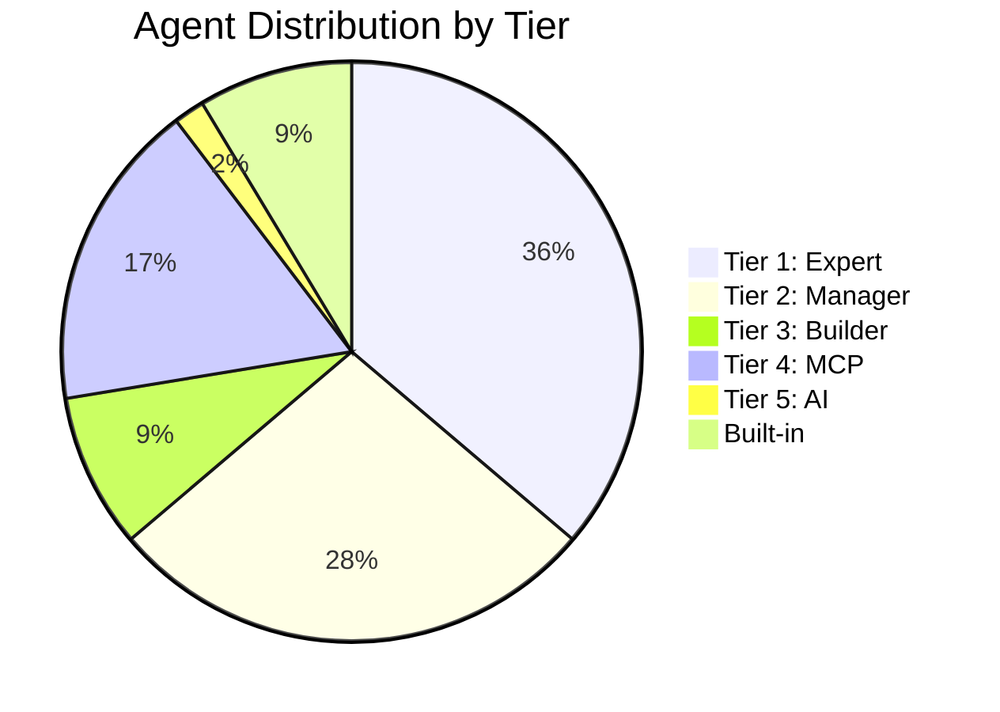
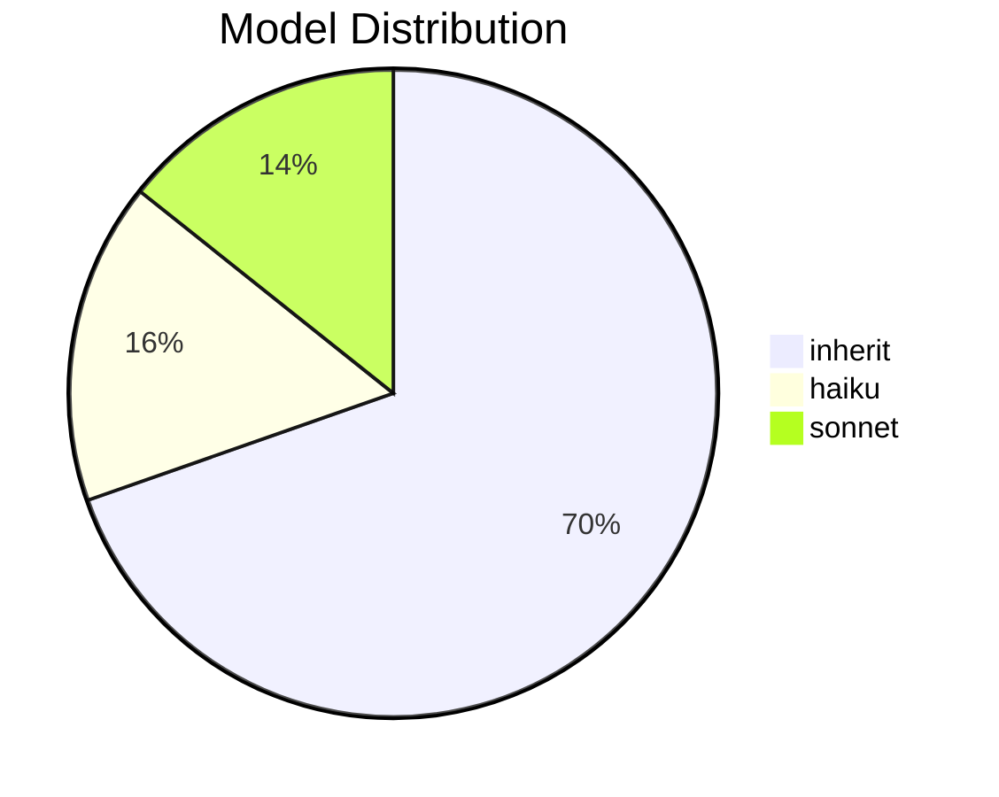
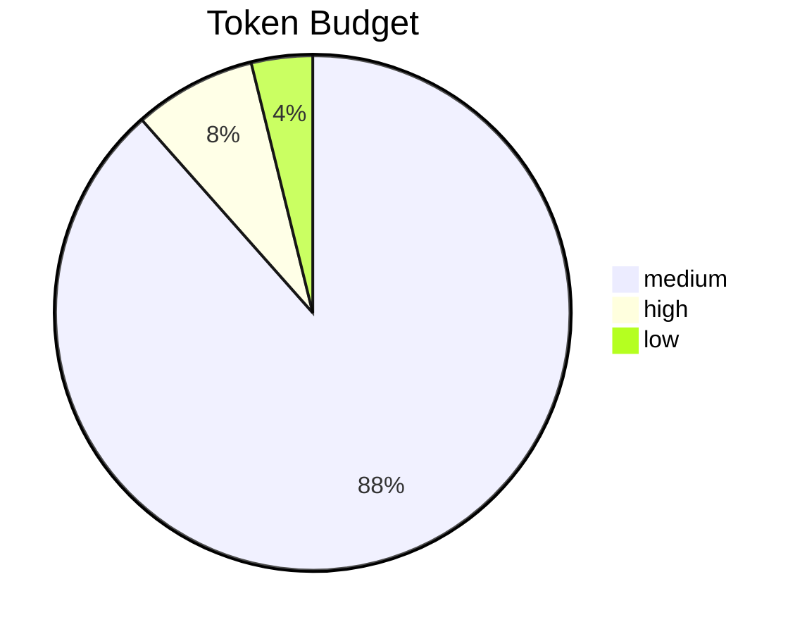

# MoAI-ADK Master Agent Registry

> **Version**: 1.0.0
> **Last Updated**: 2025-11-29
> **Total Agents**: 61 (56 Custom + 5 Built-in)
> **Source Directory**: `.claude/agents/moai/`

---

## Table of Contents

1. [Overview Dashboard](#overview-dashboard)
2. [Agent Distribution Charts](#agent-distribution-charts)
3. [5-Tier Agent Hierarchy](#5-tier-agent-hierarchy)
4. [Complete Agent Registry](#complete-agent-registry)
5. [Agent Locations](#agent-locations)
6. [Quick Reference](#quick-reference)

---

## Overview Dashboard

### Key Metrics

| Metric | Value |
|--------|-------|
| **Total Custom Agents** | 56 |
| **Built-in Agents** | 5 |
| **Grand Total** | 61 |
| **Resume-Capable** | 8 |
| **High Token Budget** | 4 |

### Model Distribution

| Model | Count | Percentage |
|-------|-------|------------|
| `inherit` | 39 | 70% |
| `haiku` | 9 | 16% |
| `sonnet` | 8 | 14% |
| `opus` | 0 | 0% |

### Permission Mode Distribution

| Mode | Count | Description |
|------|-------|-------------|
| `default` | 31 | Standard permission checks |
| `dontAsk` | 14 | Skip confirmation prompts |
| `bypassPermissions` | 8 | Full bypass mode |
| `acceptEdits` | 3 | Auto-accept file edits |

---

## Agent Distribution Charts

### Tier Distribution (Mermaid)



### Model Usage (Mermaid)



### Token Budget Distribution



---

## 5-Tier Agent Hierarchy

```
+------------------------------------------------------------------+
|                    MoAI-ADK Agent Hierarchy                       |
+------------------------------------------------------------------+
|                                                                    |
|  Tier 1: EXPERT (Domain Specialists)              21 agents       |
|  +---------------------------------------------------------+      |
|  | backend, frontend, database, security, devops, debug,   |      |
|  | format, accessibility, api-designer, component-designer,|      |
|  | migration, monitoring, performance, ui-ux, macos-cleaner|      |
|  +---------------------------------------------------------+      |
|                              |                                     |
|                              v                                     |
|  Tier 2: MANAGER (Workflow Orchestrators)         16 agents       |
|  +---------------------------------------------------------+      |
|  | project, spec, tdd, docs, strategy, quality, git, sync, |      |
|  | implementation-planner, cc-manager, trust-checker,      |      |
|  | doc-syncer, quality-gate                                |      |
|  +---------------------------------------------------------+      |
|                              |                                     |
|                              v                                     |
|  Tier 3: BUILDER (Meta-Generators)                 5 agents       |
|  +---------------------------------------------------------+      |
|  | agent-factory, builder-agent, builder-command,          |      |
|  | builder-skill, skill-factory                            |      |
|  +---------------------------------------------------------+      |
|                              |                                     |
|                              v                                     |
|  Tier 4: MCP (External Integrations)              10 agents       |
|  +---------------------------------------------------------+      |
|  | context7, figma, notion, playwright, sequential-thinking|      |
|  | + integrator variants                                   |      |
|  +---------------------------------------------------------+      |
|                              |                                     |
|                              v                                     |
|  Tier 5: AI (AI Service Connectors)                1 agent        |
|  +---------------------------------------------------------+      |
|  | ai-nano-banana (Gemini 3 Image Generation)              |      |
|  +---------------------------------------------------------+      |
|                                                                    |
+------------------------------------------------------------------+
```

---

## Complete Agent Registry

### Tier 1: Expert Agents (21)

| # | Agent Name | File | Model | Permission | Resume | Token | Description |
|---|-----------|------|-------|------------|--------|-------|-------------|
| 1 | `accessibility-expert` | `accessibility-expert.md` | inherit | default | false | medium | WCAG compliance, accessibility testing, inclusive design |
| 2 | `api-designer` | `api-designer.md` | inherit | default | false | medium | REST/GraphQL API design, OpenAPI specifications |
| 3 | `backend-expert` | `backend-expert.md` | inherit | default | false | medium | Backend architecture, API design, microservices |
| 4 | `component-designer` | `component-designer.md` | inherit | default | false | medium | Component architecture, design systems, UI libraries |
| 5 | `database-expert` | `database-expert.md` | inherit | default | false | medium | Database design, schema optimization, query performance |
| 6 | `debug-helper` | `debug-helper.md` | inherit | default | false | medium | Runtime error analysis, debugging |
| 7 | `devops-expert` | `devops-expert.md` | inherit | default | false | medium | CI/CD pipelines, containerization, cloud infrastructure |
| 8 | `expert-backend` | `expert-backend.md` | inherit | default | false | **high** | Backend architecture specialist (v2) |
| 9 | `expert-database` | `expert-database.md` | inherit | default | false | medium | Database expert (v2) |
| 10 | `expert-devops` | `expert-devops.md` | inherit | default | false | medium | DevOps expert (v2) |
| 11 | `expert-frontend` | `expert-frontend.md` | inherit | default | false | **high** | Frontend architecture specialist (v2) |
| 12 | `expert-security` | `expert-security.md` | inherit | default | false | medium | Security analysis expert (v2) |
| 13 | `expert-uiux` | `expert-uiux.md` | inherit | default | false | **high** | UI/UX design expert (v2) |
| 14 | `format-expert` | `format-expert.md` | inherit | dontAsk | false | medium | Code formatting, linting, style guides |
| 15 | `frontend-expert` | `frontend-expert.md` | inherit | default | false | medium | Frontend architecture, component design |
| 16 | `macos-cleaner` | `macos-cleaner.md` | inherit | default | false | medium | macOS optimization, storage cleanup |
| 17 | `migration-expert` | `migration-expert.md` | inherit | default | false | medium | Database migrations, schema evolution |
| 18 | `monitoring-expert` | `monitoring-expert.md` | inherit | default | false | medium | Observability, alerting, logging |
| 19 | `performance-engineer` | `performance-engineer.md` | inherit | default | false | medium | Performance optimization, load testing |
| 20 | `security-expert` | `security-expert.md` | inherit | default | false | medium | Security analysis, vulnerability assessment |
| 21 | `ui-ux-expert` | `ui-ux-expert.md` | inherit | default | false | medium | UI/UX design, accessibility, design systems |

### Tier 2: Manager Agents (16)

| # | Agent Name | File | Model | Permission | Resume | Token | Description |
|---|-----------|------|-------|------------|--------|-------|-------------|
| 1 | `cc-manager` | `cc-manager.md` | inherit | dontAsk | false | medium | Claude Code configuration management |
| 2 | `doc-syncer` | `doc-syncer.md` | **haiku** | dontAsk | false | medium | Document synchronization (/moai:3-sync) |
| 3 | `docs-manager` | `docs-manager.md` | **sonnet** | dontAsk | false | medium | Documentation generation, README enhancement |
| 4 | `git-manager` | `git-manager.md` | **haiku** | default | false | medium | Git operations, branches, PRs, commits |
| 5 | `implementation-planner` | `implementation-planner.md` | inherit | default | false | medium | SPEC analysis, implementation strategy |
| 6 | `manager-docs` | `manager-docs.md` | inherit | acceptEdits | false | medium | Documentation manager (v2) |
| 7 | `manager-git` | `manager-git.md` | - | - | - | - | Git manager (v2) |
| 8 | `manager-project` | `manager-project.md` | - | - | - | - | Project manager (v2) |
| 9 | `manager-quality` | `manager-quality.md` | **haiku** | bypassPermissions | false | **low** | Code quality verification |
| 10 | `manager-spec` | `manager-spec.md` | - | - | - | - | SPEC manager (v2) |
| 11 | `manager-strategy` | `manager-strategy.md` | inherit | default | false | medium | Implementation strategy |
| 12 | `manager-tdd` | `manager-tdd.md` | - | - | - | - | TDD implementation manager |
| 13 | `project-manager` | `project-manager.md` | inherit | dontAsk | false | medium | Project setup, .moai/ directory |
| 14 | `quality-gate` | `quality-gate.md` | **haiku** | dontAsk | false | medium | Quality verification gate |
| 15 | `spec-builder` | `spec-builder.md` | inherit | dontAsk | **true** | medium | EARS-style SPEC document creation |
| 16 | `sync-manager` | `sync-manager.md` | inherit | dontAsk | false | medium | Sync workflow orchestration |
| 17 | `tdd-implementer` | `tdd-implementer.md` | **haiku** | default | false | medium | TDD RED-GREEN-REFACTOR implementation |
| 18 | `trust-checker` | `trust-checker.md` | **haiku** | default | false | medium | TRUST 5 compliance verification |

### Tier 3: Builder Agents (5)

| # | Agent Name | File | Model | Permission | Resume | Token | Description |
|---|-----------|------|-------|------------|--------|-------|-------------|
| 1 | `agent-factory` | `agent-factory.md` | **sonnet** | dontAsk | **true** | medium | Sub-agent creation, agent blueprints |
| 2 | `builder-agent` | `builder-agent.md` | inherit | bypassPermissions | **true** | medium | Agent generation (official standards) |
| 3 | `builder-command` | `builder-command.md` | inherit | bypassPermissions | **true** | medium | Slash command creation |
| 4 | `builder-skill` | `builder-skill.md` | inherit | bypassPermissions | **true** | medium | Skill creation (progressive disclosure) |
| 5 | `skill-factory` | `skill-factory.md` | **sonnet** | acceptEdits | false | medium | Skill orchestration, Enterprise validation |

### Tier 4: MCP Agents (10)

| # | Agent Name | File | Model | Permission | Resume | Token | Description |
|---|-----------|------|-------|------------|--------|-------|-------------|
| 1 | `mcp-context7` | `mcp-context7.md` | **haiku** | bypassPermissions | **true** | **low** | Documentation research, API references |
| 2 | `mcp-context7-integrator` | `mcp-context7-integrator.md` | **sonnet** | default | false | medium | Context7 MCP optimization |
| 3 | `mcp-figma` | `mcp-figma.md` | inherit | default | false | medium | Figma design analysis, design-to-code |
| 4 | `mcp-figma-integrator` | `mcp-figma-integrator.md` | **sonnet** | default | false | medium | Figma MCP orchestration |
| 5 | `mcp-notion` | `mcp-notion.md` | inherit | default | false | medium | Notion workspace management |
| 6 | `mcp-notion-integrator` | `mcp-notion-integrator.md` | **sonnet** | default | false | medium | Notion MCP optimization |
| 7 | `mcp-playwright` | `mcp-playwright.md` | inherit | default | false | medium | Browser automation, E2E testing |
| 8 | `mcp-playwright-integrator` | `mcp-playwright-integrator.md` | **sonnet** | default | false | medium | Playwright MCP optimization |
| 9 | `mcp-sequential-thinking` | `mcp-sequential-thinking.md` | inherit | dontAsk | **true** | **high** | Complex reasoning, architecture design |

### Tier 5: AI Agents (1)

| # | Agent Name | File | Model | Permission | Resume | Token | Description |
|---|-----------|------|-------|------------|--------|-------|-------------|
| 1 | `ai-nano-banana` | `ai-nano-banana.md` | inherit | default | false | medium | Gemini 3 image generation/editing |

### Built-in Claude Code Agents (5)

| # | Agent Name | Model | Purpose |
|---|-----------|-------|---------|
| 1 | `general-purpose` | sonnet | Complex multi-step tasks, exploration + modification |
| 2 | `Explore` | haiku | Fast read-only codebase search |
| 3 | `Plan` | sonnet | Plan mode investigation |
| 4 | `claude-code-guide` | - | Claude Code documentation lookup |
| 5 | `statusline-setup` | - | Status line configuration |

---

## Agent Locations

### Directory Structure

```
moai-adk/
├── .claude/agents/moai/          # Active agents (56 files)
│   ├── expert-*.md               # Tier 1: Domain experts
│   ├── manager-*.md              # Tier 2: Workflow managers
│   ├── builder-*.md              # Tier 3: Meta generators
│   ├── mcp-*.md                  # Tier 4: MCP integrations
│   └── ai-*.md                   # Tier 5: AI services
│
├── moai-adk/
│   ├── .claude/agents/moai/      # Package internal (25 files)
│   └── src/moai_adk/templates/
│       └── .claude/agents/moai/  # Templates (24 files)
│
└── _config/
    └── MASTER-AGENTS.md          # This file
```

### File Counts by Location

| Location | Count | Purpose |
|----------|-------|---------|
| `moai-adk/.claude/agents/moai/` | **56** | Active agents |
| `moai-adk/moai-adk/.claude/agents/moai/` | 25 | Package internal |
| `moai-adk/moai-adk/src/.../templates/` | 24 | Deployment templates |
| **Total Files** | **105** | (with duplicates) |
| **Unique Agents** | **56** | Custom agents |

---

## Quick Reference

### Invocation Pattern

```python
# Standard Task invocation
Task(
    subagent_type="agent-name",
    description="Brief task description",
    prompt="Detailed instructions..."
)

# With resume (MCP agents)
result = Task(subagent_type="mcp-context7", prompt="Research React 19")
agent_id = result.agent_id

result2 = Task(
    subagent_type="mcp-context7",
    prompt="Compare with React 18",
    resume=agent_id  # Continue context
)
```

### Resume-Capable Agents (8)

| Agent | Use Case |
|-------|----------|
| `spec-builder` | Multi-session SPEC refinement |
| `agent-factory` | Iterative agent development |
| `builder-agent` | Agent blueprint refinement |
| `builder-command` | Command optimization |
| `builder-skill` | Skill iteration |
| `mcp-context7` | Multi-day documentation research |
| `mcp-sequential-thinking` | Complex reasoning chains |

### Agent Selection Decision Tree

```
Is it read-only exploration?
├── YES → Use `Explore` (built-in)
└── NO
    ├── Needs MCP service?
    │   └── YES → Use `mcp-*` agent
    └── NO
        ├── Domain specialty?
        │   └── YES → Use `expert-*` agent
        └── NO
            ├── Workflow orchestration?
            │   └── YES → Use `manager-*` agent
            └── NO
                └── Use `general-purpose` (built-in)
```

### Naming Convention

| Prefix | Tier | Purpose |
|--------|------|---------|
| `expert-*` | 1 | Domain specialists |
| `manager-*` | 2 | Workflow orchestration |
| `builder-*` | 3 | Meta-generation |
| `mcp-*` | 4 | External service integration |
| `ai-*` | 5 | AI model connections |

---

## Appendix: Full Agent Index (Alphabetical)

| Agent | Tier | Model | Permission | Resume |
|-------|------|-------|------------|--------|
| `accessibility-expert` | 1-Expert | inherit | default | false |
| `agent-factory` | 3-Builder | sonnet | dontAsk | true |
| `ai-nano-banana` | 5-AI | inherit | default | false |
| `api-designer` | 1-Expert | inherit | default | false |
| `backend-expert` | 1-Expert | inherit | default | false |
| `builder-agent` | 3-Builder | inherit | bypassPermissions | true |
| `builder-command` | 3-Builder | inherit | bypassPermissions | true |
| `builder-skill` | 3-Builder | inherit | bypassPermissions | true |
| `cc-manager` | 2-Manager | inherit | dontAsk | false |
| `component-designer` | 1-Expert | inherit | default | false |
| `database-expert` | 1-Expert | inherit | default | false |
| `debug-helper` | 1-Expert | inherit | default | false |
| `devops-expert` | 1-Expert | inherit | default | false |
| `doc-syncer` | 2-Manager | haiku | dontAsk | false |
| `docs-manager` | 2-Manager | sonnet | dontAsk | false |
| `expert-backend` | 1-Expert | inherit | default | false |
| `expert-database` | 1-Expert | inherit | default | false |
| `expert-devops` | 1-Expert | inherit | default | false |
| `expert-frontend` | 1-Expert | inherit | default | false |
| `expert-security` | 1-Expert | inherit | default | false |
| `expert-uiux` | 1-Expert | inherit | default | false |
| `format-expert` | 1-Expert | inherit | dontAsk | false |
| `frontend-expert` | 1-Expert | inherit | default | false |
| `git-manager` | 2-Manager | haiku | default | false |
| `implementation-planner` | 2-Manager | inherit | default | false |
| `macos-cleaner` | 1-Expert | inherit | default | false |
| `manager-docs` | 2-Manager | inherit | acceptEdits | false |
| `manager-git` | 2-Manager | - | - | - |
| `manager-project` | 2-Manager | - | - | - |
| `manager-quality` | 2-Manager | haiku | bypassPermissions | false |
| `manager-spec` | 2-Manager | - | - | - |
| `manager-strategy` | 2-Manager | inherit | default | false |
| `manager-tdd` | 2-Manager | - | - | - |
| `mcp-context7` | 4-MCP | haiku | bypassPermissions | true |
| `mcp-context7-integrator` | 4-MCP | sonnet | default | false |
| `mcp-figma` | 4-MCP | inherit | default | false |
| `mcp-figma-integrator` | 4-MCP | sonnet | default | false |
| `mcp-notion` | 4-MCP | inherit | default | false |
| `mcp-notion-integrator` | 4-MCP | sonnet | default | false |
| `mcp-playwright` | 4-MCP | inherit | default | false |
| `mcp-playwright-integrator` | 4-MCP | sonnet | default | false |
| `mcp-sequential-thinking` | 4-MCP | inherit | dontAsk | true |
| `migration-expert` | 1-Expert | inherit | default | false |
| `monitoring-expert` | 1-Expert | inherit | default | false |
| `performance-engineer` | 1-Expert | inherit | default | false |
| `project-manager` | 2-Manager | inherit | dontAsk | false |
| `quality-gate` | 2-Manager | haiku | dontAsk | false |
| `security-expert` | 1-Expert | inherit | default | false |
| `skill-factory` | 3-Builder | sonnet | acceptEdits | false |
| `spec-builder` | 2-Manager | inherit | dontAsk | true |
| `sync-manager` | 2-Manager | inherit | dontAsk | false |
| `tdd-implementer` | 2-Manager | haiku | default | false |
| `trust-checker` | 2-Manager | haiku | default | false |
| `ui-ux-expert` | 1-Expert | inherit | default | false |

---

**Generated**: 2025-11-29
**Source**: `/Users/rdmtv/Documents/claydev-local/agent-os-v2/moai-adk/.claude/agents/moai/`
**Generator**: R2-D2 Code Insight
