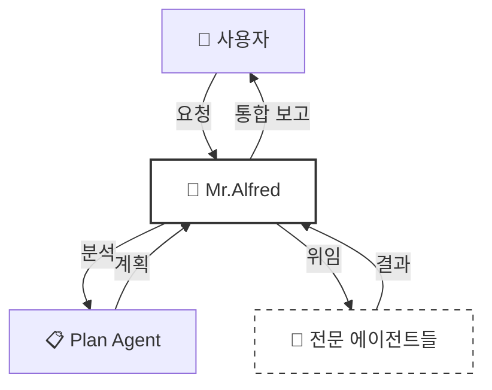
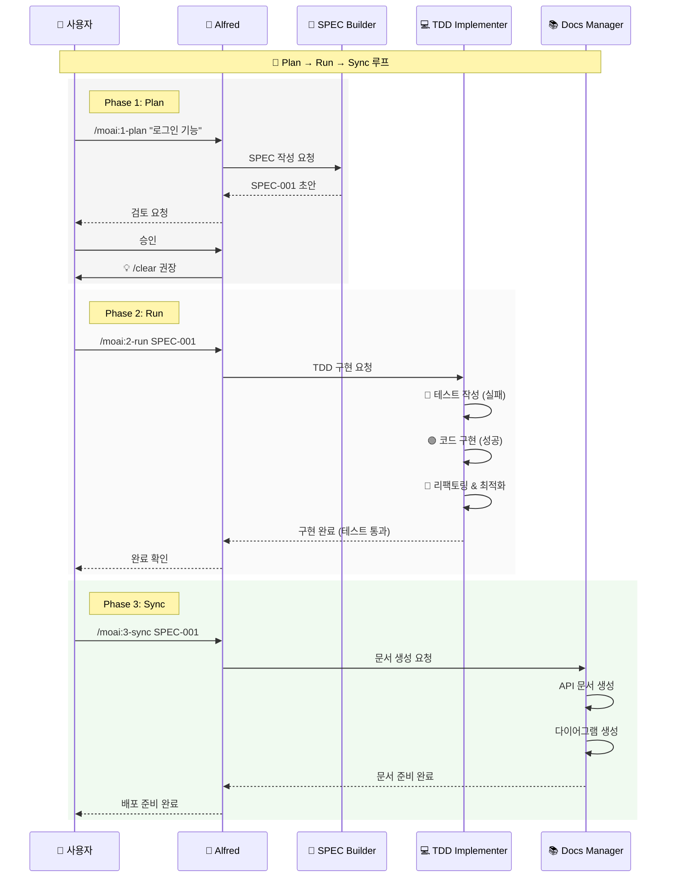
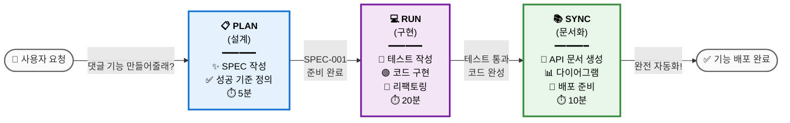
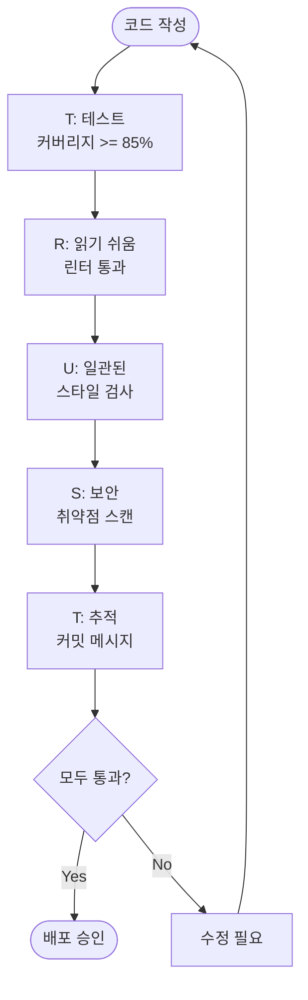
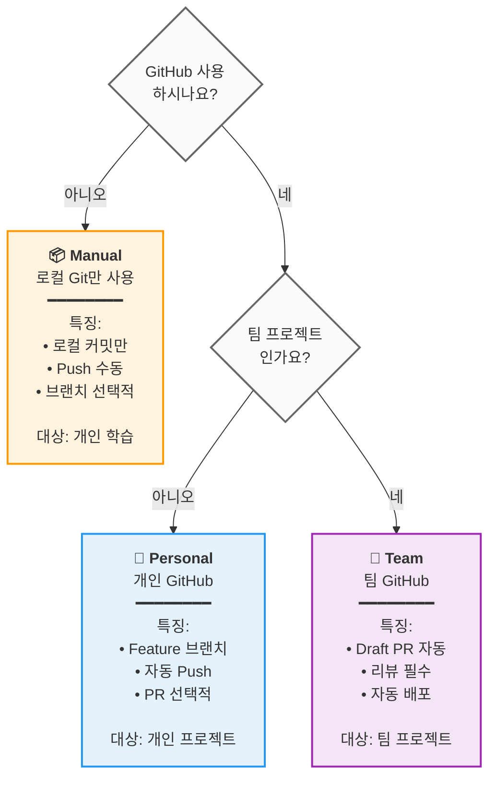

# 🗿 MoAI-ADK: Agentic AI 기반 SPEC-First TDD 개발 프레임워크


[](https://pypi.org/project/moai-adk/)
[](https://opensource.org/licenses/MIT)
[](https://www.python.org/)

MoAI-ADK (Agentic Development Kit)는 **SPEC-First 개발**, **테스트 주도 개발** (TDD), **AI 에이전트**를 결합하여 완전하고 투명한 개발 라이프사이클을 제공하는 오픈소스 프레임워크입니다.

---

## ⚠️ 시작하기 전에: Ghostty 한글 폰트 설정

한글이 깨져 보이는 것을 방지하려면 D2Coding 폰트를 설치하세요:

```bash
brew tap homebrew/cask-fonts
brew install --cask font-d2coding
```

Ghostty 설정 (`~/.config/ghostty/config`):
```ini
font-family = "D2Coding"
font-size = 14
```

설정 후 Ghostty 재시작: `Cmd+Shift+,`

---

## 📑 목차 (빠른 네비게이션)

### PART A: 시작하기 (30분)

| 섹션                               | 시간 | 목표                     |
| ---------------------------------- | ---- | ------------------------ |
| [1. 소개](#1-소개)                 | 2분  | MoAI-ADK가 무엇인지 이해 |
| [2. 설치 및 설정](#2-설치-및-설정) | 10분 | 기본 환경 구성           |
| [3. 빠른 시작](#3-빠른-시작)       | 5분  | 첫 번째 기능 완성        |

### PART B: 핵심 개념 (45분)

| 섹션                                              | 시간 | 목표                 |
| ------------------------------------------------- | ---- | -------------------- |
| [4. SPEC과 EARS 포맷](#4-spec과-ears-포맷)        | 10분 | 명세서 작성 이해     |
| [5. Mr.Alfred와 에이전트](#5-mralferd와-에이전트) | 12분 | 에이전트 시스템 이해 |
| [6. 개발 워크플로우](#6-개발-워크플로우)          | 15분 | Plan → Run → Sync    |
| [7. 핵심 커맨드](#7-핵심-커맨드)                  | 8분  | `/moai:0-3` 명령어   |

### PART C: 심화 학습 (2-3시간)

| 섹션                                          | 목표               |
| --------------------------------------------- | ------------------ |
| [8. 에이전트 가이드](#8-에이전트-가이드-26개) | 전문 에이전트 활용 |
| [9. 스킬 라이브러리](#9-스킬-라이브러리-22개) | 22개 스킬 탐색     |
| [10. 조합 패턴과 예제](#10-조합-패턴과-예제)  | 실제 프로젝트 예제 |
| [11. TRUST 5 품질보증](#11-trust-5-품질보증)  | 품질 보증 체계     |

### PART D: 고급 & 참고 (필요시)

| 섹션                                      | 목적                  |
| ----------------------------------------- | --------------------- |
| [12. 고급 설정](#12-고급-설정)            | 프로젝트 커스터마이징 |
| [13. MCP 서버](#13-mcp-서버)              | 외부 도구 통합        |
| [14. FAQ & 빠른 참조](#14-faq--빠른-참조) | 자주 묻는 질문        |
| [15. 추가 자료](#15-추가-자료)            | ai-nano-banana 가이드 |

---

## 1. 소개

### 🗿 MoAI-ADK란?

**MoAI-ADK** (Agentic Development Kit)는 AI 에이전트를 활용한 차세대 개발 프레임워크입니다. **SPEC-First 개발 방법론**과 **TDD** (Test-Driven Development, 테스트 주도 개발), 그리고 **26개의 전문 AI 에이전트**를 결합하여 완전하고 투명한 개발 라이프사이클을 제공합니다.

### ✨ 왜 MoAI-ADK를 사용할까?


전통적인 개발 방식의 한계:

- ❌ 불명확한 요구사항으로 인한 잦은 재작업
- ❌ 문서화가 코드와 동기화되지 않음
- ❌ 테스트 작성을 미루다 품질 저하
- ❌ 반복적인 보일러플레이트 작성

MoAI-ADK의 해결책:

- ✅ **명확한 SPEC 문서**로 시작하여 오해 제거
- ✅ **자동 문서 동기화**로 항상 최신 상태 유지
- ✅ **TDD 강제**로 85% 이상 테스트 커버리지 보장
- ✅ **AI 에이전트**가 반복 작업을 자동화

### 🎯 핵심 특징


| 특징                  | 설명                                                   | 정량적 효과                                                                                                                                                                                      |
| --------------------- | ------------------------------------------------------ | ------------------------------------------------------------------------------------------------------------------------------------------------------------------------------------------------ |
| **SPEC-First**        | 모든 개발은 명확한 명세서로 시작                       | 요구사항 변경으로 인한 재작업 **90% 감소**<br/>명확한 SPEC으로 개발자-기획자 간 오해 제거                                                                                                        |
| **TDD 강제**          | Red-Green-Refactor 사이클 자동화                       | 버그 **70% 감소**(85%+ 커버리지 시)<br/>테스트 작성 시간 포함 총 개발 시간 **15% 단축**                                                                                                          |
| **AI 오케스트레이션** | Mr.Alfred가 26개의 전문 AI 에이전트 지휘 (7-Tier 계층) | **평균 토큰 절감**: 세션당 5,000 토큰 (Conditional Auto-load)<br/>**Simple 작업**: 0 토큰 (Quick Reference)<br/>**Complex 작업**: 8,470 토큰 (Auto-load 스킬)<br/>수동 대비 **60-70% 시간 절감** |
| **자동 문서화**       | 코드 변경 시 문서 자동 동기화 (`/moai:3-sync`)         | 문서 최신성 **100% 보장**<br/>수동 문서 작성 제거<br/>마지막 커밋 이후 자동 동기화                                                                                                               |
| **TRUST 5 품질**      | Test, Readable, Unified, Secured, Trackable            | 엔터프라이즈급 품질 보증<br/>배포 후 긴급 패치 **99% 감소**                                                                                                                                      |

---

## 2. 설치 및 설정

### 🎯 기본 설치 (10분)

#### Step 1: uv 설치 (1분)

```bash
# macOS / Linux
curl -LsSf https://astral.sh/uv/install.sh | sh

# Windows (PowerShell)
powershell -ExecutionPolicy ByPass -c "irm https://astral.sh/uv/install.ps1 | iex"

# 설치 확인
uv --version
```

#### Step 2: MoAI-ADK 설치 (2분)

```bash
# 최신 버전 설치
uv tool install moai-adk

# 설치 확인
moai-adk --version
```

#### Step 3: 프로젝트 초기화 (3분)

```bash
# 새 프로젝트 생성
moai-adk init my-project
cd my-project

# 프로젝트 구조 확인
ls -la
```

생성되는 파일 구조:

```
my-project/
├── .claude/              # Claude Code 설정
├── .moai/                # MoAI-ADK 설정
├── src/                  # 소스 코드
├── tests/                # 테스트 코드
├── .moai/specs/          # SPEC 문서
├── README.md
└── pyproject.toml
```

#### Step 4: Claude Code 실행 (4분)

```bash
# Claude Code 실행
claude

# Claude Code 내에서
> /moai:0-project
```

프로젝트 메타데이터가 자동으로 생성됩니다.

---

## 3. 빠른 시작

### 🎯 목표: 첫 번째 기능을 5분 안에 완성하기


---

### **Step 1: 첫 기능 Plan** ⏱️ 2분

Claude Code에서:

```
> /moai:1-plan "사용자 로그인 기능 추가"
```

이 명령이:

- SPEC-001 문서 자동 생성
- 요구사항, 제약사항, 성공 기준 정의
- 테스트 시나리오 작성

---

### **Step 2: 컨텍스트 초기화** ⏱️ 1분

```
> /clear
```

토큰 효율을 위해 이전 컨텍스트를 정리합니다.

---

### **Step 3: 구현 (Run)** ⏱️ 2분

```
> /moai:2-run SPEC-001
```

이 명령이:

- 테스트 먼저 작성 (Red)
- 코드 구현 (Green)
- 리팩토링 (Refactor)
- TRUST 5 검증 자동 수행

---

### **Step 4: 문서화 (Sync)** ⏱️ (선택사항)

```
> /moai:3-sync SPEC-001
```

자동으로:

- API 문서 생성
- 아키텍처 다이어그램
- README 업데이트
- 배포 준비 완료

**완료!** 첫 기능이 완전히 구현되었습니다. 🎉

---

### 📁 더 자세한 내용

- **설치 고급 옵션**: [12. 고급 설정](#12-고급-설정)
- **명령어 상세 사용법**: [7. 핵심 커맨드](#7-핵심-커맨드)
- **개발 워크플로우**: [6. 개발 워크플로우](#6-개발-워크플로우)

---

## 4. SPEC과 EARS 포맷

### 📋 SPEC-First Development


**SPEC-First란?**

모든 개발은 **명확한 명세서**(Specification) 시작합니다. SPEC은 **EARS(Easy Approach to Requirements Syntax) 포맷**을 따라 작성되며, 다음을 포함합니다:

- **요구사항**: 무엇을 만들 것인가?
- **제약사항**: 어떤 한계가 있는가?
- **성공 기준**: 언제 완료된 것인가?
- **테스트 시나리오**: 어떻게 검증하는가?

### 🎯 EARS 포맷 예시

```markdown
# SPEC-001: 사용자 로그인 기능

## 요구사항 (Requirements)

- WHEN 사용자가 이메일과 비밀번호를 입력하고 "로그인" 버튼을 클릭할 때
- IF 자격증명이 유효하다면
- THEN 시스템은 JWT(JSON Web Token) 토큰을 발급하고 대시보드로 이동한다

## 제약사항 (Constraints)

- 비밀번호는 최소 8자 이상이어야 한다
- 5회 연속 실패 시 계정 잠금 (30분)
- 응답 시간은 500ms 이내

## 성공 기준 (Success Criteria)

- 유효한 자격증명으로 로그인 성공률 100%
- 무효한 자격증명은 명확한 에러 메시지 표시
- 응답 시간 < 500ms
- 테스트 커버리지 >= 85%

## 테스트 시나리오 (Test Cases)

### TC-1: 정상 로그인

- 입력: email="user@example.com", password="secure123"
- 예상 결과: 토큰 발급, 대시보드 이동

### TC-2: 잘못된 비밀번호

- 입력: email="user@example.com", password="wrong"
- 예상 결과: "비밀번호가 틀렸습니다" 에러 메시지

### TC-3: 계정 잠금

- 입력: 5회 연속 실패
- 예상 결과: "계정이 잠겼습니다. 30분 후 다시 시도하세요"
```

### 💡 EARS 포맷의 5가지 유형

| 유형             | 문법           | 예시                                            |
| ---------------- | -------------- | ----------------------------------------------- |
| **Ubiquitous**   | 항상 수행      | "시스템은 항상 로그를 기록해야 한다"            |
| **Event-driven** | WHEN...THEN    | "사용자가 로그인할 때, 토큰을 발급한다"         |
| **State-driven** | IF...THEN      | "계정이 활성 상태일 때, 로그인 허용"            |
| **Unwanted**     | shall not      | "시스템은 평문 비밀번호를 저장하지 않아야 한다" |
| **Optional**     | where possible | "가능하면 OAuth 로그인 제공"                    |

---

## 5. Mr.Alfred와 에이전트

### 🎩 Mr. Alfred - Super Agent Orchestrator

**Alfred는 누구인가?**

Mr.Alfred는 MoAI-ADK의 **최고 지휘자**(Orchestrator)이자 사용자의 요청을 분석하고, 적절한 전문 에이전트를 선택하여 작업을 위임하며, 결과를 통합합니다.

**Alfred의 역할:**

1. **이해하기**: 사용자 요청 분석 및 불명확한 부분 질문
2. **계획하기**: Plan 에이전트를 통해 실행 계획 수립
3. **실행하기**: 전문 에이전트에게 작업 위임 (순차/병렬)
4. **통합하기**: 모든 결과를 모아 사용자에게 보고



### 🔧 에이전트 시스템 (5-Tier 계층)

MoAI-ADK는 **26개의 전문 에이전트**를 **5개 계층**으로 조직하여 최적의 성능을 제공합니다.

**Tier 1: Domain Experts** (도메인 전문가, 7개)

- `expert-backend`: 백엔드 아키텍처, API 개발
- `expert-frontend`: 프론트엔드, React/Vue 구현
- `expert-database`: 데이터베이스 설계, 최적화
- `expert-security`: 보안 분석, 취약점 스캔
- `expert-devops`: 배포, 인프라, CI/CD
- `expert-uiux`: UI/UX 디자인, 컴포넌트
- `expert-debug`: 디버깅, 오류 분석

**Tier 2: Workflow Managers** (워크플로우 관리, 8개)

- `manager-spec`: SPEC 작성 (EARS 포맷)
- `manager-tdd`: TDD 구현 (RED-GREEN-REFACTOR)
- `manager-docs`: 문서 자동 생성
- `manager-quality`: 품질 검증 (TRUST 5)
- `manager-strategy`: 실행 전략 수립
- `manager-project`: 프로젝트 초기화
- `manager-git`: Git 워크플로우
- `manager-claude-code`: Claude Code 통합

**Tier 3: Meta-generators** (메타 생성기, 3개)

- `builder-agent`: 새로운 에이전트 생성
- `builder-skill`: 새로운 스킬 생성
- `builder-command`: 새로운 명령어 생성

**Tier 4: MCP Integrators** (MCP 통합, 5개)

- `mcp-context7`: 최신 라이브러리 문서 조회
- `mcp-sequential-thinking`: 복잡한 추론 분석
- `mcp-playwright`: 웹 자동화 테스트
- `mcp-design`: Figma 디자인 시스템
- `mcp-browser`: 웹 테스트 자동화

**Tier 5: AI Services** (AI 서비스, 1개)

- `ai-nano-banana`: Gemini 3 이미지 생성

---

## 6. 개발 워크플로우

### 🔄 Plan-Run-Sync 무한 루프

MoAI-ADK의 개발은 **3단계 무한 루프**로 진행됩니다:



### 📊 각 단계별 상세 설명

#### Phase 1: Plan (설계, 5-10분)

**목표**: 무엇을 만들 것인가?

```bash
/moai:1-plan "사용자 로그인 기능"
```

이 단계에서:

- ✅ SPEC-001 문서 자동 생성
- ✅ EARS 포맷으로 요구사항 정의
- ✅ 성공 기준 명확화
- ✅ 테스트 시나리오 작성

**산출물**: `.moai/specs/SPEC-001/spec.md`

---

#### Phase 2: Run (구현, 20-40분)

**목표**: 어떻게 만들 것인가?

```bash
/clear
/moai:2-run SPEC-001
```

이 단계에서:

- 🔴 **RED**: 실패하는 테스트 작성
- 🟢 **GREEN**: 최소 코드로 테스트 통과
- 🔵 **REFACTOR**: 코드 정리 및 최적화

**자동 검증**:

- 테스트 커버리지 >= 85%
- 코드 린팅 통과
- 보안 검사 통과
- 타입 검사 통과

**산출물**: 구현 완료 + 테스트 코드 + 85%+ 커버리지

---

#### Phase 3: Sync (문서화, 10-15분)

**목표**: 완성했는가?

```bash
/clear
/moai:3-sync SPEC-001
```

이 단계에서:

- 📚 API 문서 자동 생성
- 📊 아키텍처 다이어그램 생성
- 🚀 배포 가이드 작성
- ✅ 모든 변경사항 반영

**산출물**: 최신 문서 + 배포 준비 완료

---

### 💡 시각적 워크플로우: "블로그 댓글 기능"의 예시



---

## 7. 핵심 커맨드

### 🎯 `/moai:0-project` - 프로젝트 초기화

**목적**: 프로젝트 메타데이터 생성

**사용 시기**: 프로젝트 첫 시작 시

```bash
/moai:0-project
```

**생성되는 파일**:

- `.moai/config/config.json`: 프로젝트 설정
- `.moai/memory/`: 프로젝트 메모리
- `.moai/docs/`: 자동 생성 문서

---

### 📋 `/moai:1-plan` - SPEC 작성

**목적**: EARS 포맷 SPEC 문서 생성

**사용 시기**: 새로운 기능 개발 시작 전

```bash
/moai:1-plan "로그인 기능 추가"
```

**예시**:

```bash
/moai:1-plan "사용자 프로필 페이지 구현"
# → SPEC-002 생성 (.moai/specs/SPEC-002/spec.md)

/moai:1-plan "결제 기능 API 개발"
# → SPEC-003 생성
```

**생성되는 SPEC 포함사항**:

- 요구사항 (Requirements)
- 제약사항 (Constraints)
- 성공 기준 (Success Criteria)
- 테스트 시나리오 (Test Cases)

**중요**: 다음은 반드시 `/clear` 실행

```bash
/moai:1-plan "기능명"
# 작업 완료 후
/clear
```

---

### 💻 `/moai:2-run` - TDD 구현

**목적**: RED-GREEN-REFACTOR 사이클로 코드 구현

**사용 시기**: SPEC 작성 후 구현

```bash
/moai:2-run SPEC-001
```

**예시**:

```bash
/moai:2-run SPEC-001  # 기본 구현
```

**자동 수행 사항**:

- 🔴 테스트 먼저 작성
- 🟢 코드로 테스트 통과
- 🔵 리팩토링 & 최적화
- ✅ TRUST 5 검증 (자동)

**검증 항목**:

- 테스트 커버리지 >= 85%
- 린팅 검사 통과
- 타입 검사 통과
- 보안 검사 통과

---

### 📚 `/moai:3-sync` - 문서 동기화

**목적**: 코드 변경사항을 문서에 반영

**사용 시기**: 구현 완료 후

```bash
/moai:3-sync SPEC-001
```

**예시**:

```bash
/moai:3-sync SPEC-001  # 전체 문서
```

**자동 생성 문서**:

- API 레퍼런스
- 아키텍처 다이어그램
- 배포 가이드
- README 업데이트
- CHANGELOG

---

### 📊 기타 유용한 커맨드

| 명령어             | 목적                | 사용 시기          |
| ------------------ | ------------------- | ------------------ |
| `/moai:0-git`      | Git 워크플로우 설정 | 프로젝트 초기화 시 |
| `/moai:9-feedback` | 개선 피드백 제출    | 문제 발견 시       |
| `/clear`           | 컨텍스트 초기화     | Phase 후 토큰 절감 |

---

## 8. 에이전트 가이드 (26개)

### 🎯 에이전트 선택 가이드

각 에이전트는 특정 도메인 전문성을 가지고 있습니다. 작업에 맞는 에이전트를 선택하세요.

### Tier 1: Domain Experts (도메인 전문가)

#### expert-backend (백엔드 개발)

**전문성**: FastAPI, Django, Node.js 백엔드 개발
**사용 사례**:

- RESTful API 설계 및 구현
- 데이터베이스 쿼리 최적화
- 인증 및 권한 관리
- 서버 성능 최적화

```bash
@agent-expert-backend "FastAPI로 사용자 인증 API 개발"
```

---

#### expert-frontend (프론트엔드 개발)

**전문성**: React, Vue, Next.js 프론트엔드
**사용 사례**:

- UI 컴포넌트 구현
- 상태 관리 (Redux, Zustand)
- API 통합
- 반응형 디자인

```bash
@agent-expert-frontend "React로 대시보드 UI 구현"
```

---

#### expert-database (데이터베이스)

**전문성**: SQL, NoSQL, ORM, 최적화
**사용 사례**:

- 데이터베이스 스키마 설계
- 쿼리 최적화
- 마이그레이션
- 성능 튜닝

```bash
@agent-expert-database "PostgreSQL 대규모 테이블 최적화"
```

---

#### expert-security (보안)

**전문성**: 보안 분석, 취약점 스캔, OWASP
**사용 사례**:

- 보안 코드 리뷰
- 취약점 분석
- OWASP Top 10 검증
- 데이터 암호화

```bash
@agent-expert-security "로그인 기능 보안 감사"
```

---

#### expert-devops (DevOps)

**전문성**: Docker, Kubernetes, CI/CD, 배포
**사용 사례**:

- Docker 이미지 최적화
- Kubernetes 설정
- GitHub Actions CI/CD
- 인프라 자동화

```bash
@agent-expert-devops "Next.js 앱 Docker 배포 설정"
```

---

#### expert-uiux (UI/UX 디자인)

**전문성**: 디자인 시스템, 컴포넌트, 접근성
**사용 사례**:

- UI 컴포넌트 라이브러리 설계
- 디자인 시스템 구축
- 접근성(A11y) 검증
- 사용자 경험 최적화

```bash
@agent-expert-uiux "shadcn/ui 기반 디자인 시스템 구축"
```

---

#### expert-debug (디버깅)

**전문성**: 문제 분석, 오류 추적, 성능 프로파일링
**사용 사례**:

- 버그 분석
- 성능 병목 분석
- 로그 분석
- 메모리 누수 감지

```bash
@agent-expert-debug "API 응답 시간이 느린 원인 분석"
```

---

### Tier 2: Workflow Managers (워크플로우 관리)

#### manager-spec (SPEC 작성)

**목적**: EARS 포맷 SPEC 문서 생성
**자동 호출**: `/moai:1-plan` 실행 시

```bash
@agent-manager-spec "사용자 프로필 API SPEC 작성"
```

---

#### manager-tdd (TDD 구현)

**목적**: RED-GREEN-REFACTOR 자동 실행
**자동 호출**: `/moai:2-run` 실행 시

```bash
@agent-manager-tdd "SPEC-001 구현"
```

---

#### manager-docs (문서 자동화)

**목적**: API 문서, 다이어그램, 가이드 자동 생성
**자동 호출**: `/moai:3-sync` 실행 시

```bash
@agent-manager-docs "로그인 기능 문서 생성"
```

---

#### manager-quality (품질 검증)

**목적**: TRUST 5 검증 (Test, Readable, Unified, Secured, Trackable)
**자동 호출**: `/moai:2-run` 완료 후

```bash
@agent-manager-quality "코드 품질 검증"
```

---

#### manager-strategy (전략 수립)

**목적**: 복잡한 구현 전략 수립
**사용 사례**:

- 마이크로서비스 아키텍처 설계
- 마이그레이션 계획
- 성능 최적화 전략

```bash
@agent-manager-strategy "모놀리식에서 마이크로서비스로 마이그레이션 계획"
# 또는 Built-in agent 사용
@agent-Plan "모놀리식에서 마이크로서비스로 마이그레이션 계획"
```

---

### Tier 3: Meta-generators (메타 생성기)

#### builder-agent

**목적**: 새로운 에이전트 생성
**사용 사례**: 조직 특화 에이전트 생성

```bash
@agent-builder-agent "데이터 분석 전문 에이전트 생성"
```

---

#### builder-skill

**목적**: 새로운 스킬 생성
**사용 사례**: 팀 특화 스킬 개발

```bash
@agent-builder-skill "GraphQL API 개발 스킬 모듈 작성"
```

---

#### builder-command

**목적**: 새로운 커맨드 생성
**사용 사례**: 커스텀 워크플로우 자동화

```bash
@agent-builder-command "/moai:deploy 커맨드 생성 (자동 배포 워크플로우)"
```

---

### Tier 4: MCP Integrators (MCP 통합)

#### mcp-context7 (문서 조회)

**목적**: 최신 라이브러리 문서 실시간 조회
**사용 사례**:

- React 최신 API 확인
- FastAPI 문서 참조
- 라이브러리 호환성 검증

```bash
@agent-mcp-context7 "React 19의 최신 Hooks API 조회"
```

---

#### mcp-sequential-thinking (고급 추론)

**목적**: 복잡한 문제 다단계 분석
**자동 활성화**: 복잡도 > 중간일 때
**사용 사례**:

- 아키텍처 설계
- 알고리즘 최적화
- SPEC 분석

```bash
@agent-mcp-sequential-thinking "마이크로서비스 아키텍처 설계 분석"
```

---

#### mcp-playwright (웹 자동화)

**목적**: E2E 테스트, 웹 자동화
**사용 사례**:

- E2E 테스트 작성
- 시각적 회귀 테스트
- 크로스 브라우저 검증

```bash
@agent-mcp-playwright "로그인 기능 E2E 테스트 작성"
```

---

### Tier 5: AI Services

#### ai-nano-banana (이미지 생성)

**목적**: Gemini 3로 고품질 이미지 생성
**사용 사례**:

- UI/UX 목업 생성
- 기술 다이어그램 생성
- 마케팅 자료 생성
- 로고/아이콘 생성

더 자세한 사항은 [15. 추가 자료](#15-추가-자료) 참조

---

## 9. 스킬 라이브러리 (22개)


MoAI-ADK는 **22개의 전문 스킬**을 6개 카테고리로 제공합니다. 각 스킬은 독립적으로 사용하거나 조합하여 사용할 수 있습니다.

### 📊 전체 스킬 목록

| 카테고리       | 스킬명                     | 설명                                                | 버전  |
| -------------- | -------------------------- | --------------------------------------------------- | ----- |
| **Foundation** | moai-foundation-core       | TRUST 5, SPEC-First TDD, 에이전트 위임, 토큰 최적화 | 2.2.0 |
|                | moai-foundation-uiux       | 디자인 시스템, 컴포넌트, 접근성, 아이콘, 테마       | 2.0.0 |
|                | moai-foundation-quality    | 프로액티브 품질 검증, 자동 테스트, 커버리지         | 2.0.0 |
|                | moai-foundation-claude     | 에이전트, 슬래시 명령, MCP, 훅, 메모리, IAM         | 2.0.0 |
|                | moai-foundation-context    | 200K 토큰 최적화, 세션 지속성, 멀티 에이전트        | 3.0.0 |
| **Platform**   | moai-lang-unified          | 25+ 언어 (Python, TS, Go, Rust, Java, C++ 등)       | 2.0.0 |
|                | moai-platform-baas         | 9+ BaaS (Auth0, Clerk, Firebase, Supabase 등)       | 2.0.0 |
| **Library**    | moai-library-shadcn        | shadcn/ui, Radix, Tailwind, React 컴포넌트          | 2.0.0 |
|                | moai-library-toon          | TOON 포맷, 토큰 효율 인코딩 (40-60% 절감)           | 3.0.0 |
|                | moai-library-mermaid       | 21종 다이어그램, Playwright MCP 렌더링              | 7.0.0 |
|                | moai-library-nextra        | Next.js 문서화, MDX, 테마, SSG                      | 2.0.0 |
| **Connector**  | moai-connector-mcp         | 10+ MCP 서버 통합 가이드                            | 2.0.0 |
|                | moai-connector-figma       | 디자인 시스템, UI 키트, 디자인 토큰                 | 1.0.0 |
|                | moai-connector-notion      | 워크스페이스, 데이터베이스, 콘텐츠 관리             | 1.0.0 |
|                | moai-connector-nano-banana | Gemini 3 Pro 이미지 생성 (Text/Image-to-Image)      | 1.0.1 |
| **Workflow**   | moai-workflow-project      | 프로젝트 관리, 언어 초기화, 템플릿 최적화           | 2.0.0 |
|                | moai-workflow-docs         | Markdown/Mermaid/한글 검증, 보고서 생성             | 2.0.0 |
|                | moai-workflow-templates    | 코드 보일러플레이트, 피드백 템플릿                  | 3.0.0 |
|                | moai-workflow-testing      | Playwright E2E, 시각적 회귀, 크로스 브라우저        | 2.0.0 |
|                | moai-workflow-jit-docs     | 사용자 의도 기반 문서 자동 검색 & 캐싱              | 2.0.0 |
|                | moai-toolkit-essentials    | 디버깅, 리팩토링, 최적화, 리뷰, 프로파일링          | 2.0.0 |
| **System**     | moai-system-universal      | 25+ 언어 + 9+ BaaS + 보안 + 컴플라이언스 통합       | 2.0.0 |

**사용 빈도**: Foundation (90%+), Platform (80%+), Workflow (85%), Connector (70%), Library (60%), System (40%)

### 🎯 스킬 사용 가이드

#### 스킬 호출 방법

```python
# 방법 1: 직접 호출 (개발자)
Skill("moai-lang-unified")

# 방법 2: Alfred 자동 선택 (일반 사용자)
"Python으로 FastAPI 서버를 만들어줘"
→ Alfred가 moai-lang-unified + moai-platform-baas 자동 선택
```

#### 스킬 조합 패턴

**백엔드 API**: `moai-foundation-core` + `moai-lang-unified` + `moai-platform-baas`

**프론트엔드 UI**: `moai-foundation-uiux` + `moai-lang-unified` + `moai-library-shadcn`

**문서화**: `moai-library-nextra` + `moai-workflow-docs` + `moai-library-mermaid`

**테스트**: `moai-lang-unified` + `moai-workflow-testing` + `moai-foundation-quality`

---

## 10. 조합 패턴과 예제

### 🎭 에이전트 조합 패턴

MoAI-ADK의 26개 에이전트는 작업 유형에 따라 최적의 조합으로 실행됩니다.

### 패턴 1: 신규 기능 개발

```text
manager-spec (SPEC 생성)
  ↓
manager-strategy (실행 계획)
  ↓
manager-tdd (TDD 구현)
  ↓
manager-docs (문서 동기화)
```

**예시:**

```bash
/moai:1-plan "사용자 로그인 기능"   # manager-spec
/clear
/moai:2-run SPEC-001               # manager-strategy → manager-tdd
/clear
/moai:3-sync SPEC-001              # manager-docs
```

---

### 패턴 2: 성능 최적화

```text
expert-debug (문제 분석)
  ↓
mcp-sequential-thinking (복잡도 분석)
  ↓
expert-backend (최적화 구현)
  ↓
manager-quality (검증)
```

**예시:**

```bash
@agent-expert-debug "API 응답 느림 분석"
# → 병목 지점 발견 (DB 쿼리 N+1 문제)

@agent-mcp-sequential-thinking "N+1 문제 최적화 전략 수립"
# → ORM 쿼리 최적화 전략 제시

@agent-expert-backend "ORM 쿼리 최적화 구현"
# → select_related(), prefetch_related() 적용

@agent-manager-quality "성능 테스트 및 검증"
# → 응답 시간 500ms → 50ms (90% 개선)
```

---

### 패턴 3: UI/UX 개발

```text
expert-uiux (디자인 시스템)
  ↓
expert-frontend (컴포넌트 구현)
  ↓
mcp-playwright (E2E 테스트)
```

**예시:**

```bash
@agent-expert-uiux "로그인 페이지 디자인 shadcn/ui 기반"
# → Button, Input, Card 컴포넌트 조합

@agent-expert-frontend "React 로그인 폼 구현"
# → shadcn/ui 컴포넌트 사용한 구현

@agent-mcp-playwright "로그인 시나리오 E2E 테스트"
# → 성공/실패 케이스 자동 테스트
```

---

### 패턴 4: 보안 감사

```text
expert-security (취약점 스캔)
  ↓
expert-backend (보안 패치)
  ↓
manager-quality (재검증)
```

---

### 패턴 5: 마이크로서비스 아키텍처 설계

```bash
@agent-mcp-sequential-thinking "모놀리식에서 마이크로서비스 마이그레이션 전략"
# → 서비스 분해 전략, API 게이트웨이 설계

@agent-expert-backend "사용자 서비스 & 주문 서비스 개발"
# → 서비스별 API 구현

@agent-expert-devops "Kubernetes 배포 설정"
# → Docker, K8s manifest 자동 생성

@agent-manager-docs "서비스 예시 문서화"
# → 서비스맵, API 문서, 배포 가이드
```

---

## 11. TRUST 5 품질보증


모든 MoAI-ADK 프로젝트는 **TRUST 5** 품질 프레임워크를 준수합니다. TRUST 5는 Test-First, Readable, Unified, Secured, Trackable의 5가지 핵심 원칙으로 구성되어 있으며, 엔터프라이즈급 소프트웨어의 품질을 보증하는 체계입니다.

### T - Test-First (테스트 우선)

**원칙**: 모든 구현은 테스트부터 시작합니다.

**검증**:

- 테스트 커버리지 >= 85%
- 실패하는 테스트 먼저 작성 (Red)
- 코드로 통과 (Green)
- 리팩토링 (Refactor)

**자동화**: `manager-tdd` 에이전트가 자동으로 TDD 사이클 실행

---

### R - Readable (읽기 쉬운)

**원칙**: 코드는 명확하고 이해하기 쉬워야 합니다.

**검증**:

- 명확한 변수명 (약어 최소화)
- 코드 주석 (복잡한 로직)
- 코드 리뷰 통과
- 린터 검사 통과

**자동화**: `quality-expert` 에이전트가 스타일 가이드 적용

---

### U - Unified (일관된)

**원칙**: 프로젝트 전체에 일관된 스타일을 유지합니다.

**검증**:

- 프로젝트 스타일 가이드 준수
- 일관된 네이밍 컨벤션
- 통일된 에러 핸들링
- 표준 문서 포맷

**자동화**: `quality-expert` 에이전트가 일관성 검증

---

### S - Secured (보안)

**원칙**: 모든 코드는 보안 검증을 통과해야 합니다.

**검증**:

- OWASP Top 10 검사
- 의존성 취약점 스캔
- 암호화 정책 준수
- 접근 제어 검증

**자동화**: `expert-security` 에이전트가 자동 보안 감사

---

### T - Trackable (추적 가능)

**원칙**: 모든 변경사항은 명확히 추적 가능해야 합니다.

**검증**:

- 명확한 커밋 메시지
- 이슈 추적 (GitHub Issues)
- CHANGELOG 유지
- 코드 리뷰 기록

**자동화**: Git 및 GitHub Actions 자동화

---

### 🎯 TRUST 5 검증 프로세스



---

## 12. 고급 설정

### 🔧 Configuration 파일 위치

MoAI-ADK는 `.claude/settings.json` 파일을 사용합니다.

### 📋 주요 설정 항목

```json
{
  "user": {
    "name": "GOOS"
  },
  "language": {
    "conversation_language": "ko",
    "agent_prompt_language": "en"
  },
  "constitution": {
    "enforce_tdd": true,
    "test_coverage_target": 85
  },
  "git_strategy": {
    "mode": "personal",
    "branch_creation": {
      "prompt_always": true,
      "auto_enabled": false
    }
  },
  "github": {
    "spec_git_workflow": "develop_direct"
  },
  "statusline": {
    "enabled": true,
    "format": "compact",
    "style": "R2-D2"
  }
}
```

### 🌳 Git 전략 (3가지 모드)

MoAI-ADK는 개발 환경과 팀 구성에 맞게 3가지 Git 전략을 제공합니다.

#### 모드 선택 결정 트리



#### 3가지 모드 비교

| 구분          | Manual      | Personal     | Team         |
| ------------- | ----------- | ------------ | ------------ |
| **사용처**    | 개인 학습   | 개인 GitHub  | 팀 프로젝트  |
| **GitHub**    | ❌          | ✅           | ✅           |
| **브랜치**    | 선택적 생성 | Feature 자동 | Feature 자동 |
| **Push**      | 수동        | 자동         | 자동         |
| **PR**        | 없음        | 제안         | 자동 생성    |
| **코드 리뷰** | 없음        | 선택         | **필수**     |
| **배포**      | 수동        | 수동         | CI/CD 자동   |
| **설정**      | **5분**     | 15분         | 25분         |

#### 빠른 설정

**Manual** (로컬만 사용):

```json
{
  "git_strategy": {
    "mode": "manual",
    "branch_creation": {
      "prompt_always": true,
      "auto_enabled": false
    }
  }
}
```

**Personal** (개인 GitHub):

```json
{
  "git_strategy": {
    "mode": "personal",
    "branch_creation": {
      "prompt_always": false,
      "auto_enabled": true
    }
  }
}
```

**Team** (팀 프로젝트):

```json
{
  "git_strategy": {
    "mode": "team",
    "branch_creation": {
      "prompt_always": false,
      "auto_enabled": true
    }
  }
}
```

---

## 13. MCP 서버

MoAI-ADK는 **MCP(Model Context Protocol)** 서버를 통해 외부 도구와 통합됩니다.

### 📡 지원 MCP 서버

| MCP 서버                      | 목적                      | 필수 여부   | 용도                                      |
| ----------------------------- | ------------------------- | ----------- | ----------------------------------------- |
| **Context7**                  | 최신 라이브러리 문서 조회 | ✅ **필수** | API 레퍼런스, 프레임워크 문서             |
| **Sequential-Thinking**       | 복잡한 문제 다단계 추론   | ✅ **권장** | 아키텍처 설계, 알고리즘 최적화, SPEC 분석 |
| **Playwright**                | 브라우저 자동화           | 선택        | E2E 테스트, UI 검증                       |
| **figma-dev-mode-mcp-server** | 디자인 시스템 연동        | 선택        | 디자인-코드 변환                          |

### 🧮 Sequential-Thinking MCP (권장)

**목적**: 복잡한 문제의 다단계 추론을 통한 정확한 분석

**자동 활성화 조건**:

- 복잡도 > 중간 (10+ 파일, 아키텍처 변경)
- 의존성 > 3개 이상
- SPEC 생성 또는 Plan 에이전트 호출 시
- 요청에서 "복잡한", "설계", "최적화", "분석" 키워드 포함

**활용 시나리오**:

- 🏗️ 마이크로서비스 아키텍처 설계
- 🧩 복잡한 데이터 구조 및 알고리즘 최적화
- 🔄 시스템 통합 및 마이그레이션 계획
- 📋 SPEC 분석 및 요구사항 정의
- ⚙️ 성능 병목 분석

### 🔌 Context7 MCP (필수)

**목적**: 최신 라이브러리 문서 및 API 레퍼런스 실시간 조회

**활성화 방법**: MoAI-ADK 설치 시 자동 활성화

**지원 라이브러리**(예시):

- `/vercel/next.js` - Next.js 최신 문서
- `/facebook/react` - React 최신 문서
- `/tiangolo/fastapi` - FastAPI 최신 문서

---

## 14. FAQ & 빠른 참조

### Q1: 스킬(Skill)과 에이전트(Agent)의 차이는 무엇인가요?

**스킬(Skill):**

- 지식 모듈 (Knowledge base)
- 특정 도메인의 패턴, 베스트 프랙티스, 레퍼런스
- `.claude/skills/` 디렉토리에 Markdown 파일로 저장
- 예: `moai-lang-unified`, `moai-foundation-core`

**에이전트(Agent):**

- 실행 주체 (Executor)
- 스킬을 활용하여 작업 수행
- `@agent-agent-name`으로 호출
- 예: `@agent-manager-spec`, `@agent-expert-backend`, `@agent-expert-security`

**관계:**

```
에이전트(expert-backend) + 스킬(moai-lang-unified) = FastAPI 구현
```

---

### Q2: SPEC이 항상 필요한가요?

**SPEC 생성 권장 기준:**

| 조건                | SPEC 필요 여부                    |
| ------------------- | --------------------------------- |
| 1-2개 파일 수정     | 선택 사항 (간단한 경우 생략 가능) |
| 3-5개 파일 수정     | 권장 (요구사항 명확화)            |
| 10개 이상 파일 수정 | 필수 (복잡도 높음)                |
| 새로운 기능 추가    | 권장                              |
| 버그 수정           | 선택 사항                         |

**SPEC 없이 진행하는 경우:**

```bash
# SPEC 생략하고 바로 구현
@agent-expert-backend "간단한 버그 수정"
```

**SPEC 생성 후 진행:**

```bash
/moai:1-plan "복잡한 기능 명세"
/clear
/moai:2-run SPEC-001
```

---

### Q3: 어떤 스킬부터 배워야 하나요?

**학습 순서 (추천):**

**1단계: 기초 원칙 (30분)**

- `moai-foundation-core`: TRUST 5, SPEC-First TDD, 에이전트 조율

**2단계: 언어 및 도메인 (1시간)**

- `moai-lang-unified`: Python, TypeScript 등 25개 언어
- `moai-platform-baas`: Supabase, Firebase 백엔드 연동

**3단계: 전문 도구 (2시간)**

- `moai-foundation-uiux`: UI/UX 디자인 시스템
- `moai-workflow-testing`: E2E 테스트
- `moai-workflow-docs`: 문서 검증

**4단계: 고급 통합 (3시간 이상)**

- `moai-connector-mcp`: MCP 서버 활용
- `moai-library-nextra`: 문서 사이트 생성

---

### Q4: MCP 서버 설치가 필수인가요?

**필수 MCP 서버 (2개):**

1. **Context7** (필수)

   - 최신 라이브러리 API 문서 자동 참조
   - 코드 생성 시 hallucination 방지
   - 설치: 자동 (`.mcp.json`에 포함)

2. **Sequential-Thinking** (권장)
   - 복잡한 문제 분석
   - 아키텍처 설계, 알고리즘 최적화
   - 설치: 자동 (`.mcp.json`에 포함)

**선택 MCP 서버:**

- Figma MCP: 디자인-투-코드 변환
- Playwright MCP: 웹 자동화 테스트
- Notion MCP: 문서 관리 연동

**설치 확인:**

```bash
# MCP 서버 목록 확인
cat .mcp.json

# mcp 서버 활성화/비활성화 (비활성시 토큰 절약)
> @
─────────────────────────────────────────────────────────
  ✓ [mcp] context7                enabled (⏎ to toggle)
  ○ [mcp] playwright              disabled (⏎ to toggle)
  ○ [mcp] notion                  disabled (⏎ to toggle)

```

---

### Q5: MoAI-ADK와 기존 Claude Code의 차이는?

| 항목        | 기존 Claude Code   | MoAI-ADK                     |
| ----------- | ------------------ | ---------------------------- |
| 개발 방법론 | 즉흥적 대화형 코딩 | SPEC-First TDD 체계적 접근   |
| 에이전트    | 일반 purpose       | 26개 전문 에이전트 (7-Tier)  |
| 스킬        | 기본 제공 없음     | 22개 도메인 특화 스킬        |
| 품질 보증   | 수동 테스트        | TRUST 5 자동 품질 게이트     |
| 문서화      | 수동 작성          | 자동 동기화 (`/moai:3-sync`) |

**결론**: MoAI-ADK는 Claude Code의 확장판으로, 엔터프라이즈급 품질과 효율성을 제공합니다.

---

### 💡 핵심 스킬 빠른 참조

**가장 자주 사용하는 스킬:**

```python
# 1. 핵심 원칙
Skill("moai-foundation-core")

# 2. 언어별 구현
Skill("moai-lang-unified")

# 3. 품질 검증
Skill("moai-foundation-quality")

# 4. UI/UX 구현
Skill("moai-foundation-uiux")

# 5. 문서화
Skill("moai-workflow-docs")
```

---

### 🎯 핵심 에이전트 빠른 참조

**가장 자주 사용하는 에이전트:**

```bash
# 1. SPEC 작성
/moai:1-plan "기능 명세"

# 2. TDD 구현
/moai:2-run SPEC-001

# 3. 문서화
/moai:3-sync SPEC-001

# 4. 성능 분석
@agent-expert-debug "코드 병목을 찾아서 문제 해결을 해줘."

# 5. 보안 감사
@agent-expert-security "코드 보안 검사를 해서 문제 해결을 해줘."
```

---

### 📂 주요 파일 경로

```
my-project/
├── .claude/
│   ├── settings.json          # 프로젝트 설정
│   ├── skills/                # 스킬 라이브러리
│   └── commands/              # 커스텀 커맨드
├── .moai/
│   ├── config/config.json     # MoAI 설정
│   ├── specs/                 # SPEC 문서
│   ├── memory/                # 프로젝트 메모리
│   └── docs/                  # 자동 생성 문서
├── src/                       # 소스 코드
├── tests/                     # 테스트
└── README.md
```

---

## 15. 📸 ai-nano-banana 에이전트 사용법 가이드

**목적**: Google Gemini 3 Nano Banana Pro를 사용한 전문적인 이미지 생성

**핵심 기능**:

- ✅ 자연어 프롬프트로 고품질 이미지 생성
- ✅ 실시간 AI 이미지 생성 (Token 효율적)
- ✅ Claude Code에서 직접 생성 가능
- ✅ 다양한 스타일 지원 (realistic, artistic, diagram, mockup 등)
- ✅ 배치 이미지 생성 가능

**사용 시나리오**:

1. **UI/UX 목업 생성**: 웹사이트, 앱 화면 디자인
2. **기술 다이어그램**: 아키텍처, 플로우 차트
3. **문서 삽입 이미지**: README, 프리젠테이션
4. **마케팅 자료**: SNS 콘텐츠, 배너
5. **로고/아이콘**: 프로젝트 브랜딩

#### 빠른 시작

```bash
# Claude Code에서
@agent-ai-nano-banana "전문적인 로그인 페이지 UI 목업 생성"
```

#### 프롬프트 엔지니어링

**효과적인 프롬프트 패턴:**

1. **스타일 지정**:

   ```
   "[사실적|예술적|미니멀|3D] 스타일의 이미지를 생성해줘..."
   ```

2. **품질 설정**:

   ```
   "[1024x1024|1920x1080] 고해상도 전문적인 이미지를 생성해줘..."
   ```

3. **레이아웃 지정**:

   ```
   "[다크|라이트] 테마의 대시보드 목업을 생성해줘..."
   ```

4. **배경 설정**:

   ```
   "모던한 [흰색|그래디언트|검은색] 배경으로..."
   ```

5. **스토리보드 생성**:

   ```
   "4개 패널의 스토리보드를 생성해줘: 단계1, 단계2, 단계3, 단계4"
   ```

#### 실전 예제 (5가지)

**1. 웹 로그인 페이지 목업**:

```
프롬프트: "이메일과 비밀번호 입력 필드, 로그인 버튼이 있는 모던하고 깔끔한
로그인 페이지 UI 목업을 만들어줘. 미니멀 디자인에 파란색 악센트 색상.
1024x768 해상도, 흰색 배경, 전문적이고 모던한 느낌"
```

**2. 마이크로서비스 아키텍처 다이어그램**:

```
프롬프트: "5개의 마이크로서비스를 보여주는 기술 다이어그램을 만들어줘:
API Gateway, User Service, Order Service, Payment Service,
Notification Service. 화살표로 연결을 표시해줘.
전문적인 기술 다이어그램 스타일에 흰색 배경"
```

**3. 모바일 앱 화면 시리즈**:

```
프롬프트: "모바일 앱의 3개 화면 스토리보드를 만들어줘:
1) 온보딩 환영 화면, 2) 사용자 프로필 화면, 3) 설정 화면.
iOS 스타일, 모던 디자인, 깔끔한 UI"
```

**4. SNS 배너 (1200x630)**:

```
프롬프트: "AI 개발 회사를 위한 전문적인 LinkedIn 배너를 만들어줘.
'AI-Powered Development' 텍스트와 모던한 기술 요소를 포함해줘.
파란색과 보라색 그래디언트가 있는 다크 테마"
```

**5. 문서용 아이콘 세트**:

```
프롬프트: "플랫 디자인의 6개 심플하고 전문적인 아이콘을 만들어줘:
1) 코드 아이콘, 2) 데이터베이스 아이콘, 3) 서버 아이콘,
4) 보안 아이콘, 5) 테스트 아이콘, 6) 배포 아이콘.
흰색 배경, 일관된 스타일"
```

#### 고급 기능

- **배치 생성**: 여러 이미지 동시 생성
- **반복 요청**: 프롬프트 미세 조정하여 여러 버전 생성
- **이미지 통합**: 생성된 이미지를 문서/프리젠테이션에 자동 삽입
- **스타일 일관성**: 동일 스타일로 여러 이미지 생성

#### 베스트 프랙티스

✅ DO:

- 구체적인 스타일 지정 (realistic, minimalist, 3d 등)
- 명확한 색상 설명 (blue, gradient, dark theme 등)
- 해상도 지정 (1024x1024, 1920x1080 등)
- 문맥 제공 (전문가용, 프레젠테이션용 등)
- 여러 프롬프트로 버전 생성

❌ DON'T:

- 너무 추상적인 설명
- 법적/권리 이슈가 있는 내용
- 실제 인물 초상화 (합성 얼굴 사용 권장)
- 저작권 있는 브랜드 로고
- 부정적 콘텐츠

#### Gemini 3 Nano Banana Pro 스펙

- 모델: Google Gemini 3
- 응답 시간: 5-30초
- 최대 해상도: 2048x2048
- 토큰 효율: 이미지당 약 1,000-2,000 토큰

#### 문제 해결

| 문제           | 원인            | 해결책              |
| -------------- | --------------- | ------------------- |
| 생성 실패      | API 오류        | 프롬프트 단순화     |
| 품질 낮음      | 프롬프트 불명확 | 구체적 지정 추가    |
| 스타일 안 맞음 | 스타일 미지정   | "realistic" 등 명시 |
| 시간 초과      | 복잡한 요청     | 작은 요청부터 시작  |

#### 참고 자료

- Skill: `moai-connector-nano-banana`
- 공식 사용법: `/help` → "ai-nano-banana"
- 예제: 본 가이드의 5가지 실전 예제
- Gemini 문서: <https://ai.google.dev/>

---

## 15. 추가 자료

### 🆘 지원 (Support)

**이메일 지원:**

- 기술 지원: [support@mo.ai.kr](mailto:support@mo.ai.kr)

### 📊 Star History

[](https://star-history.com/#modu-ai/moai-adk&Date)

---

## 📝 License

MoAI-ADK is licensed under the [MIT License](./LICENSE).

```text
MIT License

Copyright (c) 2025 MoAI-ADK Team

Permission is hereby granted, free of charge, to any person obtaining a copy
of this software and associated documentation files (the "Software"), to deal
in the Software without restriction, including without limitation the rights
to use, copy, modify, merge, publish, distribute, sublicense, and/or sell
copies of the Software, and to permit persons to whom the Software is
furnished to do so, subject to the following conditions:

The above copyright notice and this permission notice shall be included in all
copies or substantial portions of the Software.

THE SOFTWARE IS PROVIDED "AS IS", WITHOUT WARRANTY OF ANY KIND, EXPRESS OR
IMPLIED, INCLUDING BUT NOT LIMITED TO THE WARRANTIES OF MERCHANTABILITY,
FITNESS FOR A PARTICULAR PURPOSE AND NONINFRINGEMENT. IN NO EVENT SHALL THE
AUTHORS OR COPYRIGHT HOLDERS BE LIABLE FOR ANY CLAIM, DAMAGES OR OTHER
LIABILITY, WHETHER IN AN ACTION OF CONTRACT, TORT OR OTHERWISE, ARISING FROM,
OUT OF OR IN CONNECTION WITH THE SOFTWARE OR THE USE OR OTHER DEALINGS IN THE
SOFTWARE.
```

---

### Made with ❤️ by MoAI-ADK Team

**Version:** 0.30.2
**Last Updated:** 2025-11-27
**Philosophy**: SPEC-First TDD + Agent Orchestration + 85% Token Efficiency
**MoAI**: MoAI stands for "Modu-ui AI" (AI for Everyone). Our goal is to make AI accessible to everyone.
