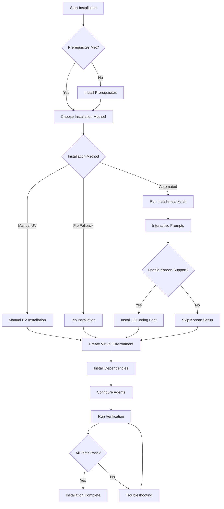

# MoAI-ADK Installation Schema

**Version**: 1.0.0
**Last Updated**: November 29, 2025

## 📋 Overview

This document describes the complete installation workflow schema, file structure, and configuration details for MoAI-ADK.

---

## 🏗️ Installation Workflow Schema

### **High-Level Installation Flow**



---

## 📁 Directory Structure

### **Complete File Hierarchy**

```
moai-adk/
├── _config/
│   └── install-moai-ko/              # Installation configuration
│       ├── .venv/                     # Virtual environment (created)
│       │   ├── bin/
│       │   │   ├── activate
│       │   │   ├── python -> python3.13
│       │   │   └── ...
│       │   ├── lib/
│       │   │   └── python3.13/
│       │   │       └── site-packages/
│       │   └── pyvenv.cfg
│       │
│       ├── agents/                    # Agent configurations
│       │   ├── spec-0.yaml
│       │   ├── spec-1.yaml
│       │   ├── spec-2.yaml
│       │   ├── spec-3.yaml
│       │   ├── spec-4.yaml
│       │   ├── tdd-10.yaml
│       │   ├── tdd-11.yaml
│       │   ├── tdd-12.yaml
│       │   ├── tdd-13.yaml
│       │   ├── tdd-14.yaml
│       │   ├── dev-20.yaml
│       │   ├── dev-21.yaml
│       │   ├── dev-22.yaml
│       │   ├── dev-23.yaml
│       │   ├── dev-24.yaml
│       │   ├── analysis-30.yaml
│       │   ├── analysis-31.yaml
│       │   ├── analysis-32.yaml
│       │   ├── analysis-33.yaml
│       │   ├── analysis-34.yaml
│       │   └── ... (26 total)
│       │
│       ├── config/                    # Configuration files
│       │   ├── moai.yaml             # Main configuration
│       │   ├── agents.yaml           # Agent definitions
│       │   ├── language.yaml         # Language settings
│       │   └── timeout.yaml          # Timeout settings
│       │
│       ├── docs/                      # Documentation
│       │   ├── 00-INSTALL-STEPS.md
│       │   ├── 01-REQUIREMENTS.md
│       │   ├── 02-INSTALLATION.md
│       │   ├── 03-KOREAN-SETUP.md
│       │   ├── 04-VERIFICATION.md
│       │   ├── 05-TROUBLESHOOTING.md
│       │   └── api/
│       │       ├── moai-adk-api.md
│       │       ├── korean-fonts.md
│       │       └── installation-schema.md
│       │
│       ├── ai_docs/                   # AI-scrapable docs
│       │   ├── README.md
│       │   ├── moai-adk-guide.md
│       │   ├── korean-setup.md
│       │   └── uv-inline-dependencies.md
│       │
│       ├── scripts/                   # Utility scripts
│       │   ├── configure-agents.py
│       │   ├── setup-agents.py
│       │   ├── verify-installation.py
│       │   └── korean-setup.sh
│       │
│       ├── logs/                      # Log files (created)
│       │   ├── moai.log
│       │   ├── installation.log
│       │   └── agents/
│       │       └── *.log
│       │
│       ├── outputs/                   # Generated outputs
│       │   ├── spec/
│       │   ├── tests/
│       │   ├── code/
│       │   └── docs/
│       │
│       ├── examples/                  # Example workflows
│       │   ├── spec-first-example.sh
│       │   ├── tdd-example.sh
│       │   └── korean-example.sh
│       │
│       ├── install-moai-ko.sh        # Main installation script
│       ├── moai.sh                    # MoAI-ADK command
│       ├── requirements.txt           # Python dependencies
│       ├── .env                       # Environment variables
│       ├── .gitignore
│       └── README.md
```

---

## ⚙️ Configuration Files

### **moai.yaml**

Main configuration file:

```yaml
# MoAI-ADK Configuration
version: "1.0.0"

general:
  installation_directory: "/Users/rdmtv/Documents/claydev-local/agent-os-v2/moai-adk/_config/install-moai-ko"
  output_directory: "outputs"
  log_directory: "logs"
  log_level: INFO
  cache_enabled: true
  cache_directory: ".moai/cache"

python:
  version: "3.13.0"
  virtual_env: ".venv"
  package_manager: "uv"

agents:
  total: 26
  max_concurrent: 5
  timeout: 300
  retry_attempts: 3
  configuration_directory: "agents"

language:
  default_locale: "ko_KR.UTF-8"
  input_encoding: "utf-8"
  output_encoding: "utf-8"
  korean_support_enabled: true
  font: "D2Coding"

spec_first:
  enabled: true
  phases:
    - specification    # /moai:0
    - pseudocode      # /moai:1
    - architecture    # /moai:2
    - refinement      # /moai:3
    - completion      # /moai:4

tdd:
  enabled: true
  test_framework: "jest"
  coverage_threshold: 80
  phases:
    - test_specification   # /moai:10
    - test_implementation  # /moai:11
    - code_implementation  # /moai:12
    - test_validation      # /moai:13
    - integration          # /moai:14

development:
  enabled: true
  agents:
    - frontend    # /moai:20
    - backend     # /moai:21
    - api         # /moai:22
    - database    # /moai:23
    - devops      # /moai:24

analysis:
  enabled: true
  agents:
    - code_review    # /moai:30
    - security       # /moai:31
    - performance    # /moai:32
    - refactoring    # /moai:33
    - documentation  # /moai:34

# AI providers (optional)
ai:
  enabled: false
  provider: "openai"
  model: "gpt-4"
  temperature: 0.7
  max_tokens: 4000
```

---

### **requirements.txt**

Python dependencies:

```txt
# Core Dependencies
pydantic>=2.5.0
pyyaml>=6.0.1
jinja2>=3.1.2
click>=8.1.7
rich>=13.7.0

# Agent Framework
langchain>=0.1.0
langchain-openai>=0.0.2
langchain-community>=0.0.10

# AI Providers (optional)
openai>=1.3.0
anthropic>=0.8.0
tiktoken>=0.5.2

# Utilities
python-dotenv>=1.0.0
requests>=2.31.0
aiohttp>=3.9.0

# Development
pytest>=7.4.0
pytest-asyncio>=0.21.0
black>=23.12.0
ruff>=0.1.8
```

---

### **.env**

Environment variables:

```bash
# MoAI-ADK Configuration
MOAI_HOME="/Users/rdmtv/Documents/claydev-local/agent-os-v2/moai-adk/_config/install-moai-ko"
MOAI_OUTPUT_DIR="outputs"
MOAI_LOG_LEVEL="INFO"
MOAI_LOG_DIR="logs"

# Python Configuration
PYTHONUTF8=1
PYTHONIOENCODING=utf-8
PYTHONPATH="${MOAI_HOME}:${PYTHONPATH}"

# Agent Configuration
MOAI_MAX_CONCURRENT_AGENTS=5
MOAI_AGENT_TIMEOUT=300
MOAI_AGENT_CONFIG_DIR="agents"

# Language Configuration
LANG=ko_KR.UTF-8
LC_ALL=ko_KR.UTF-8
LC_CTYPE=ko_KR.UTF-8
MOAI_LANG=ko_KR
MOAI_OUTPUT_LANGUAGE=auto

# AI Providers (optional - uncomment to use)
# OPENAI_API_KEY=sk-...
# ANTHROPIC_API_KEY=sk-ant-...

# Cache Configuration
MOAI_CACHE_ENABLED=true
MOAI_CACHE_DIR=".moai/cache"

# Debug Mode (uncomment for debugging)
# MOAI_DEBUG=true
# MOAI_VERBOSE=true
```

---

## 🚀 Installation Scripts

### **install-moai-ko.sh**

Main installation script structure:

```bash
#!/bin/bash
# MoAI-ADK Installation Script
# Version: 1.0.0

set -e  # Exit on error

# Color codes for output
RED='\033[0;31m'
GREEN='\033[0;32m'
YELLOW='\033[1;33m'
BLUE='\033[0;34m'
NC='\033[0m' # No Color

# Functions
print_header() { echo -e "${BLUE}$1${NC}"; }
print_success() { echo -e "${GREEN}✅ $1${NC}"; }
print_error() { echo -e "${RED}❌ $1${NC}"; }
print_warning() { echo -e "${YELLOW}⚠️  $1${NC}"; }

# 1. Check Prerequisites
check_prerequisites() {
    print_header "Checking prerequisites..."

    # Check Python version
    python_version=$(python3 --version 2>&1 | awk '{print $2}')
    required_version="3.11.0"

    if version_greater_equal "$python_version" "$required_version"; then
        print_success "Python $python_version detected"
    else
        print_error "Python 3.11+ required (found $python_version)"
        exit 1
    fi

    # Check UV
    if command -v uv &> /dev/null; then
        uv_version=$(uv --version | awk '{print $2}')
        print_success "UV $uv_version detected"
    else
        print_warning "UV not found. Installing..."
        curl -LsSf https://astral.sh/uv/install.sh | sh
    fi
}

# 2. Interactive Installation Method Selection
choose_installation_method() {
    print_header "Choose installation method:"
    echo "1) UV (Recommended - Fast, modern)"
    echo "2) Pip (Traditional - Slower)"
    echo "3) Exit"
    read -p "Your choice [1]: " choice
    choice=${choice:-1}

    case $choice in
        1) INSTALL_METHOD="uv" ;;
        2) INSTALL_METHOD="pip" ;;
        3) exit 0 ;;
        *) print_error "Invalid choice"; exit 1 ;;
    esac
}

# 3. Python Version Selection
choose_python_version() {
    print_header "Detecting Python versions..."

    # Find all Python 3.11+ installations
    pythons=()
    for py in python3.14 python3.13 python3.12 python3.11 python3; do
        if command -v $py &> /dev/null; then
            version=$($py --version 2>&1 | awk '{print $2}')
            if version_greater_equal "$version" "3.11.0"; then
                pythons+=("$py ($version)")
            fi
        fi
    done

    # Present selection
    echo "Available Python versions:"
    for i in "${!pythons[@]}"; do
        echo "$((i+1))) ${pythons[$i]}"
    done

    read -p "Select Python version [1]: " py_choice
    py_choice=${py_choice:-1}
    PYTHON_CMD=$(echo "${pythons[$((py_choice-1))]}" | awk '{print $1}')
}

# 4. Korean Support Selection
choose_korean_support() {
    print_header "🇰🇷 Korean Language Support"
    echo "This will install D2Coding font and configure Korean locale."
    read -p "Enable Korean support? (y/N): " korean_choice

    if [[ $korean_choice =~ ^[Yy]$ ]]; then
        KOREAN_SUPPORT=true
        install_korean_support
    else
        KOREAN_SUPPORT=false
        print_success "Korean support skipped (English-only mode)"
    fi
}

# 5. Virtual Environment Creation
create_virtual_environment() {
    print_header "Creating virtual environment..."

    if [ "$INSTALL_METHOD" = "uv" ]; then
        uv venv --python "$PYTHON_CMD"
    else
        $PYTHON_CMD -m venv .venv
    fi

    print_success "Virtual environment created at .venv/"

    # Activate virtual environment
    source .venv/bin/activate
    print_success "Virtual environment activated"
}

# 6. Dependency Installation
install_dependencies() {
    print_header "Installing dependencies..."

    if [ "$INSTALL_METHOD" = "uv" ]; then
        uv pip install -r requirements.txt
    else
        pip install --upgrade pip setuptools wheel
        pip install -r requirements.txt
    fi

    print_success "Dependencies installed"
}

# 7. Agent Configuration
configure_agents() {
    print_header "Configuring 26 agents..."

    python scripts/configure-agents.py

    print_success "Agents configured"
}

# 8. Korean Support Installation
install_korean_support() {
    print_header "Installing Korean support..."

    # Detect OS
    if [[ "$OSTYPE" == "darwin"* ]]; then
        # macOS
        brew tap homebrew/cask-fonts 2>/dev/null
        brew install --cask font-d2coding
    elif [[ "$OSTYPE" == "linux-gnu"* ]]; then
        # Linux
        bash scripts/korean-setup.sh
    fi

    # Set locale
    export LANG=ko_KR.UTF-8
    export LC_ALL=ko_KR.UTF-8

    print_success "Korean support installed"
}

# 9. Verification
run_verification() {
    print_header "Running verification tests..."

    python scripts/verify-installation.py

    if [ $? -eq 0 ]; then
        print_success "Verification complete!"
    else
        print_error "Verification failed. Check logs."
        exit 1
    fi
}

# Main Installation Flow
main() {
    print_header "🚀 MoAI-ADK Installation Starting..."

    check_prerequisites
    choose_installation_method
    choose_python_version
    choose_korean_support
    create_virtual_environment
    install_dependencies
    configure_agents
    run_verification

    print_header "✅ Installation Complete!"
    echo ""
    echo "Next steps:"
    echo "1. Activate virtual environment:"
    echo "   source .venv/bin/activate"
    echo ""
    echo "2. Test MoAI-ADK:"
    echo "   ./moai.sh --help"
    echo ""
    echo "3. Run first SPEC-First command:"
    echo "   ./moai.sh /moai:0 'Create hello world specification'"
}

# Execute main function
main
```

---

## 📊 Installation States

### **State Diagram**

```
[NOT_INSTALLED]
    ↓
[PREREQUISITES_CHECK]
    ↓ (pass)
[METHOD_SELECTION]
    ↓
[PYTHON_SELECTION]
    ↓
[KOREAN_SUPPORT_CHECK]
    ↓
[VENV_CREATION]
    ↓ (success)
[DEPENDENCY_INSTALLATION]
    ↓ (success)
[AGENT_CONFIGURATION]
    ↓ (success)
[VERIFICATION]
    ↓ (pass)
[INSTALLED]
    ↓
[READY_TO_USE]
```

---

## 🔍 Verification Schema

### **Verification Checklist**

```yaml
verification:
  checkpoints:
    1_python_environment:
      - python_version: ">=3.11.0"
      - virtual_env: "active"
      - venv_path: ".venv"

    2_core_dependencies:
      - pydantic: "installed"
      - yaml: "installed"
      - jinja2: "installed"

    3_agent_framework:
      - langchain: "installed"
      - agents_count: 26

    4_moai_command:
      - script_executable: true
      - help_command: "success"

    5_agent_availability:
      - spec_first: 5
      - tdd: 5
      - development: 5
      - analysis: 5

    6_spec_first_workflow:
      - phase_0_spec: "working"
      - phase_1_pseudocode: "working"
      - phase_2_architecture: "working"

    7_tdd_workflow:
      - test_spec: "working"
      - test_impl: "working"

    8_file_operations:
      - encoding: "utf-8"
      - read_write: "working"

    9_korean_support:
      - font: "d2coding (optional)"
      - locale: "ko_KR.UTF-8 (optional)"
      - display: "working (optional)"

    10_integration:
      - all_tests: "passing"
      - success_rate: ">=80%"
```

---

## 📞 Support

For schema-related questions:
- **Installation Guide**: `02-INSTALLATION.md`
- **Verification**: `04-VERIFICATION.md`
- **Troubleshooting**: `05-TROUBLESHOOTING.md`

---

**MoAI-ADK Installation Schema v1.0.0** - Complete installation architecture and workflow definition
