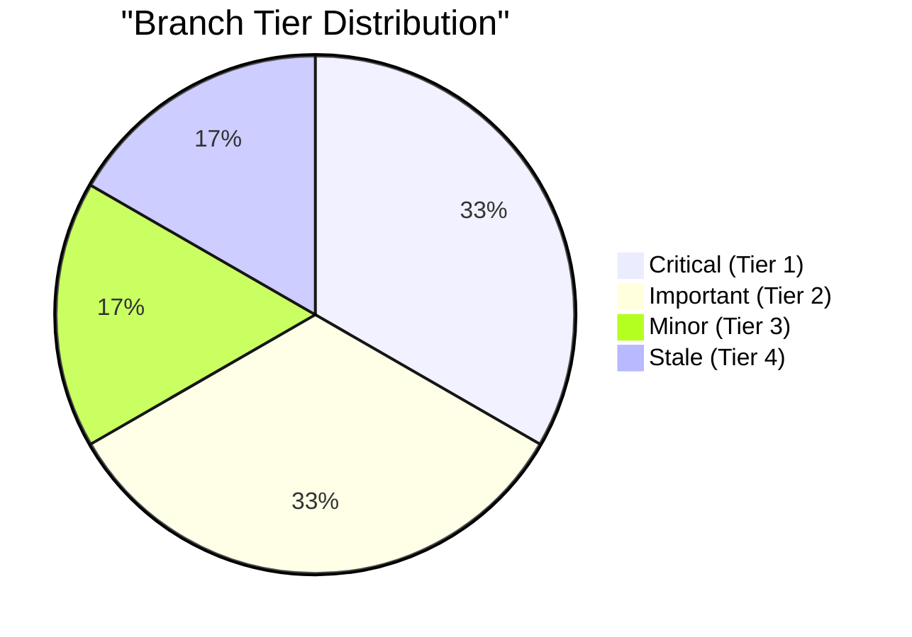
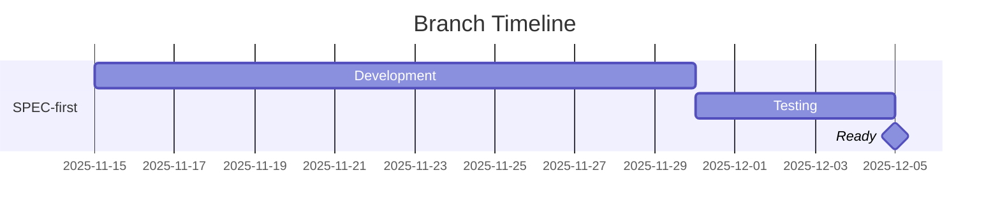

# Branch Learning Database

**Track branch scores, status, and improvements over time**

> **Version**: 1.0.0
> **Part of**: collector-learner skill
> **Last Updated**: 2025-12-04

---

## Purpose

The Branch Learning Database tracks branch history across multiple scans, enabling:

1. **Score Evolution**: Track how branch quality changes over time
2. **Status Tracking**: Monitor active, merged, stale, or abandoned branches
3. **Tier Classification**: Categorize branches by priority
4. **Improvement Detection**: Identify what each branch contributes

---

## Storage Location

```
.moai/flow/branch-history/
├── index.json              # Branch registry (all branches)
├── timeline.json           # Global score evolution
└── branches/
    └── {branch-name}.json  # Per-branch detailed history
```

---

## Schema Definitions

### Index Schema (index.json)

```json
{
  "version": "1.0.0",
  "last_updated": "2025-12-04T15:00:00Z",
  "default_repo": "superdisco-agents/moai-adk",
  "branches": [
    {
      "id": "feature/SPEC-first-builders",
      "repo": "superdisco-agents/moai-adk",
      "status": "active",
      "tier": 1,
      "last_score": 91,
      "last_scanned": "2025-12-04T15:00:00Z",
      "created_at": "2025-11-15",
      "merged_to_main": null,
      "file": "branches/feature-SPEC-first-builders.json"
    }
  ],
  "summary": {
    "total_branches": 5,
    "active": 3,
    "merged": 1,
    "stale": 1,
    "by_tier": {
      "1": 2,
      "2": 2,
      "3": 1
    }
  }
}
```

### Branch History Schema (branches/*.json)

```json
{
  "branch_id": "feature/SPEC-first-builders",
  "repo": "superdisco-agents/moai-adk",
  "display_name": "SPEC-First Builders",
  "description": "Implements SPEC-first development workflow for all builders",

  "metadata": {
    "created_at": "2025-11-15",
    "created_by": "developer",
    "last_commit": "2025-12-03T10:00:00Z",
    "commit_count": 47,
    "base_branch": "main"
  },

  "status": {
    "current": "active",
    "history": [
      {"date": "2025-11-15", "status": "created"},
      {"date": "2025-11-20", "status": "active"}
    ]
  },

  "tier": {
    "current": 1,
    "reason": "Score >= 90, introduces new capability",
    "auto_classified": true,
    "user_override": null
  },

  "score_history": [
    {
      "date": "2025-11-20",
      "score": 72,
      "breakdown": {
        "structure": 15,
        "documentation": 12,
        "functionality": 20,
        "quality": 15,
        "freshness": 10
      },
      "scanned_by": "collector-scanner v2.0.0"
    },
    {
      "date": "2025-12-01",
      "score": 85,
      "breakdown": {
        "structure": 17,
        "documentation": 16,
        "functionality": 22,
        "quality": 18,
        "freshness": 12
      },
      "delta": "+13",
      "scanned_by": "collector-scanner v2.0.0"
    },
    {
      "date": "2025-12-04",
      "score": 91,
      "breakdown": {
        "structure": 18,
        "documentation": 17,
        "functionality": 23,
        "quality": 19,
        "freshness": 14
      },
      "delta": "+6",
      "scanned_by": "collector-scanner v2.0.0"
    }
  ],

  "components": {
    "modified": ["builder-skill", "decision-framework", "moai-foundation-core"],
    "added": ["spec-first-workflow", "tdd-integration"],
    "component_scores": {
      "builder-skill": 88,
      "decision-framework": 91,
      "moai-foundation-core": 85
    }
  },

  "improvements": [
    {
      "id": "imp-001",
      "title": "SPEC-First Integration",
      "description": "All builders now support SPEC-driven development",
      "type": "feature",
      "impact": "high"
    },
    {
      "id": "imp-002",
      "title": "Workflow Automation",
      "description": "TOON-based workflow definitions for all builders",
      "type": "enhancement",
      "impact": "medium"
    }
  ],

  "merge_info": {
    "ready_for_main": true,
    "conflicts": [],
    "recommended_action": "Merge with priority",
    "pr_url": null,
    "merged_at": null,
    "merged_by": null
  },

  "notes": [
    {
      "date": "2025-12-01",
      "author": "user",
      "content": "Quality significantly improved after documentation update"
    }
  ]
}
```

### Timeline Schema (timeline.json)

```json
{
  "version": "1.0.0",
  "generated_at": "2025-12-04T15:00:00Z",
  "repo": "superdisco-agents/moai-adk",

  "events": [
    {
      "date": "2025-11-15",
      "type": "branch_created",
      "branch": "feature/SPEC-first-builders",
      "details": "New feature branch for SPEC-first development"
    },
    {
      "date": "2025-11-20",
      "type": "scan_completed",
      "branches_scanned": 3,
      "avg_score": 72
    },
    {
      "date": "2025-12-01",
      "type": "score_improved",
      "branch": "feature/SPEC-first-builders",
      "from": 72,
      "to": 85,
      "delta": "+13"
    },
    {
      "date": "2025-12-04",
      "type": "tier_upgrade",
      "branch": "feature/SPEC-first-builders",
      "from_tier": 2,
      "to_tier": 1,
      "reason": "Score reached 91"
    }
  ],

  "score_trends": {
    "feature/SPEC-first-builders": [
      {"date": "2025-11-20", "score": 72},
      {"date": "2025-12-01", "score": 85},
      {"date": "2025-12-04", "score": 91}
    ],
    "feature/workspace-consolidation": [
      {"date": "2025-11-25", "score": 65},
      {"date": "2025-12-02", "score": 78}
    ]
  }
}
```

---

## Operations

### 1. Register New Branch

When a new branch is discovered during scanning:

```yaml
register_branch:
  trigger: Branch found in scan, not in index
  action:
    1. Create branches/{sanitized-name}.json
    2. Add entry to index.json
    3. Add "branch_created" event to timeline.json
    4. Auto-classify tier based on initial score
```

### 2. Update Branch Score

After each scan:

```yaml
update_score:
  trigger: Scan completed for branch
  action:
    1. Calculate new score with breakdown
    2. Append to score_history
    3. Update last_score in index.json
    4. Check tier upgrade/downgrade
    5. Add event to timeline.json if significant change
```

### 3. Mark Branch Status

Track branch lifecycle:

```yaml
status_transitions:
  created → active: First scan completed
  active → merged: PR merged to main
  active → stale: No updates for 90 days
  stale → active: New commits detected
  stale → abandoned: No updates for 180 days
```

### 4. Tier Classification

Auto-classify based on score and characteristics:

```yaml
tier_rules:
  tier_1_critical:
    - score >= 90
    - OR: introduces_new_capability = true
    - OR: blocks_other_work = true

  tier_2_important:
    - score >= 75 AND score < 90
    - improves_existing = true

  tier_3_minor:
    - score >= 50 AND score < 75
    - OR: cosmetic_or_docs = true

  tier_4_stale:
    - last_updated > 90_days
    - no_recent_commits = true
```

---

## API Functions

### get_branch_history(branch_id)

```python
def get_branch_history(branch_id: str) -> BranchHistory:
    """
    Retrieve complete history for a branch.

    Returns:
        BranchHistory with score_history, status, tier, improvements
    """
    file_path = f".moai/flow/branch-history/branches/{sanitize(branch_id)}.json"
    return load_json(file_path)
```

### update_branch_score(branch_id, score, breakdown)

```python
def update_branch_score(
    branch_id: str,
    score: int,
    breakdown: ScoreBreakdown
) -> None:
    """
    Record new score for branch, update tier if needed.
    """
    history = get_branch_history(branch_id)

    # Add to score_history
    entry = {
        "date": today(),
        "score": score,
        "breakdown": breakdown,
        "delta": score - history.score_history[-1].score,
        "scanned_by": f"collector-scanner v{VERSION}"
    }
    history.score_history.append(entry)

    # Check tier
    new_tier = classify_tier(score, history)
    if new_tier != history.tier.current:
        history.tier.current = new_tier
        add_timeline_event("tier_change", branch_id, new_tier)

    save_history(branch_id, history)
    update_index(branch_id, score)
```

### get_tier_summary()

```python
def get_tier_summary() -> TierSummary:
    """
    Get count of branches by tier.

    Returns:
        {1: 2, 2: 3, 3: 1, 4: 1}  # tier -> count
    """
    index = load_index()
    return index.summary.by_tier
```

### get_score_trends(branch_id, days=30)

```python
def get_score_trends(branch_id: str, days: int = 30) -> List[ScorePoint]:
    """
    Get score evolution for Mermaid chart generation.
    """
    timeline = load_timeline()
    return timeline.score_trends.get(branch_id, [])
```

---

## Integration with Collector Agents

### collector-scanner Integration

After each scan:

```yaml
post_scan_hook:
  1. For each scanned branch:
     - Call update_branch_score()
     - Update component mappings
  2. Check for new branches → register_branch()
  3. Check for stale branches → update_status()
```

### collector-learner Integration

During analysis:

```yaml
learning_integration:
  1. Load branch history for context
  2. Compare current vs historical scores
  3. Identify improvement patterns
  4. Factor tier into recommendations
```

### collector-readme Integration

For README generation:

```yaml
readme_data:
  1. Get score_history for chart
  2. Get improvements list
  3. Get tier for badge
  4. Get merge_info for status
```

---

## Mermaid Chart Generation

### Score Evolution Chart

```mermaid
xychart-beta
    title "Branch Score Evolution"
    x-axis ["Nov 20", "Dec 01", "Dec 04"]
    y-axis "Score" 0 --> 100
    line [72, 85, 91]
```

### Tier Distribution Pie



### Timeline Gantt



---

## File Naming Convention

Branch names are sanitized for filesystem:

```
feature/SPEC-first-builders → feature-SPEC-first-builders.json
bugfix/auth-token-refresh  → bugfix-auth-token-refresh.json
main                       → main.json
```

---

## Retention Policy

```yaml
retention:
  active_branches: indefinite
  merged_branches: 180 days after merge
  stale_branches: 90 days after last activity
  abandoned_branches: 30 days after abandonment

  score_history:
    max_entries: 100
    compress_old: true  # Aggregate daily → weekly after 30 days
```

---

## Quick Reference

| Operation | File Modified | When |
|-----------|---------------|------|
| New branch found | index.json, new branch file | Scan |
| Score updated | branch file, index.json | Scan |
| Status changed | branch file, timeline.json | Lifecycle event |
| Tier changed | branch file, index.json | Score threshold crossed |
| Branch merged | All files | PR merged |

---

**Version**: 1.0.0 | **Status**: Production Ready | **Last Updated**: 2025-12-04
