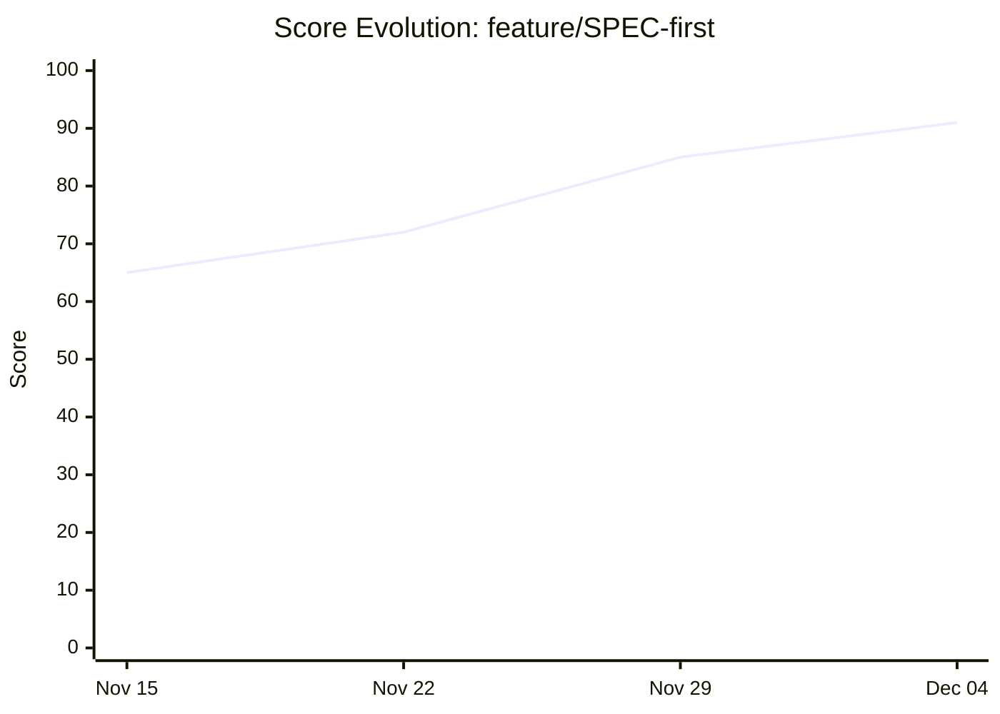
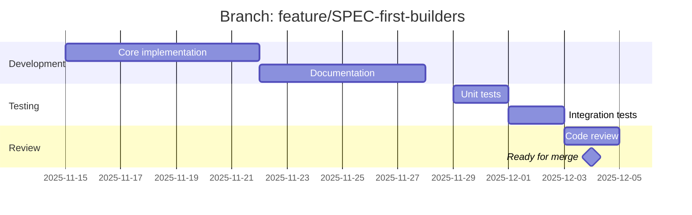
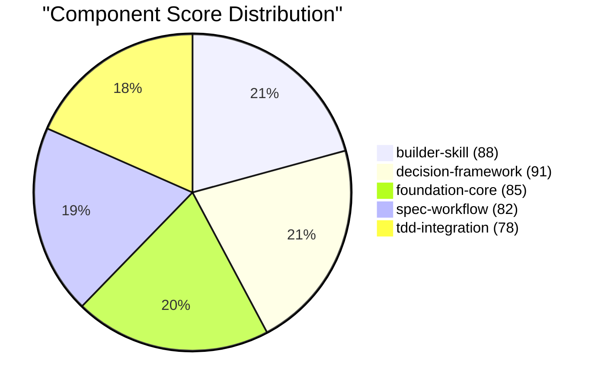

# 📚 Collector: README Generator

**Modern 2025 hyper-detailed documentation with charts, emojis, ANSI diagrams, and visual excellence**

> **Version**: 2.0.0
> **Status**: Production Ready
> **Style**: Modern 2025 with Visual Excellence
> **Part of**: MoAI Flow System

## Quick Reference

### Purpose

Generate comprehensive README documentation for each branch:
- Status badges and tier indicators
- Score evolution charts
- Improvement summaries
- Merge status and recommendations

### Quick Invocation

```python
Skill("collector-readme")
```

---

## TL;DR

- Generate high-quality branch README documentation with visual charts and status tracking
- Categorize changes by type: Agent, Skill, Workflow, TOON, Command, Hook
- Apply quality gates targeting 90/100 minimum score
- Status-specific guidance for ACTIVE, PR_OPEN, MERGED, STALE branches
- Automated TOON workflow for consistent README generation

---

## Modules

| Module | Description | Priority |
|--------|-------------|----------|
| `modern-2025-template.md` | 🎨 **NEW**: Hyper-detailed template with emojis, ANSI diagrams, charts | **Critical** |
| `readme-rules.md` | **Core rules**: Section requirements, ordering, content standards | Critical |
| `quality-gates.md` | **Validation**: 4-gate system, scoring formula, pass/fail criteria | Critical |
| `change-type-templates.md` | **Templates**: Agent, Skill, Workflow, TOON, Mixed change templates | High |
| `visual-enhancement-rules.md` | **Charts**: Mermaid templates, badge standards, anti-patterns | High |
| `best-practice-template.md` | **Reference**: Complete 10-section template with all variables | High |
| `readme-template.md` | Standard README structure and sections | Medium |
| `chart-sections.md` | Mermaid chart templates for READMEs | Medium |
| `status-badges.md` | Badge formatting and status indicators | Medium |

## Workflows

| Workflow | Description |
|----------|-------------|
| `readme-generation.toon.md` | 7-stage automated pipeline: Collect → Classify → Template → Generate → Visuals → Validate → Output |

---

## Level 1: README Structure

### Standard Branch README

Every branch README includes these sections:

```markdown
# Branch: {branch_name}

> **Status**: {status_badge} | **Tier**: {tier_badge} | **Score**: {score}/100

## Overview

{brief_description}

## Score Evolution

{score_chart}

## Improvements Introduced

{improvement_list}

## Components Modified

{component_table}

## Merge Status

{merge_info}

## Timeline

{timeline_gantt}

---

Generated: {timestamp}
Collector: v{version}
```

---

## Level 2: Section Templates

### Header Section

```markdown
# Branch: feature/SPEC-first-builders

> **Status**: Active | **Tier**: Tier 1: Critical | **Score**: 91/100

**Description**: Implements SPEC-first development workflow for all builder agents

| Attribute | Value |
|-----------|-------|
| Created | 2025-11-15 |
| Last Updated | 2025-12-04 |
| Commits | 47 |
| Base Branch | main |
```

### Score Evolution Section

```markdown
## Score Evolution

| Date | Score | Change | Notes |
|------|-------|--------|-------|
| Nov 15 | 65 | - | Initial branch |
| Nov 22 | 72 | +7 | Added core structure |
| Nov 29 | 85 | +13 | Documentation complete |
| Dec 04 | 91 | +6 | Quality refinements |

{mermaid_line_chart}
```

### Improvements Section

```markdown
## Improvements Introduced

This branch introduces the following improvements:

### 1. SPEC-First Integration
- **Type**: Feature
- **Impact**: High
- **Description**: All builders now support SPEC-driven development with automatic validation

### 2. Workflow Automation
- **Type**: Enhancement
- **Impact**: Medium
- **Description**: TOON-based workflow definitions for automated builder execution

### 3. Quality Gates
- **Type**: Enhancement
- **Impact**: High
- **Description**: Trust-5 validation at every build stage
```

### Components Section

```markdown
## Components Modified

| Component | Action | Score | Description |
|-----------|--------|-------|-------------|
| builder-skill | Enhanced | 88 | Added SPEC validation |
| decision-framework | Enhanced | 91 | New decision patterns |
| moai-foundation-core | Modified | 85 | SPEC field integration |
| spec-first-workflow | Added | 82 | New workflow system |
| tdd-integration | Added | 78 | TDD automation |

**Total**: 5 components (2 new, 3 enhanced)
```

### Merge Status Section

```markdown
## Merge Status

| Criterion | Status |
|-----------|--------|
| Ready for Main | Yes |
| Conflicts | None |
| CI Status | Passing |
| Reviews | 1 approved |

**Recommended Action**: Merge with priority

**Merge Command**:
```bash
/collector:merge feature/SPEC-first-builders --to main
```
```

### Timeline Section

```markdown
## Timeline

{mermaid_gantt_chart}

| Phase | Start | End | Duration |
|-------|-------|-----|----------|
| Development | Nov 15 | Nov 28 | 13 days |
| Testing | Nov 29 | Dec 02 | 4 days |
| Review | Dec 03 | Dec 04 | 2 days |
| Ready | Dec 04 | - | - |
```

---

## Level 3: Chart Templates

### Score Evolution Chart



### Development Timeline



### Component Score Breakdown



---

## Level 4: Status Badges

### Tier Badges

| Tier | Badge |
|------|-------|
| 1 | **Tier 1: Critical** |
| 2 | **Tier 2: Important** |
| 3 | **Tier 3: Minor** |
| 4 | **Tier 4: Stale** |

### Status Badges

| Status | Badge |
|--------|-------|
| Active | **Active** |
| Merged | **Merged** |
| Stale | **Stale** |
| Abandoned | **Abandoned** |

### Score Badges

| Range | Badge |
|-------|-------|
| 90+ | **Score: {N}/100** (Critical) |
| 75-89 | **Score: {N}/100** (Important) |
| 50-74 | **Score: {N}/100** (Minor) |
| <50 | **Score: {N}/100** (Low) |

---

## Level 5: Generation API

### generate_branch_readme(branch_id)

```python
def generate_branch_readme(branch_id: str) -> str:
    """
    Generate complete README for a branch.

    Args:
        branch_id: Branch identifier

    Returns:
        Complete markdown README content
    """
    history = load_branch_history(branch_id)
    template = load_template("branch-readme")

    # Build sections
    sections = {
        "header": build_header(history),
        "score_evolution": build_score_section(history),
        "improvements": build_improvements_section(history),
        "components": build_components_section(history),
        "merge_status": build_merge_section(history),
        "timeline": build_timeline_section(history)
    }

    # Render template
    return render_template(template, sections)
```

### update_branch_readme(branch_id)

```python
def update_branch_readme(branch_id: str) -> str:
    """
    Regenerate README with latest data.
    """
    readme = generate_branch_readme(branch_id)

    # Save to branch-specific location
    output_path = f".moai/docs/branches/{sanitize(branch_id)}/README.md"
    write_file(output_path, readme)

    return output_path
```

### generate_all_readmes()

```python
def generate_all_readmes() -> List[str]:
    """
    Generate/update READMEs for all tracked branches.
    """
    index = load_branch_index()
    paths = []

    for branch in index.branches:
        path = update_branch_readme(branch.id)
        paths.append(path)

    # Generate index README
    generate_branches_index(index)

    return paths
```

---

## Level 6: Output Locations

### Per-Branch README

```
.moai/docs/branches/
├── feature-SPEC-first-builders/
│   └── README.md
├── feature-workspace-consolidation/
│   └── README.md
├── main/
│   └── README.md
└── index.md  # All branches overview
```

### Branches Index

```markdown
# Branch Overview

| Branch | Status | Tier | Score | Last Updated |
|--------|--------|------|-------|--------------|
| [SPEC-first](./feature-SPEC-first-builders/README.md) | Active | 1 | 91 | Dec 04 |
| [workspace](./feature-workspace/README.md) | Active | 2 | 82 | Dec 03 |
| [main](./main/README.md) | Stable | - | 75 | Dec 04 |
```

---

## Level 7: Dated Filename Support

### Filename Format

Branch READMEs can use dated filenames for historical tracking:

```
{YYYY-MM-DD}_{branch-name}_{STATUS}.md
```

### Status Values

| Status | Description |
|--------|-------------|
| `MERGED` | Branch has been merged to main |
| `PENDING` | Branch awaiting review/merge |
| `ACTIVE` | Branch currently in development |
| `STALE` | Branch inactive for extended period |

### Example Filenames

```
2025-12-02_feature-macos-optimizer_MERGED.md
2025-12-02_main_status.md
2025-12-02_feature-SPEC-first_PENDING.md
2025-12-04_bugfix-auth-token_ACTIVE.md
2025-11-15_feature-old-experiment_STALE.md
```

### Generation Function

```python
def generate_dated_filename(branch_id: str, date: str, status: str) -> str:
    """
    Generate dated filename for branch README.

    Args:
        branch_id: Branch identifier (e.g., "feature/macos-optimizer", "main")
        date: ISO date string (YYYY-MM-DD)
        status: Status value (MERGED, PENDING, ACTIVE, STALE)

    Returns:
        Dated filename string

    Example:
        >>> generate_dated_filename("feature/macos-optimizer", "2025-12-02", "MERGED")
        "2025-12-02_feature-macos-optimizer_MERGED.md"
    """
    sanitized = branch_id.replace("/", "-")
    return f"{date}_{sanitized}_{status}.md"
```

### Usage with update_branch_readme()

```python
def update_branch_readme(branch_id: str, use_dated: bool = False, status: str = "ACTIVE") -> str:
    """
    Generate README with optional dated filename.
    """
    readme = generate_branch_readme(branch_id)

    if use_dated:
        from datetime import date
        today = date.today().isoformat()
        filename = generate_dated_filename(branch_id, today, status)
        output_path = f".moai/docs/branches/{sanitize(branch_id)}/{filename}"
    else:
        output_path = f".moai/docs/branches/{sanitize(branch_id)}/README.md"

    write_file(output_path, readme)
    return output_path
```

### Directory Structure with Dated Files

```
.moai/docs/branches/
├── feature-SPEC-first-builders/
│   ├── README.md                                    # Latest
│   ├── 2025-12-04_feature-SPEC-first-builders_ACTIVE.md
│   └── 2025-11-15_feature-SPEC-first-builders_PENDING.md
├── feature-macos-optimizer/
│   ├── README.md
│   └── 2025-12-02_feature-macos-optimizer_MERGED.md
└── main/
    ├── README.md
    └── 2025-12-02_main_status.md
```

---

## Integration

### Works With

- **collector-learner**: Gets score data
- **collector-scanner**: Gets component info
- **branch-database**: Gets history data
- **collector-ui**: Chart generation patterns

### Commands

- `/collector:readme {branch}` - Generate single README
- `/collector:readme --all` - Generate all READMEs
- `/collector:readme {branch} --dated --status MERGED` - Generate with dated filename

---

## Quick Checklist

Before generating:
- [ ] Branch history exists in database
- [ ] At least one scan completed
- [ ] Score data available

After generating:
- [ ] README saved to correct location
- [ ] Charts render correctly
- [ ] All sections populated
- [ ] Links functional
- [ ] Dated filename format correct (if used)

---

**Version**: 1.0.0 | **Status**: Production Ready | **Last Updated**: 2025-12-04
