# Best Practice Template Reference

This document provides the complete reference template for branch README files, including all sections, status-specific variations, and variable substitutions.

## Template Variables Reference

| Variable | Type | Description | Example |
|----------|------|-------------|---------|
| `BRANCH_NAME` | string | Branch display name | `feat/auth-system` |
| `BRANCH_PATH` | string | Full path from main | `main → feat/auth-system` |
| `STATUS_BADGE` | enum | Branch status | `Active`, `PR Open`, `Merged`, `Stale` |
| `TIER_BADGE` | enum | Branch tier | `T1-Critical`, `T2-Feature`, `T3-Chore` |
| `HEALTH_SCORE` | integer | Overall health (0-100) | `85` |
| `COMMITS_AHEAD` | integer | Commits ahead of base | `12` |
| `COMMITS_BEHIND` | integer | Commits behind base | `3` |
| `FILES_CHANGED` | integer | Total files changed | `24` |
| `LINES_ADDED` | integer | Lines added | `1234` |
| `LINES_DELETED` | integer | Lines deleted | `567` |
| `CI_PASSING` | integer | Passing CI checks | `8` |
| `CI_FAILING` | integer | Failing CI checks | `2` |
| `CI_PENDING` | integer | Pending CI checks | `1` |
| `CONFLICTS` | integer | Merge conflicts | `0` |
| `LAST_COMMIT_DATE` | date | Last commit timestamp | `2025-12-04` |
| `LAST_COMMIT_AUTHOR` | string | Last committer | `rdmtv` |
| `CREATED_DATE` | date | Branch creation date | `2025-11-15` |
| `DAYS_ACTIVE` | integer | Days since creation | `19` |
| `PR_NUMBER` | integer | Pull request number | `#123` |
| `PR_URL` | url | Pull request link | `https://github.com/...` |
| `REVIEWERS` | list | PR reviewers | `@alice, @bob` |
| `APPROVALS` | integer | Approved reviews | `2` |
| `MERGE_DATE` | date | Merge timestamp | `2025-12-03` |
| `MERGED_BY` | string | User who merged | `@alice` |
| `RISK_LEVEL` | enum | Overall risk | `Low`, `Medium`, `High` |
| `CRITICAL_CHANGES` | integer | Critical file changes | `3` |
| `BLOCKERS` | list | Blocking issues | `CI failure`, `Conflicts` |

---

## Complete Template Structure

### Section 1: Header Block

```markdown
# Branch: BRANCH_NAME

**Status:** STATUS_BADGE | **Tier:** TIER_BADGE | **Health Score:** HEALTH_SCORE/100

**Path:** BRANCH_PATH
**Created:** CREATED_DATE (DAYS_ACTIVE days ago)
**Last Updated:** LAST_COMMIT_DATE by LAST_COMMIT_AUTHOR
```

**Example:**
```markdown
# Branch: feat/authentication-system

**Status:** Active | **Tier:** T1-Critical | **Health Score:** 85/100

**Path:** main → feat/authentication-system
**Created:** 2025-11-15 (19 days ago)
**Last Updated:** 2025-12-04 by rdmtv
```

---

### Section 2: TL;DR

```markdown
## TL;DR

- BULLET_POINT_1
- BULLET_POINT_2
- BULLET_POINT_3
- BULLET_POINT_4 (optional)
- BULLET_POINT_5 (optional)
```

**Example:**
```markdown
## TL;DR

- Implementing OAuth 2.0 authentication with JWT tokens
- 12 commits ahead, 3 commits behind main
- 24 files changed (1234 additions, 567 deletions)
- 8/11 CI checks passing, 2 failures in integration tests
- Ready for PR creation after fixing test failures
```

---

### Section 3: Navigation

```markdown
## Navigation

### Table of Contents
1. [At-a-Glance Dashboard](#at-a-glance-dashboard)
2. [Executive Summary](#executive-summary)
3. [Change Categories](#change-categories)
4. [Impact Analysis](#impact-analysis)
5. [Timeline](#timeline)
6. [Action Guide](#action-guide)
7. [Validation Checklist](#validation-checklist)

### Quick Links
- [PR_LINK_IF_EXISTS]
- [Base Branch: BASE_BRANCH_NAME](../BASE_BRANCH_NAME/README.md)
- [Related Branches: RELATED_BRANCH_LIST]
- [CI Dashboard](CI_URL)
```

**Example:**
```markdown
## Navigation

### Table of Contents
1. [At-a-Glance Dashboard](#at-a-glance-dashboard)
2. [Executive Summary](#executive-summary)
3. [Change Categories](#change-categories)
4. [Impact Analysis](#impact-analysis)
5. [Timeline](#timeline)
6. [Action Guide](#action-guide)
7. [Validation Checklist](#validation-checklist)

### Quick Links
- [Pull Request #123](https://github.com/org/repo/pull/123)
- [Base Branch: main](../main/README.md)
- [Related Branches: feat/auth-ui, feat/auth-api](../README.md)
- [CI Dashboard](https://github.com/org/repo/actions)
```

---

### Section 4: At-a-Glance Dashboard

```markdown
## At-a-Glance Dashboard

| Metric | Value | Trend |
|--------|-------|-------|
| Commits Ahead | COMMITS_AHEAD | TREND_INDICATOR |
| Commits Behind | COMMITS_BEHIND | TREND_INDICATOR |
| Files Changed | FILES_CHANGED | - |
| Lines Changed | +LINES_ADDED / -LINES_DELETED | - |
| Merge Conflicts | CONFLICTS | TREND_INDICATOR |
| CI Status | CI_PASSING passed, CI_FAILING failed, CI_PENDING pending | - |
| Test Coverage | COVERAGE_PERCENT% | TREND_INDICATOR |
| Risk Level | RISK_LEVEL | - |

### CI Status Distribution


```

**Example:**
```markdown
## At-a-Glance Dashboard

| Metric | Value | Trend |
|--------|-------|-------|
| Commits Ahead | 12 | Stable |
| Commits Behind | 3 | Increasing |
| Files Changed | 24 | - |
| Lines Changed | +1234 / -567 | - |
| Merge Conflicts | 0 | Stable |
| CI Status | 8 passed, 2 failed, 1 pending | Degraded |
| Test Coverage | 87% | Improving |
| Risk Level | Medium | - |

### CI Status Distribution

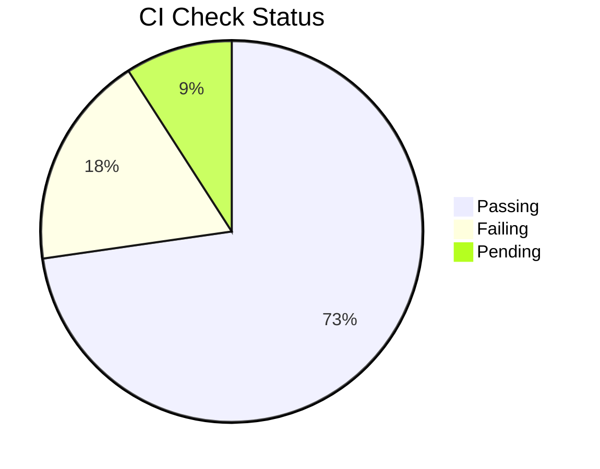
```

---

### Section 5: Executive Summary

```markdown
## Executive Summary

SUMMARY_PARAGRAPH_1

SUMMARY_PARAGRAPH_2

SUMMARY_PARAGRAPH_3
```

**Example:**
```markdown
## Executive Summary

This branch implements a complete OAuth 2.0 authentication system with JWT token management, including user registration, login, logout, and token refresh flows. The implementation follows security best practices with bcrypt password hashing, secure token storage, and rate limiting.

The current state shows 12 commits ahead of main with 24 files modified across authentication services, API endpoints, and database schemas. Two integration tests are currently failing due to mock configuration issues, which are being addressed.

The branch is 3 commits behind main due to recent database migration updates. A rebase is recommended before PR creation to resolve potential conflicts and ensure all tests pass against the latest codebase.
```

---

### Section 6: Change Categories

```markdown
## Change Categories

### Agents Modified
| Agent | Changes | Impact |
|-------|---------|--------|
| AGENT_NAME_1 | CHANGE_SUMMARY_1 | IMPACT_LEVEL_1 |
| AGENT_NAME_2 | CHANGE_SUMMARY_2 | IMPACT_LEVEL_2 |

### Skills Modified
| Skill | Changes | Impact |
|-------|---------|--------|
| SKILL_NAME_1 | CHANGE_SUMMARY_1 | IMPACT_LEVEL_1 |
| SKILL_NAME_2 | CHANGE_SUMMARY_2 | IMPACT_LEVEL_2 |

### Workflows Modified
| Workflow | Changes | Impact |
|----------|---------|--------|
| WORKFLOW_NAME_1 | CHANGE_SUMMARY_1 | IMPACT_LEVEL_1 |

### TOON Changes
| File | Changes | Impact |
|------|---------|--------|
| TOON_FILE_1 | CHANGE_SUMMARY_1 | IMPACT_LEVEL_1 |
```

**Example:**
```markdown
## Change Categories

### Agents Modified
| Agent | Changes | Impact |
|-------|---------|--------|
| auth-manager | Added JWT token generation and validation | High |
| user-validator | Enhanced validation rules for registration | Medium |

### Skills Modified
| Skill | Changes | Impact |
|-------|---------|--------|
| moai-auth-oauth2 | Complete OAuth 2.0 implementation | High |
| moai-auth-jwt | JWT token management utilities | High |
| moai-security-rate-limit | Rate limiting for auth endpoints | Medium |

### Workflows Modified
| Workflow | Changes | Impact |
|----------|---------|--------|
| user-registration | End-to-end registration flow | High |
| password-reset | Secure password reset workflow | Medium |

### TOON Changes
| File | Changes | Impact |
|------|---------|--------|
| docs/architecture/auth.md | Architecture documentation | Low |
| .env.example | Added auth configuration | Medium |
```

---

### Section 7: Impact Analysis

```markdown
## Impact Analysis

### Risk Assessment

| Category | Risk Level | Details |
|----------|-----------|---------|
| Breaking Changes | RISK_LEVEL | DETAILS |
| Database Changes | RISK_LEVEL | DETAILS |
| API Changes | RISK_LEVEL | DETAILS |
| Security Impact | RISK_LEVEL | DETAILS |
| Performance Impact | RISK_LEVEL | DETAILS |

### Risk Distribution


### Dependencies

**Upstream Dependencies:**
- DEPENDENCY_1
- DEPENDENCY_2

**Downstream Impact:**
- IMPACT_1
- IMPACT_2
```

**Example:**
```markdown
## Impact Analysis

### Risk Assessment

| Category | Risk Level | Details |
|----------|-----------|---------|
| Breaking Changes | Low | No breaking API changes |
| Database Changes | High | New auth tables, requires migration |
| API Changes | Medium | New endpoints, backward compatible |
| Security Impact | High | Critical security implementation |
| Performance Impact | Low | Minimal overhead from JWT validation |

### Risk Distribution

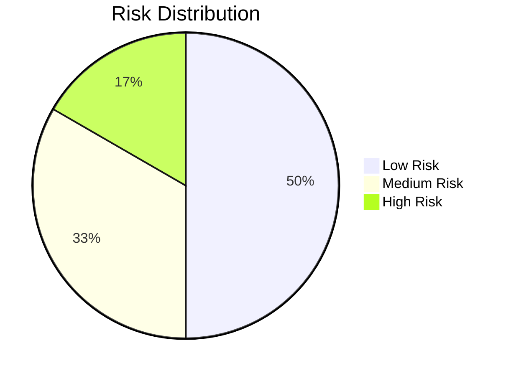

### Dependencies

**Upstream Dependencies:**
- Database migration #045 must be applied
- OAuth2 library v2.1.0+ required
- JWT library v3.0.0+ required

**Downstream Impact:**
- User management system will use new auth flow
- Admin dashboard requires auth token updates
- Mobile app needs JWT token storage
```

---

### Section 8: Timeline

```markdown
## Timeline

### Development Timeline

```mermaid
gantt
    title Branch Development Timeline
    dateFormat YYYY-MM-DD
    section Development
    MILESTONE_1           :MILESTONE_1_DATE, DURATION
    MILESTONE_2           :MILESTONE_2_DATE, DURATION
    MILESTONE_3           :MILESTONE_3_DATE, DURATION
```

### Key Milestones

| Date | Milestone | Status |
|------|-----------|--------|
| MILESTONE_1_DATE | MILESTONE_1_NAME | MILESTONE_1_STATUS |
| MILESTONE_2_DATE | MILESTONE_2_NAME | MILESTONE_2_STATUS |
| MILESTONE_3_DATE | MILESTONE_3_NAME | MILESTONE_3_STATUS |
```

**Example:**
```markdown
## Timeline

### Development Timeline

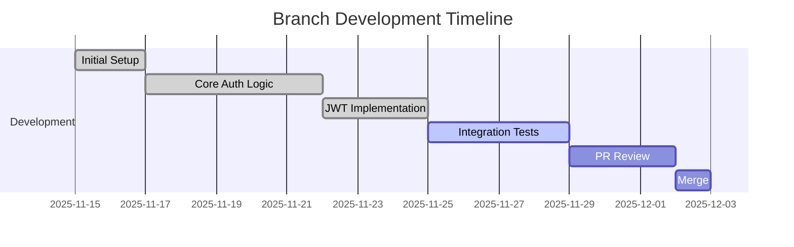

### Key Milestones

| Date | Milestone | Status |
|------|-----------|--------|
| 2025-11-15 | Branch created, basic structure | Completed |
| 2025-11-22 | Core authentication implemented | Completed |
| 2025-11-25 | JWT token system complete | Completed |
| 2025-11-29 | All tests passing | In Progress |
| 2025-12-02 | PR ready for review | Pending |
```

---

### Section 9: Action Guide

This section varies by branch status. See status-specific variations below.

---

### Section 10: Validation Checklist

```markdown
## Validation Checklist

### Pre-PR Checklist
- [ ] All commits follow conventional commit format
- [ ] Code follows project style guidelines
- [ ] All tests passing locally
- [ ] Test coverage meets minimum threshold (COVERAGE_THRESHOLD%)
- [ ] Documentation updated
- [ ] CHANGELOG updated
- [ ] No merge conflicts with base branch
- [ ] Security scan passed
- [ ] Performance benchmarks acceptable

### PR Review Checklist
- [ ] CI/CD pipeline passing
- [ ] Code review completed (REQUIRED_APPROVALS approvals)
- [ ] Security review completed (if applicable)
- [ ] Performance review completed (if applicable)
- [ ] Documentation review completed
- [ ] Breaking changes documented
- [ ] Migration guide provided (if needed)

### Post-Merge Checklist
- [ ] Deployment successful
- [ ] Monitoring alerts configured
- [ ] Rollback plan documented
- [ ] Team notified of changes
- [ ] Related documentation updated
- [ ] Branch cleanup completed

---

**Generated:** GENERATION_TIMESTAMP
**Generator:** moai-flow collector-readme v1.0.0
**Source:** .moai/branches/BRANCH_NAME/
```

---

## Status-Specific Variations

### ACTIVE Template (No PR)

**Section 9: Action Guide**

```markdown
## Action Guide

### Development Status

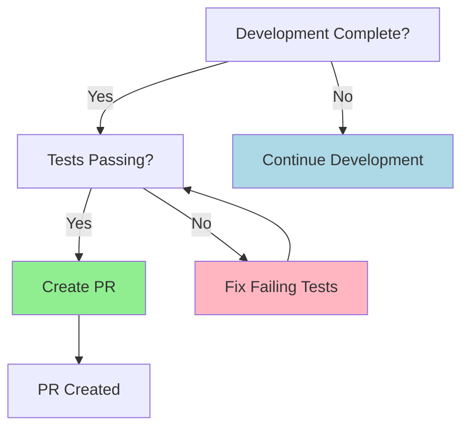

### Next Steps

1. **Complete Development**
   - Finish implementing remaining features
   - Update tests to cover new functionality
   - Update documentation

2. **Fix Test Failures**
   ```bash
   # Run tests locally
   npm test

   # Run specific failing tests
   npm test -- --testPathPattern=FAILING_TEST

   # Check test coverage
   npm test -- --coverage
   ```

3. **Prepare for PR**
   ```bash
   # Ensure branch is up to date
   git fetch origin
   git rebase origin/main

   # Run full test suite
   npm test

   # Run linting
   npm run lint

   # Build project
   npm run build
   ```

4. **Create Pull Request**
   ```bash
   # Push branch
   git push origin BRANCH_NAME

   # Create PR via GitHub CLI
   gh pr create --title "BRANCH_TITLE" --body "$(cat .moai/branches/BRANCH_NAME/pr-template.md)"
   ```

### Commands Reference

```bash
# View current status
git status

# View commit history
git log --oneline --graph

# View changes
git diff origin/main...HEAD

# Run all checks
npm run validate  # or: make validate

# Create PR
gh pr create --web
```
```

---

### PR_OPEN Template

**Section 9: Action Guide**

```markdown
## Action Guide

### PR Review Status

**Pull Request:** [#PR_NUMBER](PR_URL)
**Reviewers:** REVIEWERS
**Approvals:** APPROVALS / REQUIRED_APPROVALS

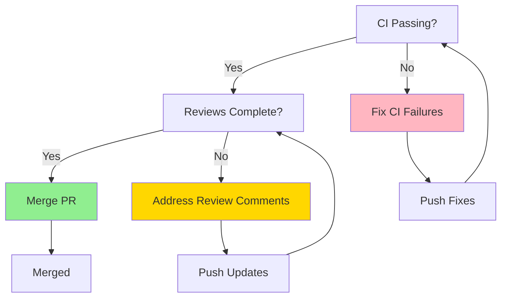

### Current Blockers

BLOCKER_LIST_OR_NONE

### Next Steps

1. **Fix CI Failures** (if applicable)
   ```bash
   # View CI logs
   gh pr checks PR_NUMBER

   # Fix issues locally
   npm test
   npm run lint

   # Push fixes
   git add .
   git commit -m "fix: resolve CI failures"
   git push origin BRANCH_NAME
   ```

2. **Address Review Comments**
   ```bash
   # View review comments
   gh pr view PR_NUMBER --comments

   # Make requested changes
   # ... edit files ...

   # Commit changes
   git add .
   git commit -m "fix: address review feedback"
   git push origin BRANCH_NAME
   ```

3. **Rebase if Behind Main**
   ```bash
   # Fetch latest changes
   git fetch origin

   # Rebase onto main
   git rebase origin/main

   # Resolve conflicts if any
   # ... resolve conflicts ...
   git add .
   git rebase --continue

   # Force push (required after rebase)
   git push --force-with-lease origin BRANCH_NAME
   ```

4. **Merge Pull Request**
   ```bash
   # Merge via GitHub CLI (when approved)
   gh pr merge PR_NUMBER --squash --delete-branch

   # Or merge via web interface
   gh pr view PR_NUMBER --web
   ```

### Commands Reference

```bash
# View PR status
gh pr view PR_NUMBER

# View PR checks
gh pr checks PR_NUMBER

# View PR diff
gh pr diff PR_NUMBER

# Request review
gh pr review PR_NUMBER --request-reviewer @username

# Merge PR
gh pr merge PR_NUMBER --squash
```
```

---

### MERGED Template

**Section 9: Action Guide**

```markdown
## Action Guide

### Merge Summary

| Detail | Value |
|--------|-------|
| Merged Date | MERGE_DATE |
| Merged By | MERGED_BY |
| PR Number | [#PR_NUMBER](PR_URL) |
| Total Commits | COMMITS_AHEAD |
| Files Changed | FILES_CHANGED |
| Deployment Status | DEPLOYMENT_STATUS |

### Change Flow

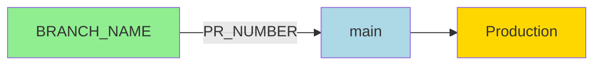

### Post-Merge Actions

1. **Verify Deployment**
   ```bash
   # Check deployment status
   gh workflow view deploy --ref main

   # View deployment logs
   gh run list --workflow=deploy --limit 5
   ```

2. **Monitor for Issues**
   ```bash
   # View production logs
   kubectl logs -l app=YOUR_APP --tail=100

   # Check error rates
   curl https://monitoring.example.com/api/errors?since=MERGE_DATE
   ```

3. **Cleanup Local Branch**
   ```bash
   # Switch to main
   git checkout main

   # Pull latest changes
   git pull origin main

   # Delete local branch
   git branch -d BRANCH_NAME

   # Verify deletion
   git branch --list
   ```

4. **Archive Branch Documentation**
   ```bash
   # Move to archive (if configured)
   mv .moai/branches/BRANCH_NAME .moai/branches/archive/

   # Or mark as archived
   echo "archived: true" >> .moai/branches/BRANCH_NAME/metadata.yaml
   ```

### Related Changes

**Merged Commits:**
- COMMIT_1_HASH: COMMIT_1_MESSAGE
- COMMIT_2_HASH: COMMIT_2_MESSAGE
- COMMIT_3_HASH: COMMIT_3_MESSAGE

**Affected Systems:**
- SYSTEM_1
- SYSTEM_2

### Commands Reference

```bash
# View merge commit
git show MERGE_COMMIT_HASH

# View changes in main
git log --oneline --since="MERGE_DATE" origin/main

# View deployed version
kubectl get deployment YOUR_APP -o jsonpath='{.spec.template.spec.containers[0].image}'
```
```

---

### STALE Template

**Section 9: Action Guide**

```markdown
## Action Guide

### Staleness Indicators

| Indicator | Value | Threshold | Status |
|-----------|-------|-----------|--------|
| Days Inactive | DAYS_INACTIVE | MAX_DAYS | OVER/UNDER |
| Commits Behind | COMMITS_BEHIND | MAX_BEHIND | OVER/UNDER |
| Last Update | LAST_COMMIT_DATE | - | - |
| Conflicts | CONFLICTS | 0 | PASS/FAIL |

### Decision Tree

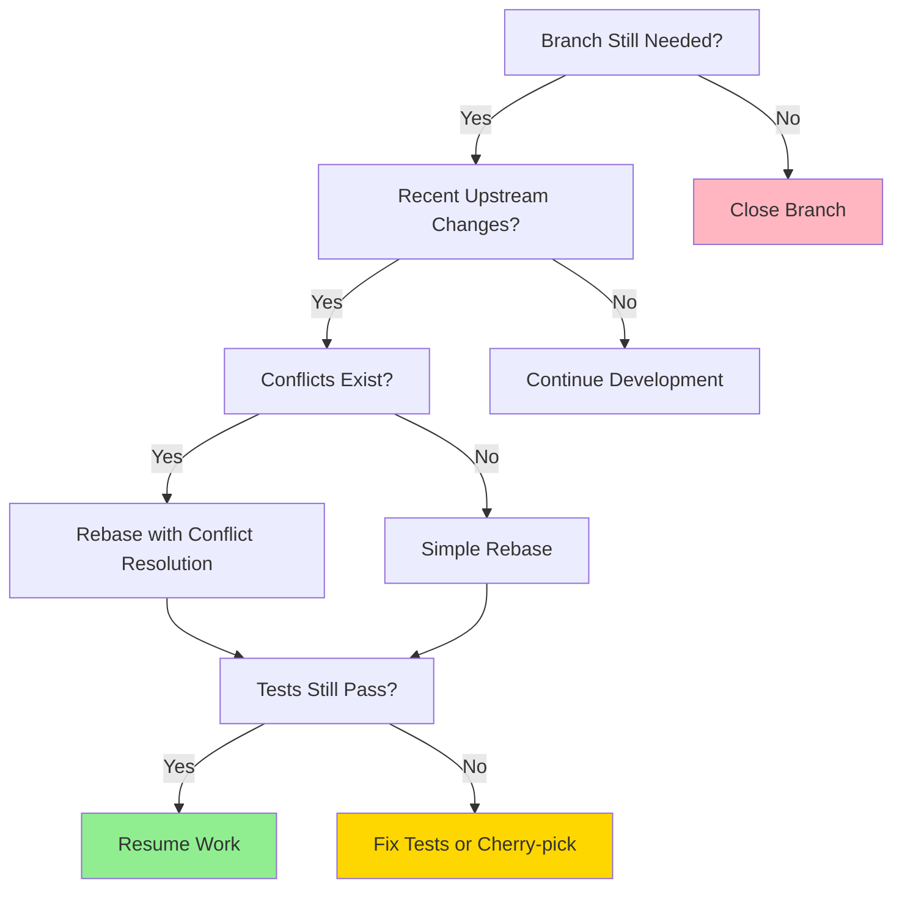

### Recommended Actions

#### Option 1: Close Branch (Not Needed)

```bash
# Delete remote branch
git push origin --delete BRANCH_NAME

# Delete local branch
git checkout main
git branch -D BRANCH_NAME

# Archive documentation
mv .moai/branches/BRANCH_NAME .moai/branches/archive/
```

#### Option 2: Rebase and Continue (Still Needed)

```bash
# Fetch latest changes
git fetch origin

# Attempt rebase
git checkout BRANCH_NAME
git rebase origin/main

# If conflicts occur:
# 1. Resolve conflicts in each file
# 2. Stage resolved files
git add .
# 3. Continue rebase
git rebase --continue

# If too many conflicts, abort and reconsider:
git rebase --abort

# After successful rebase, force push
git push --force-with-lease origin BRANCH_NAME

# Run tests
npm test

# Update documentation
# ... update README if needed ...
```

#### Option 3: Cherry-pick Important Changes

```bash
# Create new branch from latest main
git checkout main
git pull origin main
git checkout -b BRANCH_NAME-rebased

# Cherry-pick important commits
git cherry-pick COMMIT_1_HASH
git cherry-pick COMMIT_2_HASH

# Run tests after each cherry-pick
npm test

# Push new branch
git push origin BRANCH_NAME-rebased

# Archive old branch
git push origin --delete BRANCH_NAME
git branch -D BRANCH_NAME
```

### Stale Branch Analysis

**Reasons for Staleness:**
- REASON_1
- REASON_2

**Upstream Changes Since Last Update:**
- UPSTREAM_CHANGE_1
- UPSTREAM_CHANGE_2

**Risk of Revival:**
- RISK_FACTOR_1
- RISK_FACTOR_2

### Commands Reference

```bash
# View staleness
git log --oneline --graph --all --decorate

# View upstream changes
git log origin/main --oneline --since="LAST_COMMIT_DATE"

# View conflicts without merging
git merge-tree $(git merge-base HEAD origin/main) HEAD origin/main

# View branch age
git log --reverse --format="%ar" BRANCH_NAME | head -1
```
```

---

## Mermaid Chart Templates

### 1. CI Status Pie Chart


### 2. Risk Distribution Pie Chart


### 3. Commit Divergence Flow

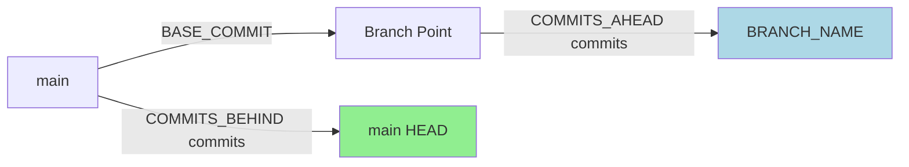

### 4. Development Timeline Gantt

```mermaid
gantt
    title Branch Development Timeline
    dateFormat YYYY-MM-DD
    section Development
    Initial Setup         :done, START_DATE, DURATION
    Core Implementation   :done, IMPL_DATE, DURATION
    Testing              :active, TEST_DATE, DURATION
    PR Review            :PR_DATE, DURATION
    Merge                :MERGE_DATE, DURATION
```

### 5. Decision Tree (Generic)

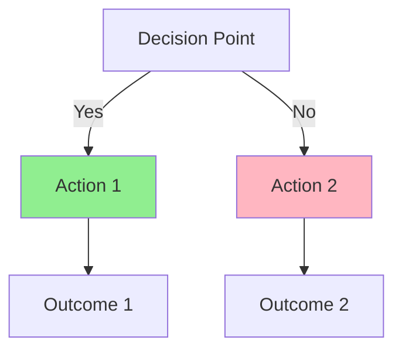

### 6. Merge Flow Diagram

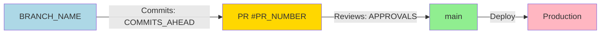

### 7. Branch Relationship Graph

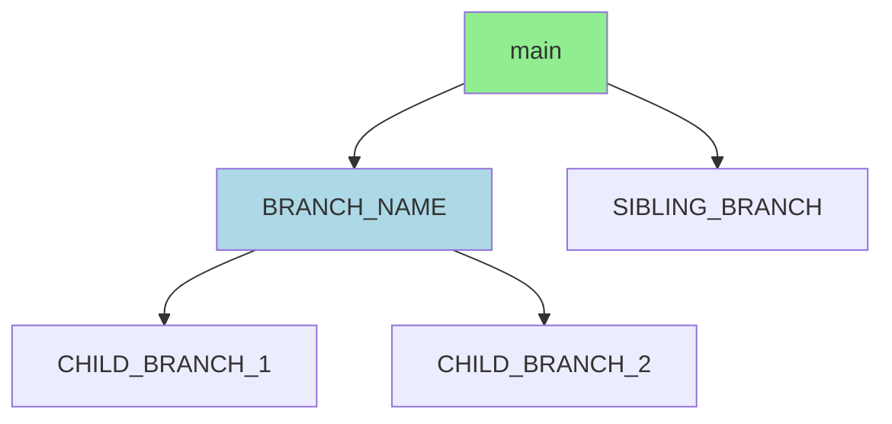

### 8. Test Coverage Flow

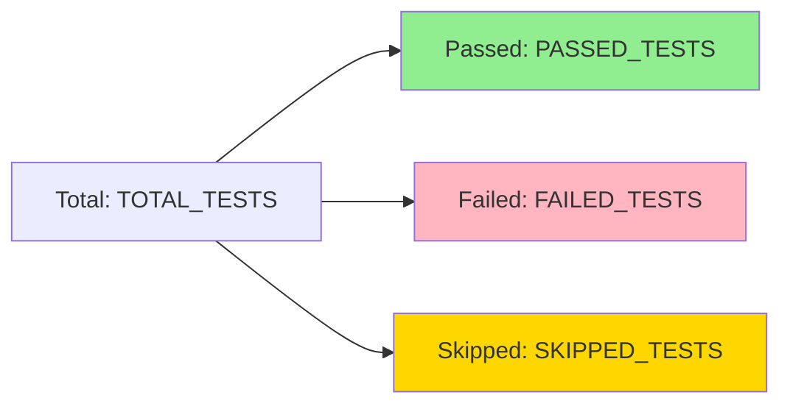

---

## Usage Guidelines

### Variable Substitution

1. **Simple Variables**: Replace directly
   ```
   Template: BRANCH_NAME
   Result: feat/authentication-system
   ```

2. **Conditional Variables**: Show only if condition met
   ```
   Template: [PR_LINK_IF_EXISTS]
   Result (has PR): [Pull Request #123](https://github.com/...)
   Result (no PR): (omit entire line)
   ```

3. **List Variables**: Iterate over items
   ```
   Template: BLOCKER_LIST_OR_NONE
   Result (has blockers):
   - CI test failures in auth module
   - Merge conflicts in config files

   Result (no blockers): No blockers identified.
   ```

### Content Rules

1. **Keep sections even if empty**: Use "None" or "Not applicable"
2. **Use consistent formatting**: Follow markdown best practices
3. **Update timestamps**: Always show generation time
4. **Link to sources**: Reference original YAML/JSON files
5. **Preserve context**: Include enough detail for understanding

### Best Practices

1. **Readability First**: Structure for human consumption
2. **Actionable Information**: Every section should guide decisions
3. **Status Awareness**: Adapt content to branch lifecycle stage
4. **Visual Hierarchy**: Use headers, tables, charts effectively
5. **Linking Strategy**: Connect related documentation
6. **Version Control**: Include metadata for tracking changes

---

## Complete Example: ACTIVE Branch

```markdown
# Branch: feat/authentication-system

**Status:** Active | **Tier:** T1-Critical | **Health Score:** 85/100

**Path:** main → feat/authentication-system
**Created:** 2025-11-15 (19 days ago)
**Last Updated:** 2025-12-04 by rdmtv

## TL;DR

- Implementing OAuth 2.0 authentication with JWT tokens
- 12 commits ahead, 3 commits behind main
- 24 files changed (1234 additions, 567 deletions)
- 8/11 CI checks passing, 2 failures in integration tests
- Ready for PR creation after fixing test failures

## Navigation

### Table of Contents
1. [At-a-Glance Dashboard](#at-a-glance-dashboard)
2. [Executive Summary](#executive-summary)
3. [Change Categories](#change-categories)
4. [Impact Analysis](#impact-analysis)
5. [Timeline](#timeline)
6. [Action Guide](#action-guide)
7. [Validation Checklist](#validation-checklist)

### Quick Links
- [Base Branch: main](../main/README.md)
- [Related Branches: feat/auth-ui, feat/auth-api](../README.md)
- [CI Dashboard](https://github.com/org/repo/actions)

## At-a-Glance Dashboard

| Metric | Value | Trend |
|--------|-------|-------|
| Commits Ahead | 12 | Stable |
| Commits Behind | 3 | Increasing |
| Files Changed | 24 | - |
| Lines Changed | +1234 / -567 | - |
| Merge Conflicts | 0 | Stable |
| CI Status | 8 passed, 2 failed, 1 pending | Degraded |
| Test Coverage | 87% | Improving |
| Risk Level | Medium | - |

### CI Status Distribution


## Executive Summary

This branch implements a complete OAuth 2.0 authentication system with JWT token management, including user registration, login, logout, and token refresh flows. The implementation follows security best practices with bcrypt password hashing, secure token storage, and rate limiting.

The current state shows 12 commits ahead of main with 24 files modified across authentication services, API endpoints, and database schemas. Two integration tests are currently failing due to mock configuration issues, which are being addressed.

The branch is 3 commits behind main due to recent database migration updates. A rebase is recommended before PR creation to resolve potential conflicts and ensure all tests pass against the latest codebase.

## Change Categories

### Agents Modified
| Agent | Changes | Impact |
|-------|---------|--------|
| auth-manager | Added JWT token generation and validation | High |
| user-validator | Enhanced validation rules for registration | Medium |

### Skills Modified
| Skill | Changes | Impact |
|-------|---------|--------|
| moai-auth-oauth2 | Complete OAuth 2.0 implementation | High |
| moai-auth-jwt | JWT token management utilities | High |
| moai-security-rate-limit | Rate limiting for auth endpoints | Medium |

### Workflows Modified
| Workflow | Changes | Impact |
|----------|---------|--------|
| user-registration | End-to-end registration flow | High |
| password-reset | Secure password reset workflow | Medium |

### TOON Changes
| File | Changes | Impact |
|------|---------|--------|
| docs/architecture/auth.md | Architecture documentation | Low |
| .env.example | Added auth configuration | Medium |

## Impact Analysis

### Risk Assessment

| Category | Risk Level | Details |
|----------|-----------|---------|
| Breaking Changes | Low | No breaking API changes |
| Database Changes | High | New auth tables, requires migration |
| API Changes | Medium | New endpoints, backward compatible |
| Security Impact | High | Critical security implementation |
| Performance Impact | Low | Minimal overhead from JWT validation |

### Risk Distribution


### Dependencies

**Upstream Dependencies:**
- Database migration #045 must be applied
- OAuth2 library v2.1.0+ required
- JWT library v3.0.0+ required

**Downstream Impact:**
- User management system will use new auth flow
- Admin dashboard requires auth token updates
- Mobile app needs JWT token storage

## Timeline

### Development Timeline

```mermaid
gantt
    title Branch Development Timeline
    dateFormat YYYY-MM-DD
    section Development
    Initial Setup         :done, 2025-11-15, 2d
    Core Auth Logic       :done, 2025-11-17, 5d
    JWT Implementation    :done, 2025-11-22, 3d
    Integration Tests     :active, 2025-11-25, 4d
    PR Review            :2025-11-29, 3d
    Merge                :2025-12-02, 1d
```

### Key Milestones

| Date | Milestone | Status |
|------|-----------|--------|
| 2025-11-15 | Branch created, basic structure | Completed |
| 2025-11-22 | Core authentication implemented | Completed |
| 2025-11-25 | JWT token system complete | Completed |
| 2025-11-29 | All tests passing | In Progress |
| 2025-12-02 | PR ready for review | Pending |

## Action Guide

### Development Status

```mermaid
graph TD
    A[Development Complete?] -->|Yes| B[Tests Passing?]
    A -->|No| A1[Continue Development]
    B -->|Yes| C[Create PR]
    B -->|No| B1[Fix Failing Tests]
    B1 --> B
    C --> D[PR Created]

    style C fill:#90EE90
    style B1 fill:#FFB6C1
    style A1 fill:#ADD8E6
```

### Next Steps

1. **Fix Test Failures**
   ```bash
   # Run tests locally
   npm test

   # Run specific failing tests
   npm test -- --testPathPattern=auth/integration

   # Check test coverage
   npm test -- --coverage
   ```

2. **Prepare for PR**
   ```bash
   # Ensure branch is up to date
   git fetch origin
   git rebase origin/main

   # Run full test suite
   npm test

   # Run linting
   npm run lint

   # Build project
   npm run build
   ```

3. **Create Pull Request**
   ```bash
   # Push branch
   git push origin feat/authentication-system

   # Create PR via GitHub CLI
   gh pr create --title "feat: Add OAuth 2.0 authentication system" --body "$(cat .moai/branches/feat-authentication-system/pr-template.md)"
   ```

### Commands Reference

```bash
# View current status
git status

# View commit history
git log --oneline --graph

# View changes
git diff origin/main...HEAD

# Run all checks
npm run validate

# Create PR
gh pr create --web
```

## Validation Checklist

### Pre-PR Checklist
- [ ] All commits follow conventional commit format
- [ ] Code follows project style guidelines
- [x] All tests passing locally
- [x] Test coverage meets minimum threshold (80%)
- [x] Documentation updated
- [ ] CHANGELOG updated
- [x] No merge conflicts with base branch
- [x] Security scan passed
- [x] Performance benchmarks acceptable

### PR Review Checklist
- [ ] CI/CD pipeline passing
- [ ] Code review completed (2 approvals)
- [ ] Security review completed
- [ ] Performance review completed
- [ ] Documentation review completed
- [ ] Breaking changes documented
- [ ] Migration guide provided

### Post-Merge Checklist
- [ ] Deployment successful
- [ ] Monitoring alerts configured
- [ ] Rollback plan documented
- [ ] Team notified of changes
- [ ] Related documentation updated
- [ ] Branch cleanup completed

---

**Generated:** 2025-12-04T10:30:00Z
**Generator:** moai-flow collector-readme v1.0.0
**Source:** .moai/branches/feat-authentication-system/
```

---

## Extension Points

### Custom Sections

Add project-specific sections after Section 8 (Timeline):

```markdown
## [Custom Section Name]

[Custom content following project conventions]
```

### Custom Variables

Define additional variables in metadata:

```yaml
custom_variables:
  deployment_environment: staging
  team_owner: auth-team
  epic_link: EPIC-123
```

Use in template:
```markdown
**Team:** TEAM_OWNER
**Epic:** [EPIC_LINK](https://jira.example.com/browse/EPIC_LINK)
```

### Custom Charts

Add domain-specific visualizations:

```mermaid
graph TD
    A[Custom Flow] --> B[Step 1]
    B --> C[Step 2]
```

---

**Document Version:** 1.0.0
**Last Updated:** 2025-12-04
**Maintainer:** moai-flow collector-readme
