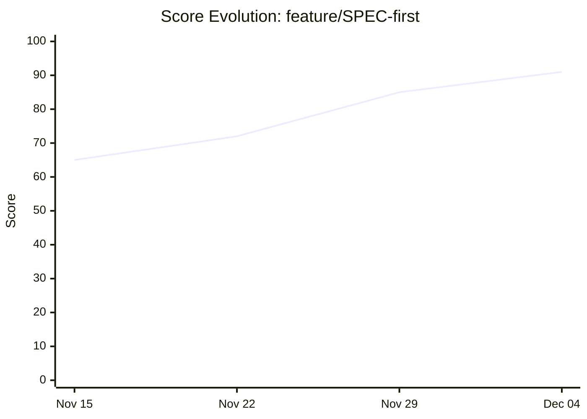
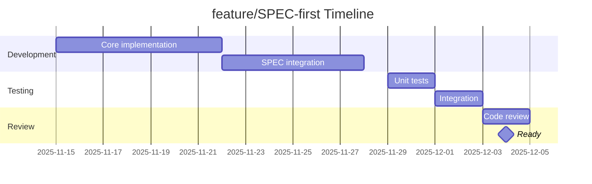
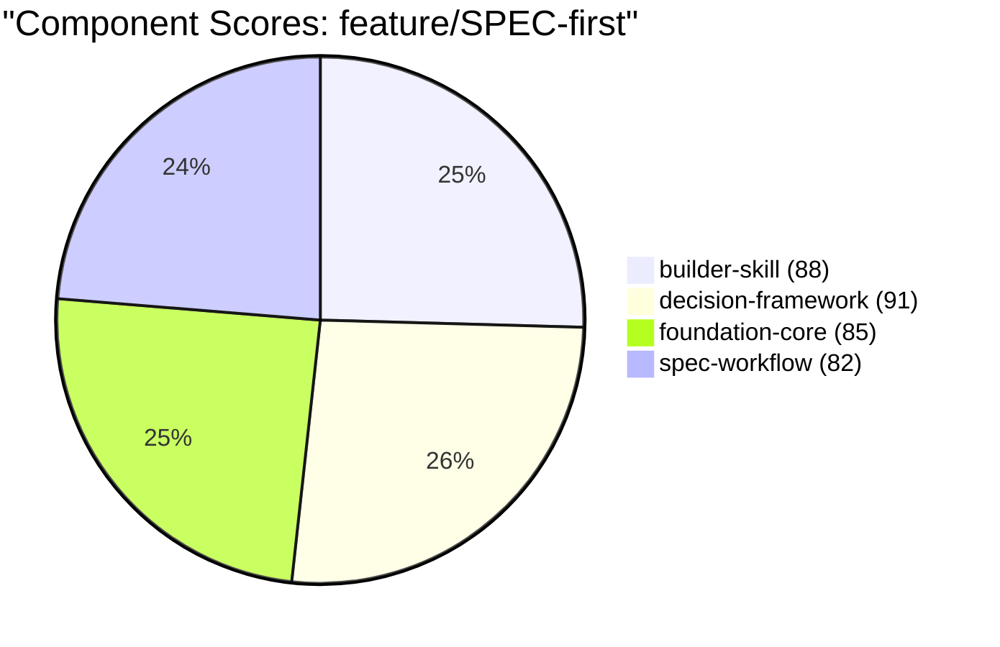
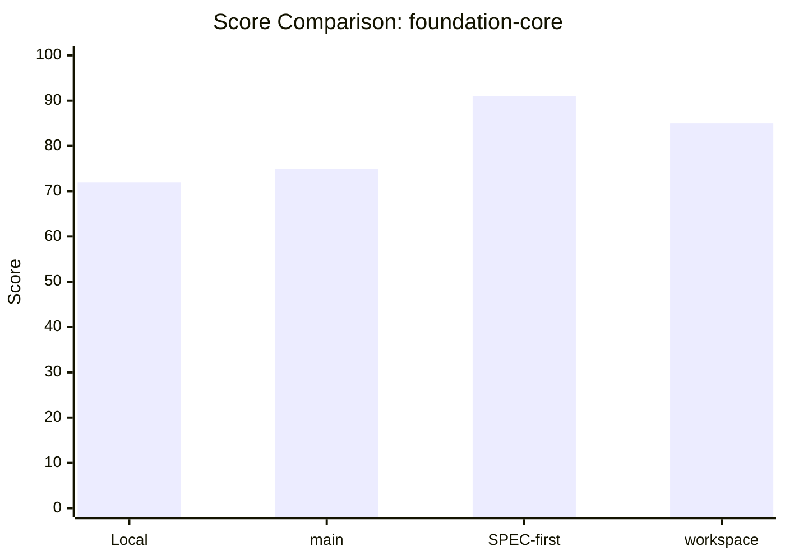
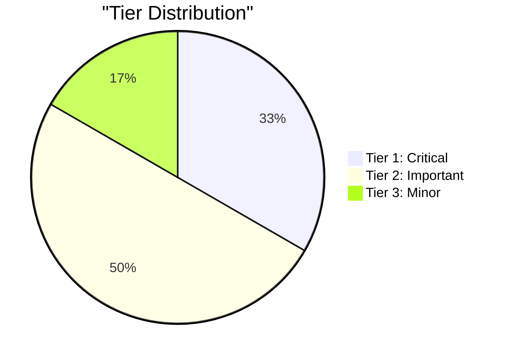

# Chart Sections for READMEs

**Mermaid chart templates for branch documentation**

> **Version**: 1.0.0
> **Part of**: collector-readme skill
> **Last Updated**: 2025-12-04

---

## Available Charts

### 1. Score Evolution Line Chart

Track score changes over time:

```mermaid
xychart-beta
    title "Score Evolution: {{branch_name}}"
    x-axis [{{date_labels}}]
    y-axis "Score" 0 --> 100
    line [{{score_values}}]
```

**Example**:



**Data Requirements**:
- `date_labels`: Comma-separated quoted dates
- `score_values`: Comma-separated scores

---

### 2. Development Timeline Gantt

Show project phases:

```mermaid
gantt
    title {{branch_name}} Timeline
    dateFormat YYYY-MM-DD

    {{#each phases}}
    section {{section_name}}
    {{task_name}}    :{{task_id}}, {{start_date}}, {{duration}}
    {{/each}}
```

**Example**:



**Phase Types**:
- Regular task: `TaskName :id, start, duration`
- After previous: `TaskName :id, after prev_id, duration`
- Milestone: `Name :milestone, id, date, 0d`

---

### 3. Component Score Pie

Distribution of component scores:


**Example**:



---

### 4. Score Comparison Bar

Compare across sources:

```mermaid
xychart-beta
    title "Score Comparison: {{component_name}}"
    x-axis ["Local", "main", "SPEC-first", "workspace"]
    y-axis "Score" 0 --> 100
    bar [{{scores}}]
```

**Example**:



---

### 5. Tier Distribution

Branch tier breakdown:


**Example**:



---

### 6. Sync Decision Flowchart

Visualize sync logic:

```mermaid
flowchart TD
    A[{{branch_name}}] --> B{Compare Scores}

    B -->|Local: {{local_score}}| C{Better?}
    B -->|Remote: {{remote_score}}| C

    C -->|Local wins| D[PRESERVE]
    C -->|Remote wins| E[UPDATE]
    C -->|Close| F[MERGE]

    D --> G[Done]
    E --> G
    F --> G
```

---

## Chart Generation Functions

### generate_score_chart(history)

```python
def generate_score_chart(history: List[ScoreEntry]) -> str:
    """
    Generate score evolution chart.
    """
    dates = [f'"{format_date(e.date)}"' for e in history]
    scores = [str(e.score) for e in history]

    return f"""```mermaid
xychart-beta
    title "Score Evolution"
    x-axis [{', '.join(dates)}]
    y-axis "Score" 0 --> 100
    line [{', '.join(scores)}]
```"""
```

### generate_timeline_gantt(phases)

```python
def generate_timeline_gantt(phases: List[Phase]) -> str:
    """
    Generate timeline Gantt chart.
    """
    sections = []
    task_id = 0

    for phase in phases:
        section = f"    section {phase.name}\n"
        for task in phase.tasks:
            task_id += 1
            tid = f"t{task_id}"

            if task.after:
                section += f"    {task.name}    :{tid}, after {task.after}, {task.duration}d\n"
            else:
                section += f"    {task.name}    :{tid}, {task.start}, {task.duration}d\n"

            if task.is_milestone:
                section += f"    Complete    :milestone, m{task_id}, {task.end}, 0d\n"

        sections.append(section)

    return f"""```mermaid
gantt
    title Branch Timeline
    dateFormat YYYY-MM-DD

{chr(10).join(sections)}
```"""
```

### generate_component_pie(components)

```python
def generate_component_pie(components: List[Component]) -> str:
    """
    Generate component score pie chart.
    """
    slices = []

    for comp in components:
        slices.append(f'    "{comp.name} ({comp.score})" : {comp.score}')

    return f"""```mermaid
pie title "Component Scores"
{chr(10).join(slices)}
```"""
```

---

## Placement Guidelines

### Score Evolution

Place after Quick Stats, before Improvements:

```markdown
## Quick Stats
{stats_table}

---

## Score Evolution
{score_table}
{score_chart}

---

## Improvements
```

### Timeline

Place at end of main content:

```markdown
## Merge Status
{merge_info}

---

## Timeline
{timeline_gantt}
{phase_table}

---

*Generated: ...*
```

### Component Charts

Place in Components section:

```markdown
## Components

{component_table}

### Score Distribution
{component_pie}
```

---

## Responsive Considerations

### Small Displays

For narrow displays, consider:
- Fewer data points in line charts
- Simplified pie chart labels
- Condensed Gantt sections

### Text Fallbacks

Always provide table data alongside charts:

```markdown
## Score Evolution

| Date | Score | Change |
|------|-------|--------|
| Nov 15 | 65 | - |
| Dec 04 | 91 | +26 |

{score_chart}
```

---

**Version**: 1.0.0 | **Status**: Production Ready | **Last Updated**: 2025-12-04
