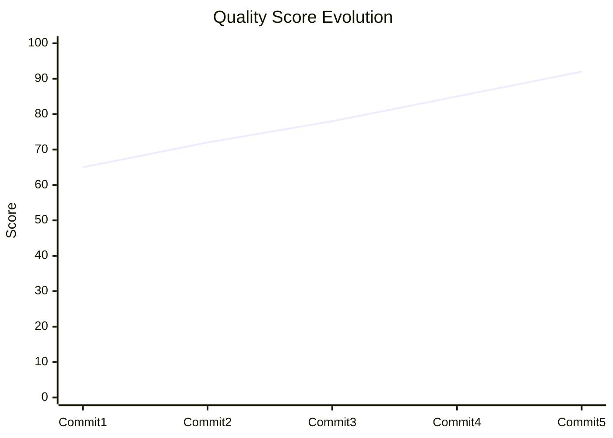
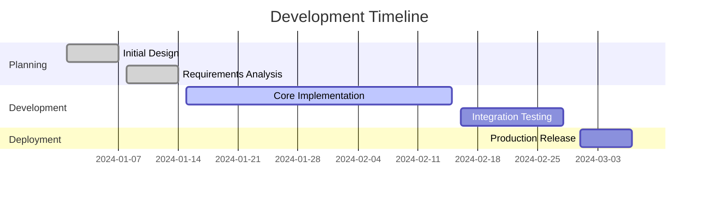
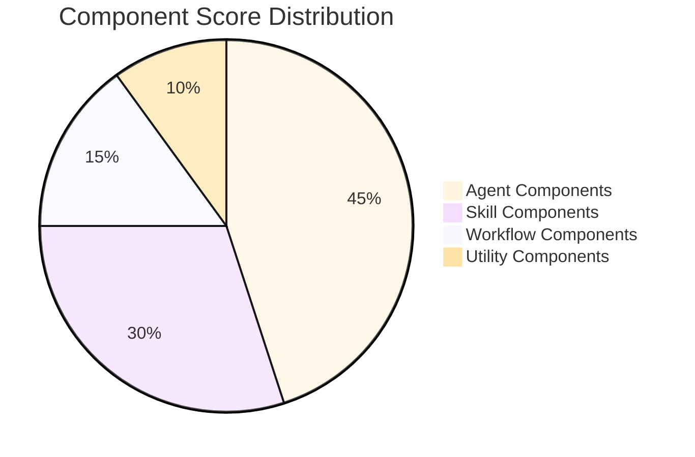
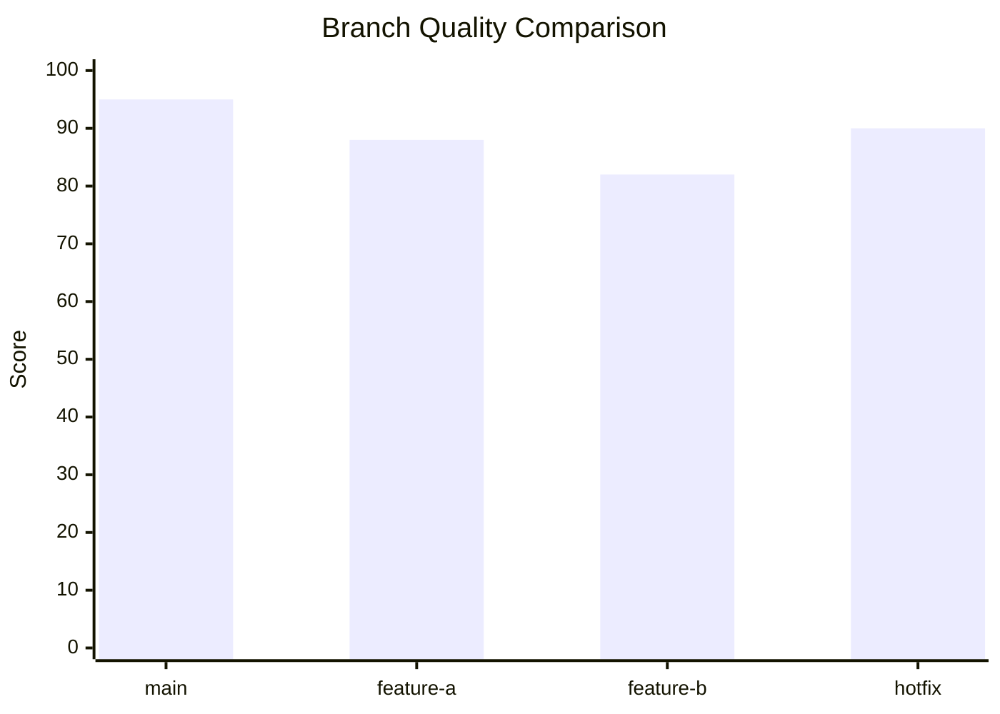
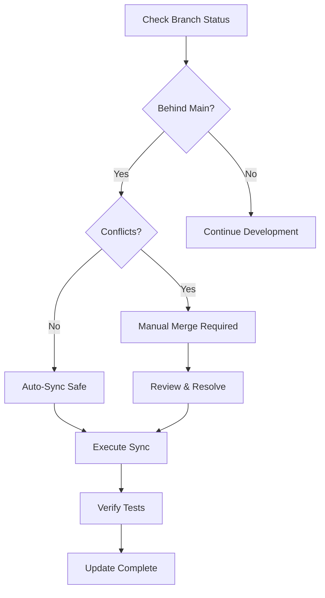
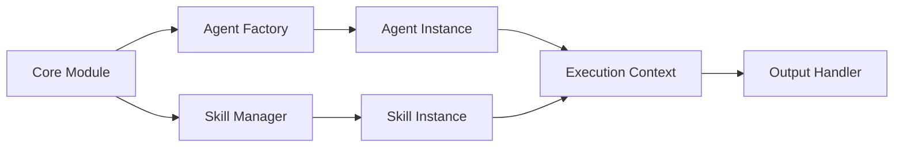
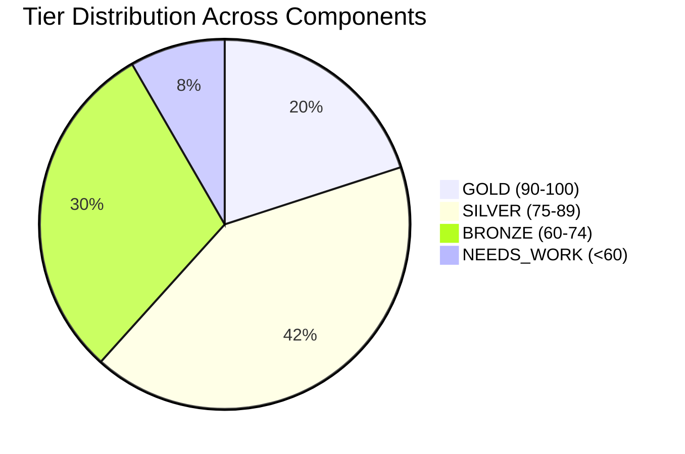
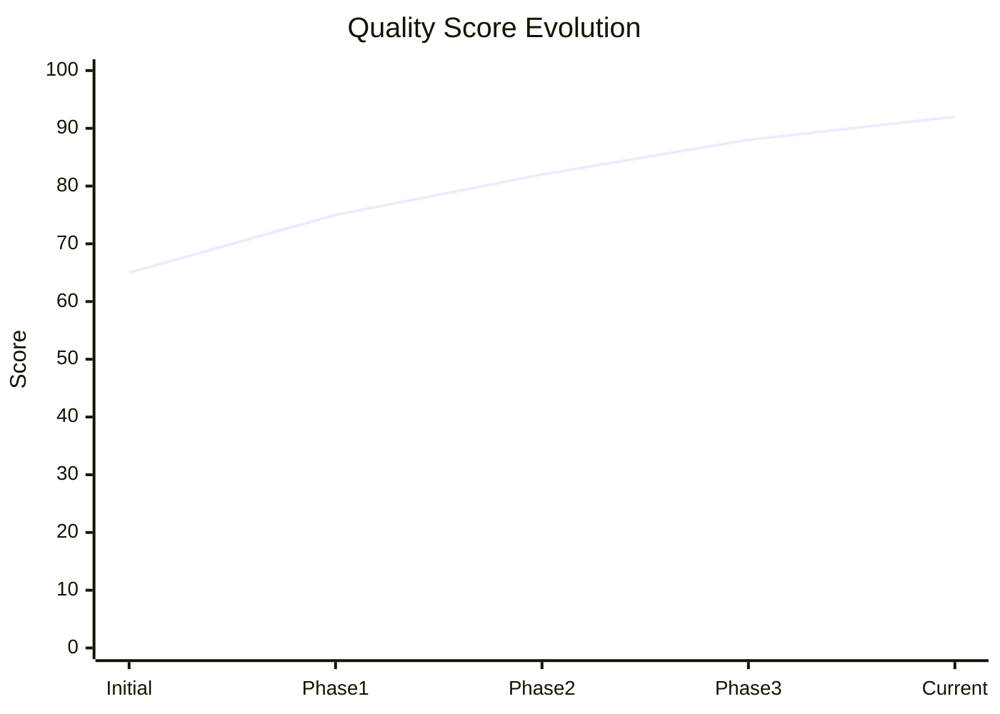
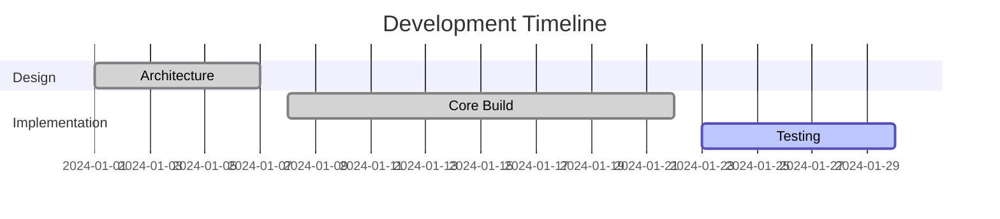

# Visual Enhancement Rules

This module defines chart selection criteria, visual standards, and mandatory requirements for README visual content generation.

## Chart Selection Matrix

| Scenario | Chart Type | Mermaid Syntax | Use Case |
|----------|-----------|----------------|----------|
| Score evolution (3+ data points) | Line Chart | `xychart-beta` | Track quality metrics over time |
| Development timeline | Gantt Chart | `gantt` | Visualize development phases |
| Component distribution | Pie Chart | `pie` | Show relative component scores |
| Cross-branch comparison | Bar Chart | `xychart-beta bar` | Compare metrics across branches |
| Decision/sync logic | Flowchart | `flowchart TD` | Document decision trees |
| Component dependencies | Flowchart | `flowchart LR` | Map component relationships |

## Mandatory Visual Requirements

### Header Badge Line

Every README must include a status header immediately after the title:

```markdown
> **Status**: ACTIVE | **Tier**: GOLD | **Score**: 95/100
```

Format: `> **Status**: {status} | **Tier**: {tier} | **Score**: {score}/100`

### Minimum Content Requirements

- **Minimum 1 chart** per README (automatically selected based on data)
- **Minimum 3 tables** per README (score breakdown, file details, metadata)
- **Header badge line** required for all documents

## Chart Generation Triggers

| Condition | Auto-Generate | Chart Type |
|-----------|---------------|------------|
| `score_history.length >= 3` | Score Evolution Line | `xychart-beta` line |
| `has_development_phases == true` | Timeline Gantt | `gantt` |
| `components.length >= 3` | Component Score Pie | `pie` |
| `behind_main >= 2` | Sync Decision Flowchart | `flowchart TD` |
| `is_index_document == true` | Tier Distribution Pie | `pie` |
| `dependencies.length >= 3` | Dependency Graph | `flowchart LR` |

### Trigger Logic

```python
def should_generate_chart(data):
    if len(data.get('score_history', [])) >= 3:
        return 'score_evolution_line'
    if data.get('has_development_phases'):
        return 'timeline_gantt'
    if len(data.get('components', [])) >= 3:
        return 'component_pie'
    if data.get('behind_main', 0) >= 2:
        return 'sync_flowchart'
    if data.get('is_index_document'):
        return 'tier_distribution_pie'
    return None
```

## Badge Standards

### Change Type Badges

Use bold bracketed labels to indicate content type:

- `**[AGENT]**` - Agent-related changes
- `**[SKILL]**` - Skill-related changes
- `**[WORKFLOW]**` - Workflow-related changes
- `**[TOON]**` - Toon-related changes
- `**[MIXED]**` - Multiple types of changes

### Status Indicators

- `[PASS]` - Quality check passed
- `[WARN]` - Warning condition
- `[FAIL]` - Quality check failed
- `[INFO]` - Informational status

### Example Usage

```markdown
**[AGENT]** [PASS] All quality checks passed
**[SKILL]** [WARN] Documentation coverage below threshold
**[WORKFLOW]** [INFO] Sync recommended with main branch
```

## Anti-Patterns (AVOID)

The following patterns are explicitly forbidden:

1. **NO emojis** - Use text labels instead
   - BAD: `:white_check_mark: Passed`
   - GOOD: `[PASS] Passed`

2. **NO external badge services** - No shields.io or similar
   - BAD: ``
   - GOOD: `**Status**: PASSING`

3. **NO inline images** - Use Mermaid diagrams
   - BAD: ``
   - GOOD: Mermaid flowchart embedded in markdown

4. **NO ASCII art** - Use Mermaid instead
   - BAD: Text-based diagrams using `/`, `\`, `|`
   - GOOD: Mermaid diagrams with proper syntax

## Mermaid Templates

### 1. Score Evolution Line Chart

**Trigger**: `score_history.length >= 3`



**Example Usage**:

```python
def generate_score_evolution(score_history):
    commits = [f"Commit {i+1}" for i in range(len(score_history))]
    scores = [entry['score'] for entry in score_history]

    return f"""```mermaid
xychart-beta
    title "Quality Score Evolution"
    x-axis [{', '.join(commits)}]
    y-axis "Score" 0 --> 100
    line [{', '.join(map(str, scores))}]
```"""
```

### 2. Development Timeline Gantt

**Trigger**: `has_development_phases == true`



**Example Usage**:

```python
def generate_timeline_gantt(phases):
    sections = {}
    for phase in phases:
        section = phase.get('section', 'General')
        if section not in sections:
            sections[section] = []
        sections[section].append(phase)

    gantt_lines = ["gantt", "    title Development Timeline", "    dateFormat YYYY-MM-DD"]

    for section, tasks in sections.items():
        gantt_lines.append(f"    section {section}")
        for task in tasks:
            status = task.get('status', '')
            gantt_lines.append(
                f"        {task['name']:<25} :{status:8} {task['id']}, "
                f"{task['start']}, {task['end']}"
            )

    return f"""```mermaid
{chr(10).join(gantt_lines)}
```"""
```

### 3. Component Distribution Pie Chart

**Trigger**: `components.length >= 3`



**Example Usage**:

```python
def generate_component_pie(components):
    data = {}
    for component in components:
        category = component.get('category', 'Other')
        score = component.get('score', 0)
        data[category] = data.get(category, 0) + score

    entries = [f'    "{k}" : {v}' for k, v in data.items()]

    return f"""```mermaid
pie title Component Score Distribution
{chr(10).join(entries)}
```"""
```

### 4. Cross-Branch Comparison Bar Chart

**Trigger**: Multiple branches with metrics



**Example Usage**:

```python
def generate_branch_comparison(branches):
    names = [b['name'] for b in branches]
    scores = [b['score'] for b in branches]

    return f"""```mermaid
xychart-beta
    title "Branch Quality Comparison"
    x-axis [{', '.join(names)}]
    y-axis "Score" 0 --> 100
    bar [{', '.join(map(str, scores))}]
```"""
```

### 5. Decision/Sync Logic Flowchart

**Trigger**: `behind_main >= 2`



**Example Usage**:

```python
def generate_sync_flowchart(sync_status):
    behind = sync_status.get('behind_main', 0)
    conflicts = sync_status.get('has_conflicts', False)

    return f"""```mermaid
flowchart TD
    A[Check Branch Status] --> B{{Behind Main by {behind} commits?}}
    B -->|Yes| C{{Conflicts: {conflicts}?}}
    B -->|No| D[Continue Development]
    C -->|Yes| E[Manual Merge Required]
    C -->|No| F[Auto-Sync Safe]
    F --> G[Execute Sync]
    E --> H[Review & Resolve]
    H --> G
    G --> I[Verify Tests]
    I --> J[Update Complete]
```"""
```

### 6. Component Dependencies Flowchart

**Trigger**: `dependencies.length >= 3`



**Example Usage**:

```python
def generate_dependency_graph(dependencies):
    nodes = set()
    edges = []

    for dep in dependencies:
        source = dep['source']
        target = dep['target']
        nodes.add(source)
        nodes.add(target)
        edges.append(f"    {source} --> {target}")

    return f"""```mermaid
flowchart LR
{chr(10).join(edges)}
```"""
```

### 7. Tier Distribution Pie (Index Document)

**Trigger**: `is_index_document == true`



**Example Usage**:

```python
def generate_tier_distribution(components):
    tiers = {'GOLD (90-100)': 0, 'SILVER (75-89)': 0,
             'BRONZE (60-74)': 0, 'NEEDS_WORK (<60)': 0}

    for component in components:
        score = component.get('score', 0)
        if score >= 90:
            tiers['GOLD (90-100)'] += 1
        elif score >= 75:
            tiers['SILVER (75-89)'] += 1
        elif score >= 60:
            tiers['BRONZE (60-74)'] += 1
        else:
            tiers['NEEDS_WORK (<60)'] += 1

    entries = [f'    "{k}" : {v}' for k, v in tiers.items()]

    return f"""```mermaid
pie title Tier Distribution Across Components
{chr(10).join(entries)}
```"""
```

## Visual Hierarchy Guidelines

### Document Structure Order

1. **Title** - H1 with branch/component name
2. **Status Badge Line** - Required metadata header
3. **Overview Section** - Brief description
4. **Primary Chart** - Auto-selected based on triggers
5. **Detailed Tables** - Minimum 3 tables
6. **Secondary Charts** - Additional visualizations if needed
7. **Footer Metadata** - Generation timestamp

### Table Standards

All tables must use consistent formatting:

```markdown
| Column 1 | Column 2 | Column 3 |
|----------|----------|----------|
| Data 1   | Data 2   | Data 3   |
```

- Left-align text columns
- Right-align numeric columns (when supported)
- Use consistent spacing
- Include header separator row

## Chart Sizing and Placement

### Mermaid Configuration

For consistent rendering across platforms:

```mermaid
%%{init: {
  'theme': 'base',
  'themeVariables': {
    'primaryColor': '#f0f0f0',
    'primaryTextColor': '#000',
    'primaryBorderColor': '#333',
    'lineColor': '#666',
    'secondaryColor': '#e0e0e0',
    'tertiaryColor': '#fff'
  }
}}%%
```

### Placement Rules

1. **Primary chart** - Place after overview, before detailed tables
2. **Secondary charts** - Intersperse between table sections
3. **Comparison charts** - Place adjacent to comparison tables
4. **Timeline charts** - Place in chronological context sections

## Accessibility Considerations

### Chart Labels

- Always include descriptive titles
- Use clear axis labels
- Provide data values in adjacent tables
- Avoid color-only differentiation

### Alternative Text

While Mermaid diagrams render visually, ensure:

- Chart titles are descriptive
- Data is available in table format
- Complex relationships are explained in text

## Implementation Checklist

When implementing visual enhancements:

- [ ] Verify trigger conditions match chart type
- [ ] Include header badge line
- [ ] Generate minimum 1 chart
- [ ] Generate minimum 3 tables
- [ ] Avoid all anti-patterns
- [ ] Use appropriate Mermaid syntax
- [ ] Test chart rendering
- [ ] Validate markdown structure
- [ ] Ensure data accuracy
- [ ] Review visual hierarchy

## Example Complete README Structure

```markdown
# feature/new-agent-system

> **Status**: ACTIVE | **Tier**: GOLD | **Score**: 92/100

## Overview

**[AGENT]** [PASS] Implementation of new agent coordination system with enhanced memory capabilities.

## Score Evolution



## Component Breakdown

| Component | Type | Score | Status |
|-----------|------|-------|--------|
| Agent Core | Agent | 95 | [PASS] |
| Memory Handler | Utility | 90 | [PASS] |
| Coordinator | Agent | 88 | [PASS] |

## Development Timeline



## File Details

| File | Lines | Coverage | Quality |
|------|-------|----------|---------|
| agent_core.py | 450 | 95% | [PASS] |
| memory.py | 280 | 92% | [PASS] |
| coordinator.py | 320 | 88% | [PASS] |

---

**Generated**: 2024-01-15T10:30:00Z | **Version**: 1.0.0
```

This structure follows all visual enhancement rules and provides clear, accessible documentation.
