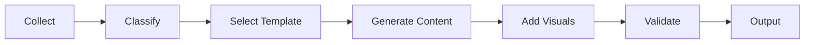
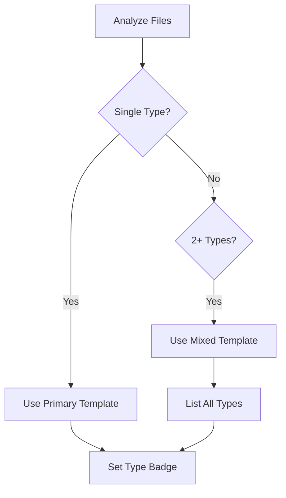

# README Generation Workflow

> **Workflow ID**: TOON-README-GEN-001 | **Version**: 1.0.0 | **Tier**: 2

Automated 7-stage pipeline for generating consistent, high-quality branch README documentation.

---

## Workflow Overview



---

## Stage 1: Collect Branch Data

**Operator**: `COLLECT`
**Input**: Branch identifier
**Output**: Branch metadata object

### Data Sources

| Source | Data Collected |
|--------|----------------|
| git_log | Commit history, authors, dates |
| git_diff | Files changed, lines added/removed |
| git_status | Sync status with main |
| github_api | PR status, CI checks, reviews |
| branch_history | Previous scans, score evolution |

### Output Schema

| Field | Type | Description |
|-------|------|-------------|
| branch_id | string | Branch identifier |
| commits_ahead | integer | Commits ahead of main |
| commits_behind | integer | Commits behind main |
| files_changed | list[path] | Modified files |
| pr_status | enum | null, PR_OPEN, MERGED |
| ci_passing | integer | Passing CI checks |
| ci_failing | integer | Failing CI checks |

---

## Stage 2: Classify Change Type

**Operator**: `CLASSIFY`
**Input**: Branch metadata, file changes
**Output**: Change type classification

### Detection Rules

| Type | File Patterns | Badge |
|------|---------------|-------|
| Agent | `.claude/agents/**/*.md` | [AGENT] |
| Skill | `.claude/skills/**/SKILL.md` | [SKILL] |
| Workflow | `**/*.toon`, `**/workflows/*` | [WORKFLOW] |
| Command | `.claude/commands/**/*.md` | [COMMAND] |
| Hook | `.claude/hooks/**/*.py` | [HOOK] |
| Mixed | Multiple types detected | [MIXED] |

### Decision Tree



---

## Stage 3: Select Template

**Operator**: `SELECT_TEMPLATE`
**Input**: Change classification, branch status
**Output**: Template selection

### Status Templates

| Status | Focus | Primary Action |
|--------|-------|----------------|
| ACTIVE | Development guidance | Create PR |
| PR_OPEN | Review and merge | Complete review |
| MERGED | Change documentation | Document impact |
| STALE | Decision required | Close or reactivate |

---

## Stage 4: Generate Content

**Operator**: `GENERATE`
**Input**: Template, branch data
**Output**: Markdown sections

### Section Order

1. **header_block** - Branch name, status, tier, score
2. **tldr** - 3-5 bullet summary (20-75 words)
3. **quick_stats** - Metrics table
4. **improvements** - Type-specific content
5. **components** - Type-specific content
6. **merge_status** - Status-specific content
7. **timeline** - Gantt chart
8. **action_guide** - Status-specific actions

---

## Stage 5: Add Visuals

**Operator**: `ADD_VISUALS`
**Input**: Generated content
**Output**: Content with charts

### Mandatory Charts

| Chart Type | Condition | Placement |
|------------|-----------|-----------|
| Pie (CI Status) | has_ci_data | After Quick Stats |
| Gantt (Timeline) | always | Timeline section |

### Conditional Charts

| Chart Type | Condition | Placement |
|------------|-----------|-----------|
| XY (Score) | score_history >= 3 | After header |
| Flowchart | status == STALE | Action guide |

---

## Stage 6: Validate

**Operator**: `VALIDATE`
**Input**: Complete README content
**Output**: Validation report

### Quality Gates

| Gate | Type | Checks |
|------|------|--------|
| Gate 1 | Blocking | header, tldr, stats, badge present |
| Gate 2 | Warning | chart_count >= 1, table_count >= 3 |
| Gate 3 | Content | summary >= 50 words, no placeholders |
| Gate 4 | Links | All links valid |

### Score Calculation

```
SCORE = (
  SECTIONS_PRESENT / MANDATORY_COUNT * 40 +
  min(CHARTS, 3) / 3 * 15 +
  min(TABLES, 3) / 3 * 15 +
  CONTENT_QUALITY * 20 +
  LINKS_VALID * 10
)
```

**Target Score**: 90/100

---

## Stage 7: Output

**Operator**: `OUTPUT`
**Input**: Validated README content
**Output**: Saved file(s)

### Output Format

```
Filename: {DATE}_{BRANCH_SANITIZED}_{STATUS}.md
Location: .moai/docs/branches/
Example:  2025-12-04_feature-macos-optimizer_ACTIVE.md
```

### Post Actions

- Update branches/index.md
- Log generation metrics
- Notify if CI failing

---

## Error Handling

| Stage | Strategy | Fallback |
|-------|----------|----------|
| Collect | Retry 3x | Skip branch with warning |
| Classify | Default | Use 'mixed' type |
| Select | Fallback | ACTIVE template |
| Generate | Partial | Use placeholders |
| Visuals | Skip | Continue text-only |
| Validate | Log | Continue if no blocking |
| Output | Retry | Alert on failure |

---

## Trigger Integration

### Manual Triggers

```bash
/collector:readme {branch}           # Single branch
/collector:readme --all              # All branches
/collector:readme --force            # Regenerate existing
/collector:readme --validate-only    # Dry run
```

### Automatic Triggers

| Event | Condition | Action |
|-------|-----------|--------|
| git push | branch in tracked_branches | Regenerate after 5m delay |
| PR merged | Always | Update status to MERGED |

---

## Module Dependencies

### Internal Modules

- `readme-rules.md` - Formatting rules
- `quality-gates.md` - Validation criteria
- `change-type-templates.md` - Type-specific templates
- `visual-enhancement-rules.md` - Chart requirements
- `best-practice-template.md` - Output templates

### External Dependencies

- `collector-scanner` - File change detection
- `collector-learner` - Score history
- `branch-database` - Branch metadata

---

**Related**: [readme-generation.toon](./readme-generation.toon) (machine-readable orchestration)
