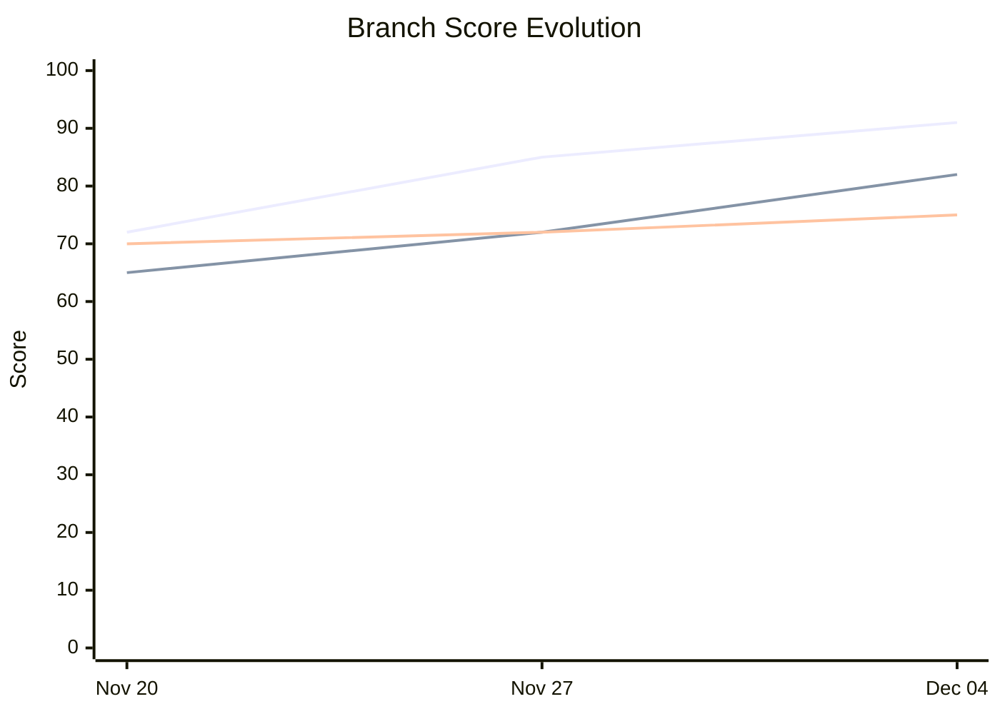
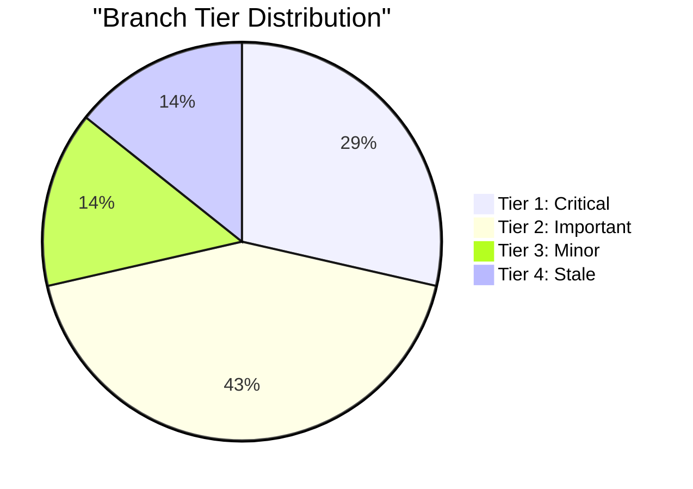
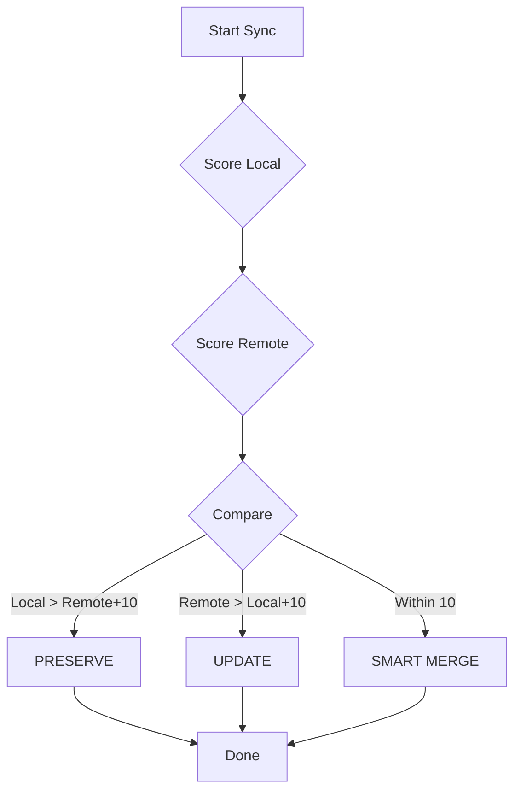
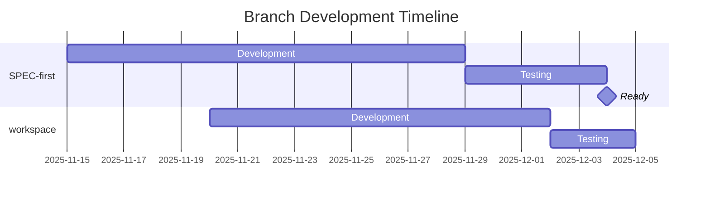

# Collector: UI

**Interactive decision interfaces for the collector system**

> **Version**: 1.0.0
> **Status**: Production Ready
> **Part of**: MoAI Flow System

## Quick Reference

### Purpose

Provide modern, interactive user interfaces for:
- Branch comparison and selection
- Merge decision making
- Progress display and feedback
- Chart generation for visualization

### Quick Invocation

```python
Skill("collector-ui")
```

---

## Modules

| Module | Description |
|--------|-------------|
| `decision-menu.md` | AskUserQuestion patterns for decisions |
| `comparison-table.md` | ANSI table formatting for comparisons |
| `progress-display.md` | Progress indicators and status updates |
| `chart-generation.md` | Mermaid chart patterns for visualization |

---

## Level 1: Decision Menus

### Standard Decision Flow

After learning/analysis phase, present decision menu:

```yaml
decision_menu:
  header: "Sync Decision"
  question: "Learning analysis complete. Select your next action."
  multiSelect: false
  options:
    - label: "Apply All"
      description: "Apply all MUST_MERGE and SHOULD_MERGE recommendations"
    - label: "Select Items"
      description: "Choose specific components to sync"
    - label: "Review Details"
      description: "See detailed breakdown for each component"
    - label: "Skip"
      description: "Save analysis and exit without changes"
```

### Multi-Select Pattern

For selective sync:

```yaml
selective_sync_menu:
  header: "Component Selection"
  question: "Select components to sync (multiple allowed)"
  multiSelect: true
  options:
    - label: "foundation-core"
      description: "UPDATE from feature/SPEC-first (Score: 91)"
    - label: "decision-framework"
      description: "SMART MERGE local + main (Score: 85/88)"
    - label: "collector-scan"
      description: "PRESERVE local innovation (Score: 88)"
```

### Confirmation Pattern

Before applying changes:

```yaml
confirmation_menu:
  header: "Confirm Sync"
  question: "Ready to apply 3 changes. Proceed?"
  multiSelect: false
  options:
    - label: "Apply Changes"
      description: "Execute the selected sync operations"
    - label: "Review First"
      description: "Show detailed diff before applying"
    - label: "Cancel"
      description: "Abort operation, no changes made"
```

---

## Level 2: Comparison Tables

### Branch Comparison Matrix

Display all branches with scores:

```
+----------------------+-------+------+-------------+-------------+--------+
| Component            | Local | main | SPEC-first  | workspace   | Best   |
+----------------------+-------+------+-------------+-------------+--------+
| collector-scan       | [88]  |  -   |     -       |     -       | LOCAL  |
| foundation-core      |  72   |  75  |    [91]     |     85      | SPEC   |
| decision-framework   | [85]  |  80  |     88      |     -       | MERGE  |
| builder-skill        |  78   | [82] |     80      |     -       | main   |
+----------------------+-------+------+-------------+-------------+--------+

Legend: [N] = Best score, highlighted
```

### Action Summary Table

Show recommended actions:

```
+----------------------+--------------+------------------+-------------+
| Component            | Action       | Source           | Delta       |
+----------------------+--------------+------------------+-------------+
| collector-scan       | PRESERVE     | local            | -           |
| foundation-core      | UPDATE       | SPEC-first       | +19 points  |
| decision-framework   | SMART MERGE  | local + main     | best of both|
| builder-skill        | UPDATE       | main             | +4 points   |
+----------------------+--------------+------------------+-------------+

Summary: PRESERVE: 1 | UPDATE: 2 | MERGE: 1
```

### Tier Distribution Table

Show branches by priority:

```
+--------+-------------------------+-------+------------------+
| Tier   | Branch                  | Score | Status           |
+--------+-------------------------+-------+------------------+
| 1      | feature/SPEC-first      |  91   | Ready to merge   |
| 1      | hotfix/security-patch   |  95   | Critical         |
| 2      | feature/workspace       |  82   | In review        |
| 2      | feature/tdd-integration |  78   | Testing          |
| 3      | docs/readme-updates     |  65   | Low priority     |
| 4      | feature/old-experiment  |  55   | Stale - 92 days  |
+--------+-------------------------+-------+------------------+
```

---

## Level 3: Progress Display

### Scan Progress

During scanning:

```
Scanning Branches...

[1/5] main .......................... Done
[2/5] feature/SPEC-first ............ Done
[3/5] feature/workspace ............. In Progress
[4/5] feature/tdd ................... Pending
[5/5] docs/updates .................. Pending

Components found: 47
Time elapsed: 12s
```

### Analysis Progress

During learning:

```
Analyzing Components...

Phase 1: Scoring [=================>  ] 85% (40/47)
Phase 2: Patterns [                    ]  0%
Phase 3: Strategy [                    ]  0%

Current: builder-skill
  Structure:     18/20
  Documentation: 16/20
  Functionality: 22/25
  Quality:       17/20
  Freshness:     12/15
  TOTAL:         85/100
```

### Merge Progress

During application:

```
Applying Changes...

[1/3] UPDATE foundation-core ........ Done
[2/3] SMART MERGE decision-fw ....... In Progress
[3/3] PRESERVE collector-scan ....... Pending

Backup created: .moai/backups/sync-2025-12-04-001/
Rollback available: Yes
```

---

## Level 4: Mermaid Charts

### Score Evolution Line Chart



### Tier Distribution Pie



### Sync Decision Flowchart



### Timeline Gantt



---

## API Reference

### display_comparison_table(data)

```python
def display_comparison_table(
    components: List[ComponentComparison],
    branches: List[str]
) -> str:
    """
    Generate ANSI comparison table.

    Args:
        components: List of component comparisons
        branches: Branch names for columns

    Returns:
        Formatted table string for terminal display
    """
```

### create_decision_menu(options)

```python
def create_decision_menu(
    header: str,
    question: str,
    options: List[MenuOption],
    multiSelect: bool = False
) -> AskUserQuestion:
    """
    Create AskUserQuestion for user decision.

    Args:
        header: Short label (max 12 chars)
        question: Full question text
        options: 2-4 options to present
        multiSelect: Allow multiple selections

    Returns:
        Properly formatted AskUserQuestion
    """
```

### show_progress(phase, current, total)

```python
def show_progress(
    phase: str,
    current: int,
    total: int,
    current_item: str = None
) -> str:
    """
    Generate progress display string.

    Args:
        phase: Current phase name
        current: Current item number
        total: Total items
        current_item: Optional item being processed

    Returns:
        Formatted progress display
    """
```

### generate_chart(chart_type, data)

```python
def generate_chart(
    chart_type: ChartType,
    data: ChartData
) -> str:
    """
    Generate Mermaid chart code.

    Args:
        chart_type: pie, line, gantt, flowchart
        data: Chart-specific data

    Returns:
        Mermaid code block
    """
```

---

## Style Guidelines

### No Emojis in AskUserQuestion

Per MoAI conventions, avoid emojis in user-facing UI:

```yaml
# Good
label: "Apply Changes"
description: "Execute the selected sync operations"

# Avoid
label: "Apply Changes"
description: "Execute the selected sync operations"
```

### Table Formatting

Use box-drawing characters for clean tables:

```
+------+  instead of  |------|
|      |              |      |
+------+              |------|
```

### Progress Bars

Use simple ASCII progress:

```
[=================>  ] 85%  (preferred)
[==================] 100%   (complete)
[                    ]  0%   (starting)
```

---

## Integration

### Works With

- **collector-scanner**: Progress during scan
- **collector-learner**: Decision menu after learning
- **collector-merger**: Progress during merge
- **collector-orchestrator**: Overall workflow UI

### Called By

- All collector agents for UI display
- Commands for interactive selection

---

**Version**: 1.0.0 | **Status**: Production Ready | **Last Updated**: 2025-12-04
