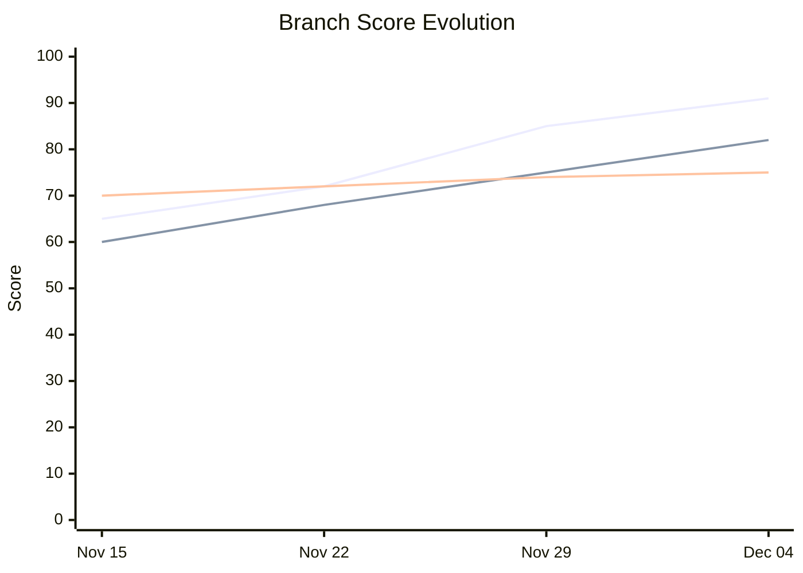
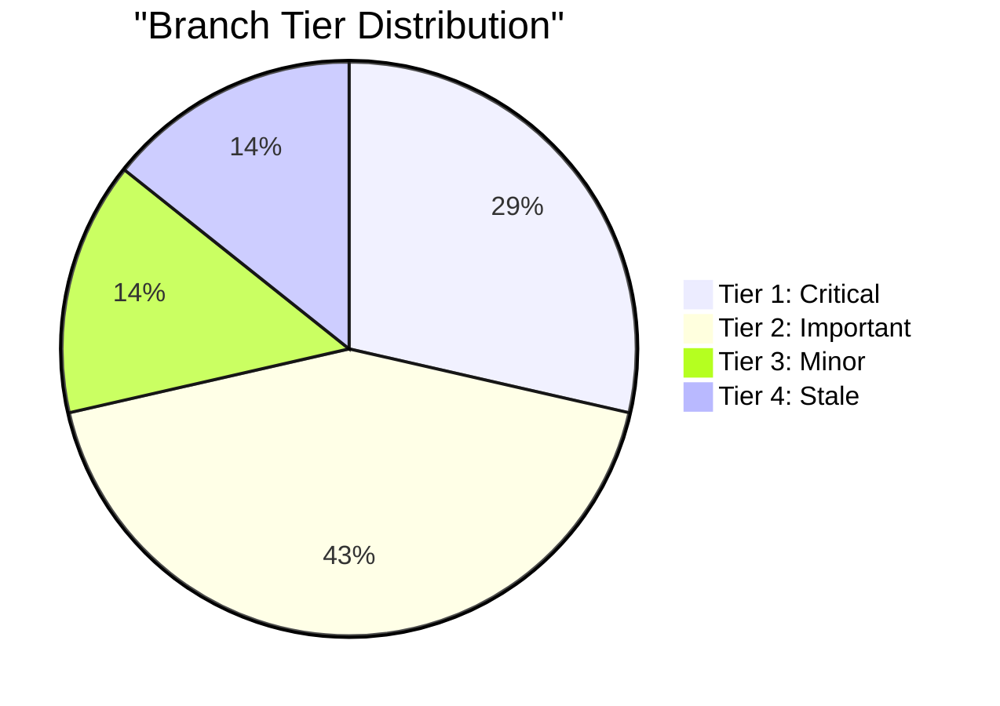
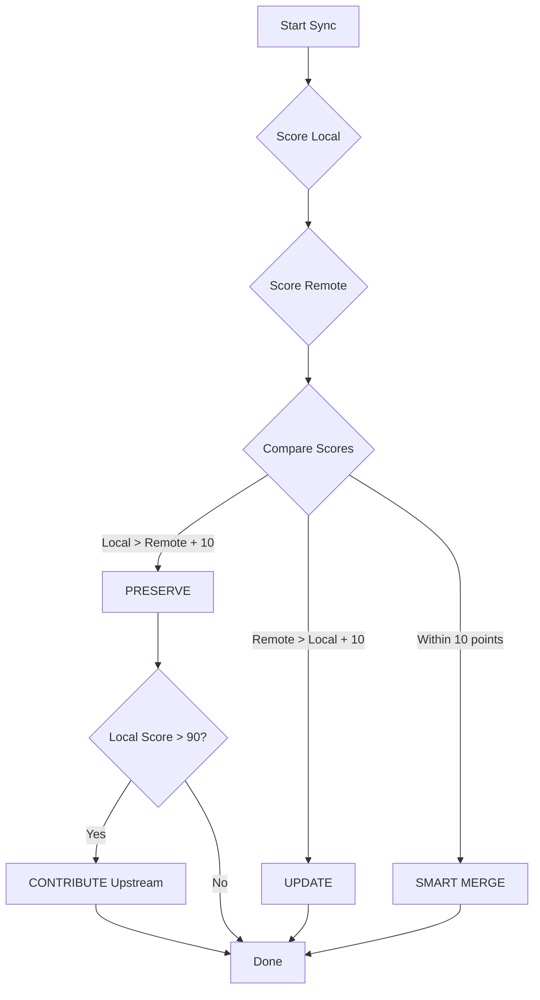
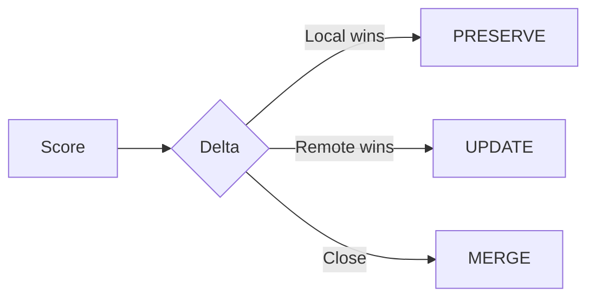
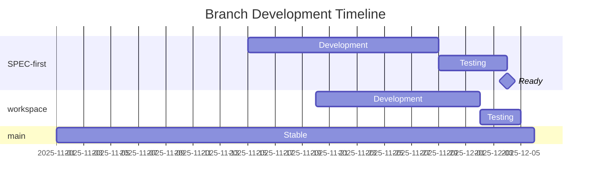
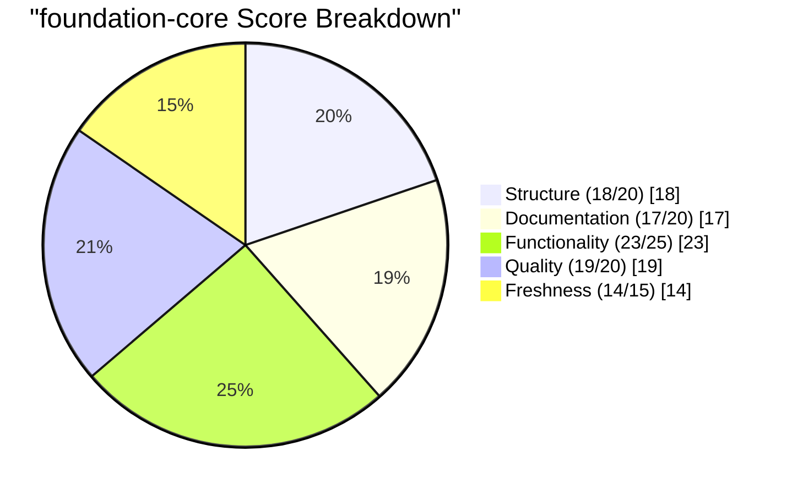
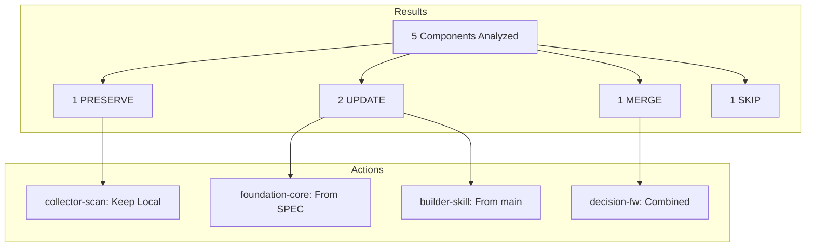

# Chart Generation Patterns

**Mermaid chart patterns for collector visualizations**

> **Version**: 1.0.0
> **Part of**: collector-ui skill
> **Last Updated**: 2025-12-04

---

## Overview

Generate Mermaid charts for visualizing branch history, score evolution, and sync decisions.

---

## Chart Types

### 1. Score Evolution Line Chart

Track branch score changes over time:



**Generation Template**:

```python
def generate_score_chart(branches: List[BranchHistory]) -> str:
    """
    Generate Mermaid line chart for score evolution.
    """
    dates = get_common_dates(branches)
    lines = []

    for branch in branches:
        scores = get_scores_for_dates(branch, dates)
        lines.append(f'    line "{branch.name}" {scores}')

    return f"""```mermaid
xychart-beta
    title "Branch Score Evolution"
    x-axis {format_dates(dates)}
    y-axis "Score" 0 --> 100
{chr(10).join(lines)}
```"""
```

### 2. Tier Distribution Pie Chart

Show branch distribution by tier:



**Generation Template**:

```python
def generate_tier_pie(tier_counts: Dict[int, int]) -> str:
    """
    Generate Mermaid pie chart for tier distribution.
    """
    tier_labels = {
        1: "Tier 1: Critical",
        2: "Tier 2: Important",
        3: "Tier 3: Minor",
        4: "Tier 4: Stale"
    }

    slices = []
    for tier, count in tier_counts.items():
        if count > 0:
            slices.append(f'    "{tier_labels[tier]}" : {count}')

    return f"""```mermaid
pie title "Branch Tier Distribution"
{chr(10).join(slices)}
```"""
```

### 3. Sync Decision Flowchart

Visualize sync decision logic:



**Simplified Version**:



### 4. Branch Timeline Gantt

Show branch development timeline:



**Generation Template**:

```python
def generate_timeline_gantt(branches: List[BranchHistory]) -> str:
    """
    Generate Mermaid Gantt chart for branch timeline.
    """
    sections = []

    for branch in branches:
        section = f"    section {branch.short_name}\n"

        # Add development phase
        dev_start = branch.created_at
        dev_days = (branch.first_stable - branch.created_at).days
        section += f"    Development    :{branch.id}_dev, {dev_start}, {dev_days}d\n"

        # Add testing phase if exists
        if branch.testing_started:
            section += f"    Testing        :{branch.id}_test, after {branch.id}_dev, {branch.testing_days}d\n"

        # Add milestone if merged
        if branch.merged:
            section += f"    Merged         :milestone, {branch.id}_m, {branch.merged_at}, 0d\n"

        sections.append(section)

    return f"""```mermaid
gantt
    title Branch Development Timeline
    dateFormat YYYY-MM-DD

{chr(10).join(sections)}
```"""
```

### 5. Component Score Radar

Compare scoring dimensions:



### 6. Sync Summary Flowchart

Show sync results:



---

## Chart Styling

### Color Schemes

```yaml
tier_colors:
  tier_1: "#FFD700"  # Gold
  tier_2: "#C0C0C0"  # Silver
  tier_3: "#CD7F32"  # Bronze
  tier_4: "#808080"  # Gray

action_colors:
  preserve: "#4CAF50"  # Green
  update: "#2196F3"    # Blue
  merge: "#FF9800"     # Orange
  skip: "#9E9E9E"      # Gray
```

### Theme Configuration

```mermaid
%%{init: {
  'theme': 'base',
  'themeVariables': {
    'primaryColor': '#4A90D9',
    'primaryTextColor': '#fff',
    'primaryBorderColor': '#3A7BC8',
    'lineColor': '#4A90D9',
    'secondaryColor': '#F5F5F5',
    'tertiaryColor': '#E8E8E8'
  }
}}%%
```

---

## Dynamic Chart Generation

### Score Evolution Generator

```python
def generate_score_evolution(
    branch_history: Dict[str, List[ScoreEntry]],
    days: int = 30
) -> str:
    """
    Generate score evolution chart for specified time period.

    Args:
        branch_history: Branch name -> score history
        days: Number of days to include

    Returns:
        Mermaid xychart code
    """
    # Get date range
    end_date = datetime.now()
    start_date = end_date - timedelta(days=days)

    # Filter and format dates
    dates = generate_date_labels(start_date, end_date, max_labels=8)

    # Build chart
    lines = []
    for branch_name, history in branch_history.items():
        scores = interpolate_scores(history, dates)
        lines.append(f'    line "{branch_name}" {scores}')

    return f"""```mermaid
xychart-beta
    title "Score Evolution (Last {days} Days)"
    x-axis {dates}
    y-axis "Score" 0 --> 100
{chr(10).join(lines)}
```"""
```

### Tier Distribution Generator

```python
def generate_tier_distribution(branches: List[Branch]) -> str:
    """
    Generate tier distribution pie chart.
    """
    counts = {1: 0, 2: 0, 3: 0, 4: 0}

    for branch in branches:
        counts[branch.tier] += 1

    # Filter out zero counts
    slices = []
    tier_labels = {
        1: "Tier 1: Critical",
        2: "Tier 2: Important",
        3: "Tier 3: Minor",
        4: "Tier 4: Stale"
    }

    for tier in [1, 2, 3, 4]:
        if counts[tier] > 0:
            slices.append(f'    "{tier_labels[tier]}" : {counts[tier]}')

    return f"""```mermaid
pie title "Branch Tier Distribution"
{chr(10).join(slices)}
```"""
```

---

## Chart Placement

### In README

```markdown
## Score Trends

{score_evolution_chart}

## Branch Status

{tier_distribution_chart}
```

### In Reports

```markdown
# Sync Report: 2025-12-04

## Analysis Summary

{sync_summary_flowchart}

## Score Evolution

{score_evolution_chart}
```

---

## Best Practices

1. **Keep Simple**: Prefer simple charts over complex ones
2. **Limit Data**: Show max 5-6 data series in line charts
3. **Use Labels**: Always include clear titles and labels
4. **Consistent Colors**: Use tier/action colors consistently
5. **Responsive**: Charts should render well in different widths

---

**Version**: 1.0.0 | **Status**: Production Ready | **Last Updated**: 2025-12-04
