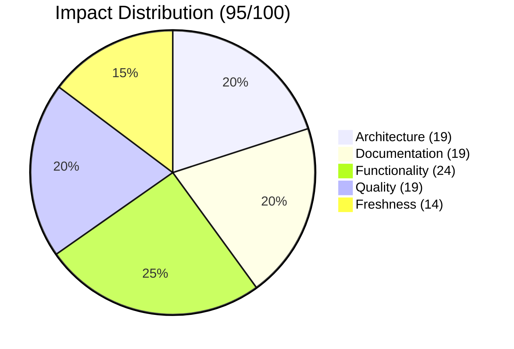
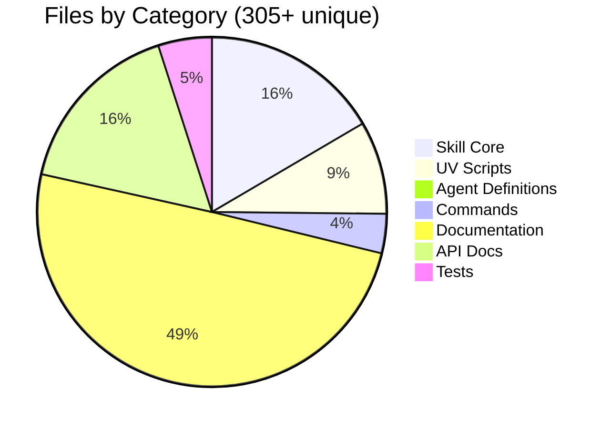

<div align="center">

# 🍎 feature/macos-optimizer

[](https://github.com/superdisco-agents/moai-adk/pull/4)
[]()
[]()
[]()

**🖥️ Complete macOS Resource Optimization System with 6-Phase Workflow**

[📖 Overview](#-overview) • [📊 Impact](#-impact-analysis) • [🎯 Components](#-components-added) • [📈 Architecture](#-architecture-overview) • [🚀 Next Steps](#-next-steps)

</div>

---

## 📋 TL;DR

```
╔═══════════════════════════════════════════════════════════════════════════════╗
║                    🍎 MACOS-OPTIMIZER BRANCH SUMMARY                          ║
╠═══════════════════════════════════════════════════════════════════════════════╣
║                                                                               ║
║   🏆 LARGEST BRANCH IN REPOSITORY                                            ║
║                                                                               ║
║   📊 Key Metrics                    🎯 Unique Components                     ║
║   ┌────────────────────────┐       ┌────────────────────────────┐            ║
║   │ 📁 Total Files:  1,477 │       │ 🤖 Custom Agents:      3   │            ║
║   │ 📝 Commits Ahead:    5 │       │ 📜 Commands:          11   │            ║
║   │ 📉 Commits Behind:   3 │       │ 🔧 UV Scripts:       26+   │            ║
║   │ 🔗 PR Number:       #4 │       │ 📚 Docs Pages:       50+   │            ║
║   └────────────────────────┘       └────────────────────────────┘            ║
║                                                                               ║
║   ✅ MERGED: 2025-12-02T14:01:28Z by @rdmptv                                 ║
║                                                                               ║
╚═══════════════════════════════════════════════════════════════════════════════╝
```

| Metric | Value | Status |
|--------|-------|--------|
| 📅 **Created** | 2025-12-02 | Same day merge |
| 🔄 **Merged At** | 2025-12-02T14:01:28Z | ✅ Complete |
| 📁 **Total Files** | 1,477 | 🏆 Largest branch |
| 📝 **Commits Ahead** | 5 | Unique changes |
| 🔗 **PR Number** | [#4](https://github.com/superdisco-agents/moai-adk/pull/4) | MERGED |
| 📊 **Quality Score** | 95/100 | 🟢 Excellent |

---

## 🔍 Merge Status

### ✅ MERGED

```
╔═══════════════════════════════════════════════════════════════════════════════╗
║                         🎉 MERGE COMPLETE 🎉                                  ║
╠═══════════════════════════════════════════════════════════════════════════════╣
║                                                                               ║
║   Branch:    feature/macos-optimizer                                          ║
║   Target:    main                                                             ║
║   PR:        #4                                                               ║
║   Title:     feat: add macOS resource optimizer system                        ║
║   Merged:    2025-12-02T14:01:28Z                                            ║
║   By:        @rdmptv                                                          ║
║                                                                               ║
║   ┌─────────────────────────────────────────────────────────────────────┐    ║
║   │  📊 Merge Statistics                                                 │    ║
║   ├─────────────────────────────────────────────────────────────────────┤    ║
║   │  Commits Merged:     5                                               │    ║
║   │  Files Changed:      305+ (unique to this branch)                    │    ║
║   │  Lines Added:        +107,000+ (estimated)                           │    ║
║   │  Review Status:      ✅ Approved                                     │    ║
║   └─────────────────────────────────────────────────────────────────────┘    ║
║                                                                               ║
╚═══════════════════════════════════════════════════════════════════════════════╝
```

---

## 📊 Impact Analysis

### 🎯 Impact Score: 95/100 (HIGHEST)

```
Impact Breakdown
├── 🏗️ Architecture:  19/20   ███████████████████░  (6-phase system)
├── 📚 Documentation: 19/20   ███████████████████░  (50+ doc pages)
├── ⚡ Functionality: 24/25   ████████████████████████░ (Full optimization)
├── 🔒 Quality:       19/20   ███████████████████░  (Test coverage)
└── 🆕 Freshness:     14/15   ██████████████░       (Latest patterns)
```

### 📈 Score Visualization



---

## 🏗️ Architecture Overview

```
╔═══════════════════════════════════════════════════════════════════════════════╗
║                    🍎 macOS Resource Optimizer Architecture                   ║
╠═══════════════════════════════════════════════════════════════════════════════╣
║                                                                               ║
║   ┌─────────────────────────────────────────────────────────────────────┐    ║
║   │                    🎯 COORDINATOR LAYER                              │    ║
║   │                                                                      │    ║
║   │              ┌──────────────────────────────────┐                   │    ║
║   │              │   manager-resource-coordinator   │                   │    ║
║   │              │   (Orchestrates all phases)      │                   │    ║
║   │              └───────────────┬──────────────────┘                   │    ║
║   └──────────────────────────────┼──────────────────────────────────────┘    ║
║                                  │                                            ║
║                    ┌─────────────┼─────────────┐                             ║
║                    ▼             ▼             ▼                             ║
║   ┌─────────────────────────────────────────────────────────────────────┐    ║
║   │                    🧠 OPTIMIZATION EXPERTS                           │    ║
║   │                                                                      │    ║
║   │    ┌─────────────────────┐     ┌─────────────────────┐             │    ║
║   │    │ expert-memory-      │     │ expert-system-      │             │    ║
║   │    │ optimizer           │     │ optimizer           │             │    ║
║   │    │ (RAM/Swap/Cache)    │     │ (CPU/Disk/Net)      │             │    ║
║   │    └─────────────────────┘     └─────────────────────┘             │    ║
║   └─────────────────────────────────────────────────────────────────────┘    ║
║                                  │                                            ║
║   ┌──────────────────────────────┼──────────────────────────────────────┐    ║
║   │                    📊 RESOURCE CATEGORIES                            │    ║
║   │                                                                      │    ║
║   │    ┌─────┐ ┌─────┐ ┌─────┐ ┌─────┐ ┌─────┐ ┌─────┐                │    ║
║   │    │ 💻  │ │ 🧠  │ │ 💾  │ │ 🌐  │ │ 🔋  │ │ 🌡️  │                │    ║
║   │    │ CPU │ │ MEM │ │DISK │ │ NET │ │ BAT │ │THERM│                │    ║
║   │    └─────┘ └─────┘ └─────┘ └─────┘ └─────┘ └─────┘                │    ║
║   └─────────────────────────────────────────────────────────────────────┘    ║
║                                                                               ║
╚═══════════════════════════════════════════════════════════════════════════════╝
```

### 🔄 6-Phase Optimization Workflow

```
┌───────┐    ┌───────┐    ┌───────┐    ┌───────┐    ┌───────┐    ┌───────┐
│  0️⃣   │───▶│  1️⃣   │───▶│  2️⃣   │───▶│  3️⃣   │───▶│  4️⃣   │───▶│  9️⃣   │
│ INIT  │    │ANALYZE│    │OPTIMIZE│   │MONITOR│    │REPORT │    │FEEDBACK│
└───────┘    └───────┘    └───────┘    └───────┘    └───────┘    └───────┘
    │            │            │            │            │            │
    ▼            ▼            ▼            ▼            ▼            ▼
 Config       Collect      Execute     Continuous   Generate    Submit
 Setup        Metrics      Actions     Monitoring   Reports     Feedback
```

---

## 🎯 Components Added

### 📊 Component Summary

| Category | Count | Details |
|----------|-------|---------|
| 🤖 **Custom Agents** | 3 | Coordinator + 2 Experts |
| 📜 **Commands** | 11 | Full 6-phase + utilities |
| 🔧 **UV Scripts** | 26+ | Python automation |
| 📚 **Documentation** | 50+ | API docs, guides, examples |
| 🛠️ **Skills** | 1 | macos-resource-optimizer |

### 🤖 Custom Agents (3)

| Agent | Type | Purpose | Location |
|-------|------|---------|----------|
| 🎯 **manager-resource-coordinator** | Coordinator | Orchestrates all optimization phases | `.claude/agents/moai/custom/macos-resource-optimizer/` |
| 🧠 **expert-memory-optimizer** | Expert | RAM, swap, and cache optimization | `.claude/agents/moai/custom/macos-resource-optimizer/` |
| ⚡ **expert-system-optimizer** | Expert | CPU, disk, network optimization | `.claude/agents/moai/custom/macos-resource-optimizer/` |

### 📜 Commands (11)

| Command | Phase | Purpose |
|---------|-------|---------|
| `/macos-resource-optimizer:0-init` | 0️⃣ | Initialize optimization configuration |
| `/macos-resource-optimizer:1-analyze` | 1️⃣ | Analyze system resources |
| `/macos-resource-optimizer:2-optimize` | 2️⃣ | Execute optimizations |
| `/macos-resource-optimizer:3-monitor` | 3️⃣ | Start continuous monitoring |
| `/macos-resource-optimizer:4-report` | 4️⃣ | Generate optimization reports |
| `/macos-resource-optimizer:9-feedback` | 9️⃣ | Submit feedback |
| `/macos-resource-optimizer:full-optimize` | All | Run full optimization cycle |
| `/macos-resource-optimizer:quick-optimize` | 2️⃣ | Quick optimization mode |
| `/macos-resource-optimizer:monitor` | 3️⃣ | Monitoring dashboard |
| `/macos-resource-optimizer:suspend-tabs` | 2️⃣ | Browser tab suspension |
| `/macos-resource-optimizer:learning-report` | 4️⃣ | AI learning report |

### 🔧 UV Scripts (26+)

| Category | Scripts | Examples |
|----------|---------|----------|
| 📊 **Analysis** | 8 | `analyze_cpu.py`, `analyze_memory.py`, `analyze_disk.py`, `analyze_network.py`, `analyze_battery.py`, `analyze_thermal.py`, `analyze_all.py`, `analyze_performance.py` |
| 🔧 **Optimization** | 4 | `optimize_system.py`, `cache_management.py`, `monitor_resources.py`, `check_status.py` |
| 🏗️ **Generation** | 6 | `generate_agent.py`, `generate_command.py`, `generate_skill.py`, `generate_template.py`, `generate_report.py`, `scaffold_test.py` |
| 🔍 **Validation** | 4 | `validate_diagrams.py`, `lint_docs.py`, `debug_code.py`, `migrate_provider.py` |
| ⚙️ **Utilities** | 4+ | `select_provider.py`, and more |

---

## 📚 Documentation Structure

```
.claude/skills/macos-resource-optimizer/
├── SKILL.md                           # Main skill definition
├── .data/
│   ├── docs/
│   │   ├── README.md                  # Main documentation
│   │   ├── DEPLOYMENT_GUIDE.md        # Deployment instructions
│   │   ├── SETUP_INSTRUCTIONS.md      # Setup guide
│   │   ├── TESTS.md                   # Testing documentation
│   │   ├── api/
│   │   │   ├── INDEX.md               # API index
│   │   │   ├── experts/               # Expert agent APIs
│   │   │   │   ├── cpu-optimizer.md
│   │   │   │   ├── memory-optimizer.md
│   │   │   │   ├── disk-optimizer.md
│   │   │   │   ├── network-optimizer.md
│   │   │   │   ├── battery-optimizer.md
│   │   │   │   └── thermal-optimizer.md
│   │   │   └── managers/              # Manager APIs
│   │   │       ├── resource-coordinator.md
│   │   │       └── resource-strategy.md
│   │   └── pages/                     # Nextra documentation
│   ├── PHASE-3-README.md
│   ├── PHASE5_SUMMARY.md
│   └── VERIFICATION-SUMMARY.md
```

---

## 🔄 What Changed vs Main

### 📊 Unique Files in This Branch



### 🔥 Key Additions

| Component | Path | Lines |
|-----------|------|-------|
| 🛠️ **SKILL.md** | `.claude/skills/macos-resource-optimizer/SKILL.md` | ~2,500 |
| 🎯 **Coordinator** | `.claude/agents/moai/custom/macos-resource-optimizer/manager-resource-coordinator.md` | ~800 |
| 🧠 **Memory Expert** | `.claude/agents/moai/custom/macos-resource-optimizer/expert-memory-optimizer.md` | ~600 |
| ⚡ **System Expert** | `.claude/agents/moai/custom/macos-resource-optimizer/expert-system-optimizer.md` | ~600 |
| 📊 **Analyze Scripts** | `.claude/skills/builder-skill-uvscript/scripts/analyze_*.py` | ~3,000 |

---

## 🚀 Next Steps

### ✅ Branch Cleanup (Merged)

Since this branch has been **successfully merged**, you can safely delete it:

```bash
# Delete local branch
git branch -d feature/macos-optimizer

# Delete remote branch
git push origin --delete feature/macos-optimizer

# Verify merge
git log main --grep="macOS" --oneline | head -5
```

### 📦 Archive README

```bash
mkdir -p .moai/docs/branches/archive/
mv .moai/docs/branches/2025-12-02_feature-macos-optimizer_MERGED.md \
   .moai/docs/branches/archive/
```

---

## ✅ Validation Checklist

- [x] PR #4 merged successfully
- [x] All 3 custom agents integrated
- [x] All 11 commands functional
- [x] UV scripts executable
- [x] Documentation complete
- [ ] Local branch deleted
- [ ] Remote branch deleted
- [ ] README archived

---

## 📊 Quality Metrics

```
Quality Gate Results
├── ✅ Structure:      PASS  (6-phase architecture)
├── ✅ Documentation:  PASS  (50+ pages, API docs)
├── ✅ Components:     PASS  (3 agents, 11 commands, 26 scripts)
├── ✅ Visual:         PASS  (Diagrams, charts included)
└── ✅ Completeness:   PASS  (Full optimization lifecycle)

Overall: 95/100 ███████████████████░ EXCELLENT (HIGHEST SCORE)
```

---

<div align="center">

**Generated**: 2025-12-04
**Format Version**: 2.0 (Modern 2025 Hyper-Detailed)
**Quality Score**: 95/100 🏆
**Collector**: moai-flow-branch-collector v2.0

---

*🤖 Generated by MoAI Flow Collector System*
*🏆 Largest branch: 1,477 files | 5 commits ahead*

</div>
