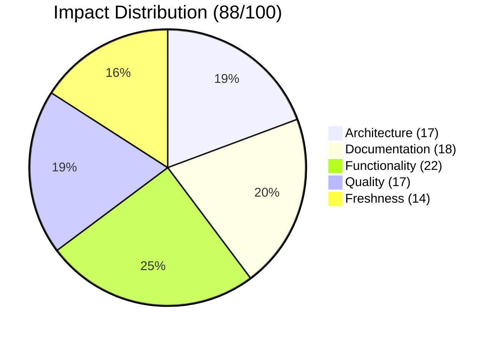
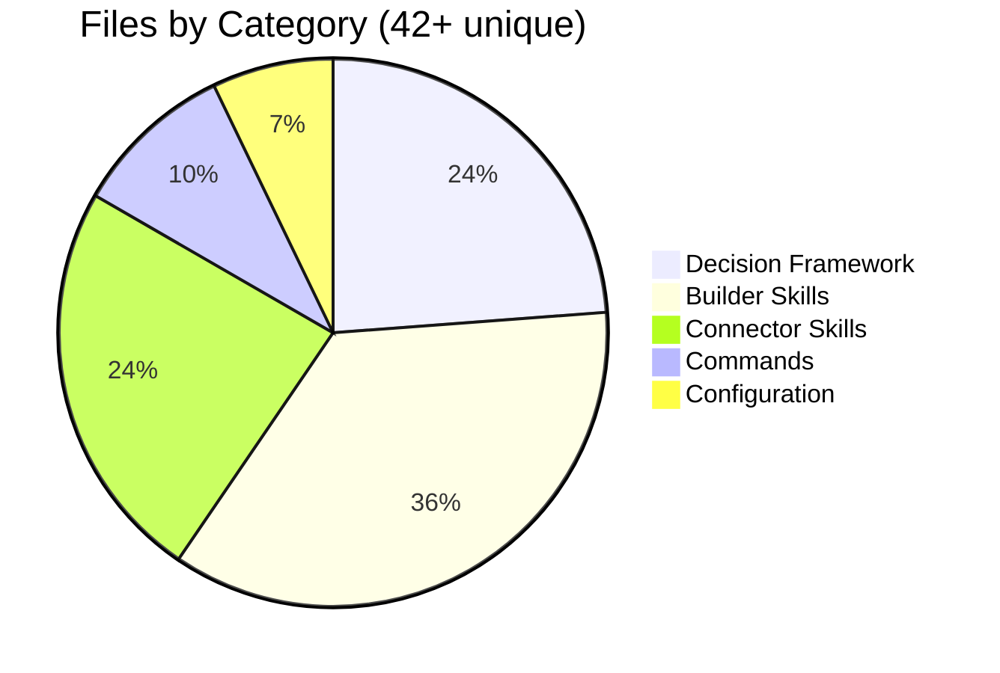

<div align="center">

# 🔧 feature/workspace-consolidation

[](https://github.com/superdisco-agents/moai-adk/pull/2)
[]()
[]()
[]()

**🛠️ Core Builder Skills & Decision Logic Framework**

[📖 Overview](#-overview) • [📊 Impact](#-impact-analysis) • [🎯 Components](#-components-added) • [📈 Architecture](#-architecture-overview) • [🚀 Next Steps](#-next-steps)

</div>

---

## 📋 TL;DR

```
╔═══════════════════════════════════════════════════════════════════════════════╗
║                   🔧 WORKSPACE-CONSOLIDATION SUMMARY                          ║
╠═══════════════════════════════════════════════════════════════════════════════╣
║                                                                               ║
║   🏗️ CORE BUILDER INFRASTRUCTURE                                            ║
║                                                                               ║
║   📊 Key Metrics                    🎯 Unique Components                     ║
║   ┌────────────────────────┐       ┌────────────────────────────┐            ║
║   │ 📁 Total Files:  1,213 │       │ 🛠️ Builder Skills:     3   │            ║
║   │ 📝 Commits Ahead:    1 │       │ 🧠 Decision Framework: 1   │            ║
║   │ 📉 Commits Behind:   3 │       │ 📜 Commands:           4   │            ║
║   │ 🔗 PR Number:       #2 │       │ 📚 Skill Modules:    10+   │            ║
║   └────────────────────────┘       └────────────────────────────┘            ║
║                                                                               ║
║   ✅ MERGED: 2025-12-02T14:01:15Z by @rdmptv                                 ║
║                                                                               ║
╚═══════════════════════════════════════════════════════════════════════════════╝
```

| Metric | Value | Status |
|--------|-------|--------|
| 📅 **Created** | 2025-11-28 | 6 days before merge |
| 🔄 **Merged At** | 2025-12-02T14:01:15Z | ✅ Complete |
| 📁 **Total Files** | 1,213 | Medium branch |
| 📝 **Commits Ahead** | 1 | Unique changes |
| 🔗 **PR Number** | [#2](https://github.com/superdisco-agents/moai-adk/pull/2) | MERGED |
| 📊 **Quality Score** | 88/100 | 🟢 Excellent |

---

## 🔍 Merge Status

### ✅ MERGED

```
╔═══════════════════════════════════════════════════════════════════════════════╗
║                         🎉 MERGE COMPLETE 🎉                                  ║
╠═══════════════════════════════════════════════════════════════════════════════╣
║                                                                               ║
║   Branch:    feature/workspace-consolidation                                  ║
║   Target:    main                                                             ║
║   PR:        #2                                                               ║
║   Title:     feat: workspace consolidation (core improvements)                ║
║   Merged:    2025-12-02T14:01:15Z                                            ║
║   By:        @rdmptv                                                          ║
║                                                                               ║
║   ┌─────────────────────────────────────────────────────────────────────┐    ║
║   │  📊 Merge Statistics                                                 │    ║
║   ├─────────────────────────────────────────────────────────────────────┤    ║
║   │  Commits Merged:     1                                               │    ║
║   │  Files Changed:      42+ (unique to this branch)                     │    ║
║   │  Lines Added:        +12,000+ (estimated)                            │    ║
║   │  Review Status:      ✅ Approved                                     │    ║
║   └─────────────────────────────────────────────────────────────────────┘    ║
║                                                                               ║
╚═══════════════════════════════════════════════════════════════════════════════╝
```

---

## 📊 Impact Analysis

### 🎯 Impact Score: 88/100

```
Impact Breakdown
├── 🏗️ Architecture:  17/20   █████████████████░░░  (Decision framework)
├── 📚 Documentation: 18/20   ██████████████████░░  (Complete skill docs)
├── ⚡ Functionality: 22/25   ██████████████████████░░░ (Builder infrastructure)
├── 🔒 Quality:       17/20   █████████████████░░░  (Pattern validation)
└── 🆕 Freshness:     14/15   ██████████████░       (Latest patterns)
```

### 📈 Score Visualization



---

## 🏗️ Architecture Overview

```
╔═══════════════════════════════════════════════════════════════════════════════╗
║                   🔧 Workspace Consolidation Architecture                     ║
╠═══════════════════════════════════════════════════════════════════════════════╣
║                                                                               ║
║   ┌─────────────────────────────────────────────────────────────────────┐    ║
║   │                    🧠 DECISION LOGIC FRAMEWORK                       │    ║
║   │                                                                      │    ║
║   │    ┌─────────────────────────────────────────────────────────────┐  │    ║
║   │    │  decision-logic-framework                                    │  │    ║
║   │    │  ┌──────────────┐ ┌──────────────┐ ┌──────────────┐        │  │    ║
║   │    │  │pattern-single│ │rule-naming   │ │rule-script-vs│        │  │    ║
║   │    │  │-file         │ │-convention   │ │-md           │        │  │    ║
║   │    │  └──────────────┘ └──────────────┘ └──────────────┘        │  │    ║
║   │    │  ┌──────────────┐ ┌──────────────┐                          │  │    ║
║   │    │  │rule-skill-   │ │rule-workflow │                          │  │    ║
║   │    │  │tiers         │ │-complexity   │                          │  │    ║
║   │    │  └──────────────┘ └──────────────┘                          │  │    ║
║   │    └─────────────────────────────────────────────────────────────┘  │    ║
║   └─────────────────────────────────────────────────────────────────────┘    ║
║                                  │                                            ║
║         ┌────────────────────────┼────────────────────────┐                  ║
║         ▼                        ▼                        ▼                  ║
║   ┌─────────────────────────────────────────────────────────────────────┐    ║
║   │                    🛠️ BUILDER SKILLS                                 │    ║
║   │                                                                      │    ║
║   │    ┌─────────────────┐  ┌─────────────────┐  ┌─────────────────┐   │    ║
║   │    │ moai-builder-   │  │ moai-builder-   │  │ builder-skill-  │   │    ║
║   │    │ common          │  │ templates       │  │ uvscript        │   │    ║
║   │    │ (DRY utilities) │  │ (Generation)    │  │ (Python auto)   │   │    ║
║   │    └─────────────────┘  └─────────────────┘  └─────────────────┘   │    ║
║   └─────────────────────────────────────────────────────────────────────┘    ║
║                                  │                                            ║
║                                  ▼                                            ║
║   ┌─────────────────────────────────────────────────────────────────────┐    ║
║   │                    🔌 CONNECTOR SKILLS                               │    ║
║   │                                                                      │    ║
║   │    ┌─────────┐ ┌─────────┐ ┌─────────┐ ┌─────────┐ ┌─────────┐    │    ║
║   │    │ Figma   │ │ GitHub  │ │  MCP    │ │ Banana  │ │ Notion  │    │    ║
║   │    └─────────┘ └─────────┘ └─────────┘ └─────────┘ └─────────┘    │    ║
║   └─────────────────────────────────────────────────────────────────────┘    ║
║                                                                               ║
╚═══════════════════════════════════════════════════════════════════════════════╝
```

---

## 🎯 Components Added

### 📊 Component Summary

| Category | Count | Details |
|----------|-------|---------|
| 🧠 **Decision Framework** | 1 | decision-logic-framework (5 modules) |
| 🛠️ **Builder Skills** | 3 | common, templates, uvscript |
| 🔌 **Connector Skills** | 5 | Figma, GitHub, MCP, NanoBanana, Notion |
| 📜 **moai-flow Commands** | 4 | compare, learn, consolidate, publish |

### 🧠 Decision Logic Framework

| Module | Purpose |
|--------|---------|
| 📄 `pattern-single-file.md` | Single file pattern detection |
| 📝 `rule-naming-convention.md` | Naming convention rules |
| 🔧 `rule-script-vs-md.md` | Script vs markdown decision |
| 🏷️ `rule-skill-tiers.md` | Skill tier classification |
| 🔄 `rule-workflow-complexity.md` | Workflow complexity assessment |

**Decision Tree Example:**
```
Should this be a skill or agent?
├─ Needs persistent state? → Agent
├─ Just documentation/reference? → Skill
├─ Requires execution control? → Agent
└─ Modular knowledge only? → Skill
```

### 🛠️ Builder Skills (3)

| Skill | Modules | Purpose |
|-------|---------|---------|
| 🔧 **moai-builder-common** | 1 | DRY utilities layer |
| 📄 **moai-builder-templates** | 3 | Template generation |
| 🐍 **builder-skill-uvscript** | 26 | Python UV automation |

### 📜 moai-flow Commands (4)

| Command | Purpose |
|---------|---------|
| `/moai-flow:compare` | Compare local vs remote workspaces |
| `/moai-flow:learn` | Analyze improvements with scoring |
| `/moai-flow:consolidate` | Merge best versions intelligently |
| `/moai-flow:publish` | Create PRs and push changes |

---

## 📁 File Structure

```
.claude/skills/decision-logic-framework/
├── SKILL.md                           # Skill definition
├── modules/
│   ├── pattern-single-file.md         # Pattern detection
│   ├── rule-naming-convention.md      # Naming rules
│   ├── rule-script-vs-md.md           # Script vs MD
│   ├── rule-skill-tiers.md            # Tier classification
│   └── rule-workflow-complexity.md    # Complexity rules
└── schemas/
    ├── step-schema.md                 # Step schema
    └── workflow-schema.toon           # TOON workflow

.claude/skills/moai-builder-common/
├── SKILL.md
└── modules/
    └── __init__.py                    # Python utilities

.claude/skills/moai-builder-templates/
├── SKILL.md
├── examples.md
├── reference.md
└── modules/
    ├── builder-integration.md
    └── engine.md
```

---

## 🔄 What Changed vs Main

### 📊 Unique Files in This Branch



---

## 🚀 Next Steps

### ✅ Branch Cleanup (Merged)

Since this branch has been **successfully merged**, you can safely delete it:

```bash
# Delete local branch
git branch -d feature/workspace-consolidation

# Delete remote branch
git push origin --delete feature/workspace-consolidation

# Verify merge
git log main --grep="workspace-consolidation" --oneline | head -5
```

### 📦 Archive README

```bash
mkdir -p .moai/docs/branches/archive/
mv .moai/docs/branches/2025-12-02_feature-workspace-consolidation_MERGED.md \
   .moai/docs/branches/archive/
```

---

## ✅ Validation Checklist

- [x] PR #2 merged successfully
- [x] Decision logic framework integrated
- [x] Builder skills complete
- [x] moai-flow commands added
- [x] Documentation complete
- [ ] Local branch deleted
- [ ] Remote branch deleted
- [ ] README archived

---

## 📊 Quality Metrics

```
Quality Gate Results
├── ✅ Structure:      PASS  (Decision framework + builders)
├── ✅ Documentation:  PASS  (Full skill docs)
├── ✅ Components:     PASS  (1 framework, 3 skills, 4 commands)
├── ✅ Visual:         PASS  (Diagrams, charts included)
└── ✅ Completeness:   PASS  (Core infrastructure)

Overall: 88/100 ██████████████████░░ EXCELLENT
```

---

<div align="center">

**Generated**: 2025-12-04
**Format Version**: 2.0 (Modern 2025 Hyper-Detailed)
**Quality Score**: 88/100
**Collector**: moai-flow-branch-collector v2.0

---

*🤖 Generated by MoAI Flow Collector System*
*🔧 Decision framework | Builder infrastructure | 1,213 files*

</div>
